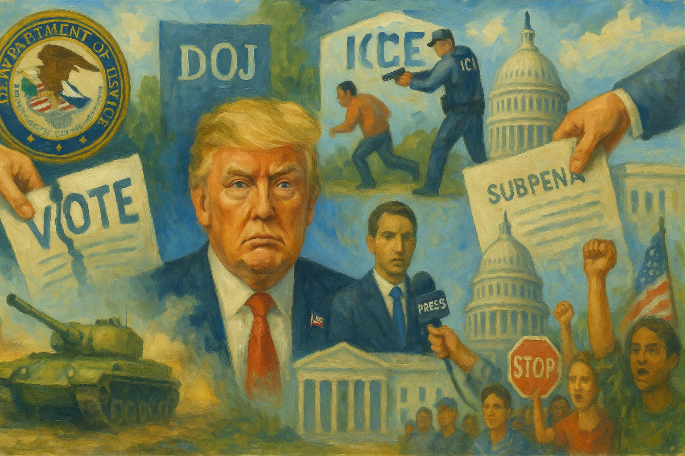

<!-- Generated by build_publish_week_v1 -->
<!-- Header image: image_wide_week78.png -->

# Week 78: Consolidation Across Public Life

*Election machinery, immigration enforcement, press freedom, and public resources all faced coordinated pressure without a new formal breach.*

> A republic can be weakened not only by shocks, but by the steady conversion of restraint into habit. — Anonymous democratic reflection
> Power rarely announces its full design at once; it advances by making each exception seem ordinary. — Historical warning
> When institutions still stand but no longer keep their distance, the form survives while the function changes. — Civic maxim

Week 78, running from July 11 to July 17, did not bring a single break in the line. It showed something quieter and more settled: pressure applied across many parts of public life at once, each move small enough to defend in isolation and together large enough to change the terms on which power was used. Election administration, immigration enforcement, press freedom, war powers, and public resources all came under the same strain. The pattern was not only force. It was coordination. Different tools served the same end.

At the close of the last period, the Democracy Clock stood at 7:44 p.m. It remained at 7:44 p.m. by the end of Week 78, a net change of 0 minutes. The hold did not mean calm. It meant this week mostly confirmed and thickened lines already in place rather than opening a wholly new front. Independent bodies were weakened, law was used more openly as pressure, and public accountability grew harder to sustain, but the week’s main significance lay in consolidation. The system did not lurch forward. It settled deeper into habits already formed.

The clearest example came in election administration. President Trump fired the remaining Democratic members of the Election Assistance Commission, using a theory of presidential removal power that reached into a body meant to stand apart from direct White House command. That act mattered beyond personnel. It weakened an independent election institution before the midterms and made federal election administration more open to direct political control. The winners were the presidency and those seeking a more obedient election apparatus. The losers were neutral administration, bipartisan design, and the idea that some parts of the state must keep distance from the ruler.

That move did not stand alone. The Justice Department warned election officials across the country that they could face criminal prosecution over noncitizen voting and voter-roll practices. The threat worked on two levels at once. It pressed local administrators from above. It also taught them that ordinary judgment could now carry personal legal risk. Such letters do not need many prosecutions to have force. The warning itself can chill discretion. Election officials lost room to act as custodians of process. Federal political actors gained a new means of command.

Congress was drawn into the same campaign. Trump refused to sign a bipartisan housing bill in an effort to pressure lawmakers on the Save America Act, and he publicly urged the Senate to take that measure up. The House had already passed the act earlier in the year, then moved a spending bill with the same voting restrictions attached. This was not ordinary policy bargaining over related subjects. It was an effort to tie unrelated governing business to a national election-law demand. Procedure became leverage. A must-pass vehicle became a way to move restrictions that might not stand as easily on their own.

The pressure then widened to the states. The Department of Homeland Security announced election-security conditions for states seeking federal grants and paired that leverage with repeated claims about noncitizen voting. In several states, lawmakers also proposed raising ballot-measure approval thresholds to sixty percent, making direct democracy harder to use. At the national level, Trump announced a primetime speech on a supposed 2020 election data breach, repeated old claims in a national address, and released declassified intelligence documents in a way that turned state-held information into political narrative. The point was not only to persuade. It was to prepare the ground. If institutions were being bent toward tighter control, the public story had to make that control seem necessary.

Immigration enforcement supplied the week’s most direct human cost. ICE agents fatally shot Lorenzo Salgado Araujo in Houston even though he was not the intended target. Soon after, agents shot and killed Johan Sebastián Durán Guerrero in Maine, also not the target of the operation. These were not abstract policy outcomes. They were deaths produced by field tactics. When two people who were not meant to be seized end up dead in separate operations, the issue is no longer a single bad encounter. It becomes a sign of what the system is willing to risk.

For a moment, the agencies appeared to recognize that fact. DHS and ICE paused most non-urgent vehicle stops after the shootings. That pause mattered. It showed internal awareness that the tactic had become dangerous enough to require retreat. Public pressure had force. Operational caution briefly surfaced. Yet the pause was short. The White House overruled it and restored a more aggressive posture. That reversal revealed the real chain of command. Internal restraint could exist, but only so long as it did not conflict with the political demand for mass deportation.

The week then confirmed that the shootings were part of a broader pattern, not an exception. Reports consolidated the two killings as evidence that ICE had killed men who were not targets of enforcement actions in Maine and Texas. Another man died after being struck by a tractor-trailer while fleeing an ICE and Homeland Security Investigations operation in Florida. Arrests rose to record levels as the White House pushed for mass deportations. Democratic lawmakers called for an investigation into the Maine shooting, and civil society groups organized protests and accountability actions. Those responses showed that resistance remained alive. But they came after the deaths, not before.

The larger immigration story ran beyond the shootings. Houston repealed an ordinance limiting police cooperation with ICE after state funding pressure. That was coercion through money. Local officials did not simply change their minds. They yielded under threat of loss. At the same time, federal authorities sharply increased the detention and removal of unaccompanied minors. The system was not only more forceful in the field. It was harder on children, harder on cities that tried to set limits, and less willing to leave room for local protection.

Conditions in custody deepened that picture. A tuberculosis outbreak was reported at the Aurora ICE processing center. Jesús Manuel Arenas-Silva died while being transferred between detention facilities in Georgia. Deportation flights reportedly went forward in defiance of a judge’s orders. ICE arrested asylum-seeking Chinese human rights lawyer Wu Shaoping despite his pending claim, while the administration asked the Supreme Court to revisit protected status for Venezuelan and Haitian nationals. Even where courts pushed back, as in an immigration-benefits case that required the government to keep processing claims, the larger movement was toward a harsher system with weaker regard for legal shelter.

Economic and labor rules also joined this structure of exclusion. Federal regulators implemented an English-proficiency rule for commercial drivers, changing access to work in a way that could fall hardest on immigrant labor. Citizenship, in practice, was being sorted by status, language, and vulnerability to enforcement. The winners were those who sought a more stratified social order and a more fearful labor force. The losers were migrants, asylum seekers, children in custody, and local governments that tried to soften the edge of federal power.

The campaign against the press moved from insult toward machinery. The administration subpoenaed New York Times journalists over reporting on security concerns involving Trump’s aircraft. That was a formal use of criminal process against reporters. It threatened not only the journalists named, but also the sources who might speak to them and the editors who must judge whether a story is worth the risk. A subpoena is not a speech. It is the state arriving with paper and penalty.

That pressure widened when Defense Secretary Pete Hegseth announced a Pentagon-Justice Department task force to identify and prosecute leaks to the press. The White House and FBI leadership also pursued a leak investigation tied to reporting on a Qatari-gifted airplane. These steps gave anti-press hostility an institutional frame. National security tools, law enforcement, and executive anger were brought into alignment. The state was not merely complaining about scrutiny. It was building channels to punish it.

The threat then reached broadcasters. FCC Chair Brendan Carr suggested that stations could lose licenses if they did not air a presidential speech, and Trump later called for revoking ABC and NBC licenses while repeating false election claims in a national address. This linked content control to state power. Editorial choice was recast as a matter that could invite punishment. Independent media organizations lost security. State-aligned or compliant outlets gained an advantage without any need for a formal censorship law.

The Justice Department sat near the center of several of these developments. A judge dismissed the Proud Boys seditious conspiracy case at the department’s request, ending a major January 6 accountability matter. That decision was the week’s clearest example of prosecutorial choice serving a political line. It did not prove every case was bent. It showed that one of the most symbolically important cases could be abandoned through ordinary legal process. Law kept its forms while changing direction.

The fight over Todd Blanche’s nomination for attorney general made that concern explicit. His confirmation hearing became a test of whether the Senate would accept a department shaped by loyalty, purges, and personal service. Liz Oyer testified against the nomination and accused Blanche of using the department for political favors. At the same time, Blanche continued to withhold Epstein-related documents despite court pressure and public demands for disclosure. Secrecy and personnel were thus joined. The question was not only who would lead the department, but what kind of department it would become.

Other actions reinforced the same impression. The Justice Department opened a grand jury investigation into UAW president Shawn Fain, affecting a major labor organization during an internal election. In Seattle, a panel of federal judges appointed Roger Rogoff as U.S. attorney, only for the administration to remove him quickly, exposing conflict over who controls prosecutors and under what limits. Across these episodes, the winners were those who wanted a department responsive to political need. The losers were neutrality, trust, and the old claim that federal prosecution stands apart from faction.

Yet the week also showed that courts still imposed friction. A federal judge voided Trump’s IRS settlement and sanctioned lawyers tied to the deal, finding no legal basis for the arrangement. Another judge stayed a State Department policy aimed at noncitizens involved in misinformation and content-moderation work, concluding that viewpoint discrimination was likely at issue. Public health groups, conservation groups, counties, tribes, and private plaintiffs filed multiple suits against federal policy changes. Twelve Democratic-led states sued to block a major media merger. Mahmoud Khalil sued Trump officials and allied groups over alleged targeting for pro-Palestinian advocacy.

These cases did not reverse the week’s main direction. They mattered because they showed that judicial review still functioned and that litigants still believed courts could matter. Ramsey County officials and advocacy groups sought review of DHS secrecy and sanctions powers. Other pending cases involving public media, immigrant advocates, and Pentagon press access were narrowed or resolved in ways that kept legal scrutiny alive. The courts were not leading events. They were reacting to them. But reaction still counts when other checks are thinning.

War powers formed another line of consolidation. Trump notified Congress that U.S. strikes on Iran had resumed and claimed continued authority under the War Powers Act. He then announced the reinstatement of an Iranian blockade and a U.S. security-fee role in the Strait of Hormuz. These were broad assertions of presidential control over military and trade power. Congress did push back in part. Senate Democrats blocked advancement of the defense authorization bill over the Iran hostilities. But the main initiative remained with the executive.

What made this development more troubling was its volatility. Trump announced a cargo-fee plan for the Strait of Hormuz and then quickly reversed it, only to return to blockade-style measures and a security-fee role soon after. The administration and the U.S. International Development Finance Corporation also announced tanker-loss insurance tied to the same crisis. This was governance by abrupt declaration in a domain where markets, diplomacy, and war can move on a sentence. Oversight becomes harder when policy itself keeps shifting. Congress and the public are left chasing a moving object.

The continuation of the national emergency on transnational criminal organizations for another year completed that picture. Emergency authority remained not as a short-term answer to a defined event, but as a standing tool of rule. The winners were executive actors who benefit from broad discretion and compressed timelines. The losers were deliberation and the expectation that war-adjacent powers should remain exceptional. Even where Congress objected, it did so after the fact and from a weaker position.

The week’s final pattern lay in the use of public office, public symbols, and public rules for private or personal advantage. Reports showed that Donald Trump Jr. and Eric Trump had invested in defense startups benefiting from Pentagon priorities. Treasury Secretary Scott Bessent announced plans for a commemorative coin featuring Trump’s likeness. Construction began on a helipad on White House grounds without seeking the usual approval or review channels. Each act was concrete. Together they formed a style of rule in which family profit, leader branding, and executive convenience sat close to the machinery of state.

Regulatory choices fit the same logic. Trump-appointed Justice Department officials overrode career antitrust lawyers who wanted merger reviews. The Department of Transportation proposed a national framework and safety-rule changes for autonomous vehicles that could adapt federal standards to favored product designs. FCC commissioners accepted gifts from CBS and Paramount while considering a merger involving Paramount. The administration also planned to repeal poultry-farmer pay, anti-retaliation, and transparency rules, shifting leverage toward processors and away from growers. These were not identical acts. They shared a common lesson: aligned firms and insiders could expect a friendlier state.

Even the treatment of land and civic space carried that mark. The administration planned permanent fencing and fortification around the White House and Lafayette Square, narrowing access to one of the country’s central protest spaces. Trump signed proclamations shrinking Bears Ears and Grand Staircase-Escalante and disbanding tribal-linked stewardship, placing executive will over shared memory and public trust. State assets, public land, and national symbols were being reordered to serve control, extraction, or image. The public lost access, standing, or voice. Power gained enclosure.

One formal public event is already set in the record: the Office of Government Information Services announced its annual public meeting, preserving a scheduled venue for discussion of access-to-records oversight under FOIA.

Week 78 therefore mattered less for novelty than for density. The same governing habits appeared in election administration, immigration, the press, war powers, and the use of public resources. Independent bodies were weakened, but not abolished. Courts resisted, but mostly after the move had been made. Public protest continued, but under greater hazard. The week did not push the clock forward because the underlying structure did not need a new breach to show itself. It showed endurance instead. That, too, measures democratic loss: when coercion, favoritism, secrecy, and personal rule no longer arrive as shocks, but as the ordinary weather of government.

<!-- Synopses for cross-posting -->
Long Synopsis: Week 78 brought no dramatic institutional rupture, but it deepened a pattern already in place: coordinated pressure across elections, immigration, the press, war powers, and public resources. President Trump fired the remaining Democratic members of the Election Assistance Commission while the Justice Department warned election officials of possible prosecution and allies pushed new voting restrictions through Congress and federal grant leverage. Immigration enforcement produced fatal ICE shootings of people who were not targets, a brief tactical pause, and a White House reversal that restored aggressive operations. The administration also escalated from attacking the press to using subpoenas, leak investigations, and license threats. At the same time, courts, states, and civil society still imposed some friction through lawsuits, stays, and public protest. The week’s significance lay in consolidation: coercive, personalized, and less accountable rule becoming more routine.
Short Synopsis: Week 78 held the Democracy Clock steady while confirming a broader pattern: election administration, immigration, press freedom, and public resources were all pressed toward tighter executive control. Courts and civic resistance remained active, but mostly in reaction to moves already made.

