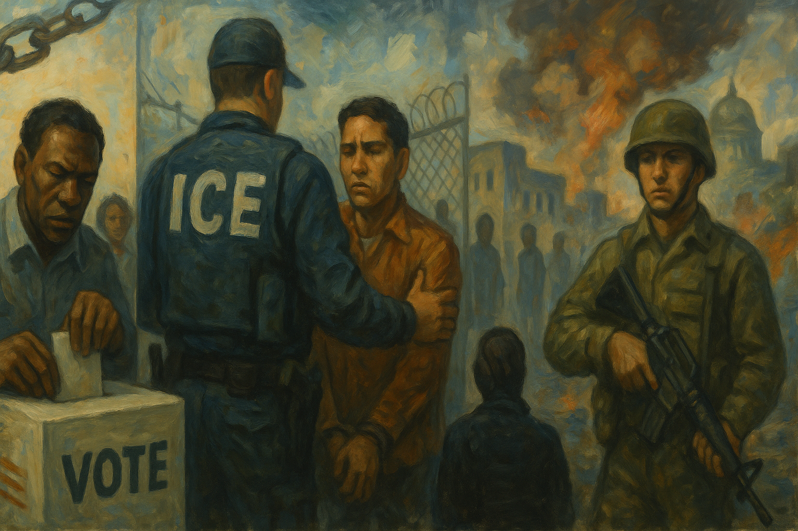

<!-- Generated by build_publish_week_v1 (appendix post) -->
<!-- Header image: image_wide_week79_appendix.png -->

# Week 79 Appendix: Consolidation Without Clock Movement

*Voting pressure, harsher immigration enforcement, war opacity, and retaliation against scrutiny deepened existing democratic strain without moving the clock.*

This was a high-pressure week defined by the convergence of three democracy-eroding patterns: aggressive voter-suppression architecture, intensified immigration enforcement with weakened accountability, and executive expansion under the cover of war and emergency politics. The strongest structural pressure fell on voting access and election fairness, as the administration pushed the SAVE America framework through executive threats, grant conditions, and congressional vehicles while courts simultaneously weakened Voting Rights Act protections and allowed racially dilutive maps to proceed. A second major theme was the normalization of coercive state power in immigration: record ICE arrests, multiple deaths tied to enforcement actions, use of a never-before-used removal court with secret evidence, cuts to legal aid for immigrant children, and efforts to stop FBI scrutiny of ICE confrontations. The third theme was executive aggrandizement through militarization and opacity: war funding requests, disputed casualty reporting, threats against civilian infrastructure, and repeated attempts to sideline Congress. Press intimidation, donor influence, and Saudi-linked conflict-of-interest concerns reinforced the sense of a governing style that fuses retaliation, secrecy, and patronage.

Power and Authority

1. Secretary of State Marco Rubio framed antifa and the "radical left" as a terrorism threat at the State Department (2026-07-18): Official terrorism rhetoric aimed at domestic political opponents can widen surveillance and justify harsher state action against dissent.

2. Stephen Bannon said a communist-threat narrative could justify a national security emergency order tied to the SAVE America agenda (2026-07-18): Public advocacy for emergency rule around domestic politics signaled support for bypassing normal lawmaking and concentrating executive power.

3. President Trump ordered DHS to notify states about alleged noncitizens on voter rolls and deem them ineligible (2026-07-18): Federal intervention in voter-roll eligibility risked wrongful removals and expanded executive pressure over election administration.

4. Secretary of Homeland Security Markwayne Mullin demanded that states run voter rolls through a federal noncitizen-check tool and threatened prosecution for noncompliance (2026-07-18): Threatening state officials over disputed voter-roll checks used federal coercion to shape election rules and voter access.

5. The Office of Management and Budget proposed a rule shifting broad federal grant-making control to political appointees (2026-07-20): Moving grant decisions toward political appointees would centralize executive leverage over public funding and weaken neutral administration.

6. The Trump administration cut federal funding for legal aid to unaccompanied immigrant children and pressed providers for sensitive data (2026-07-22): Cutting counsel for children in immigration court reduced due process protections for a vulnerable group facing state power.

7. Health and Human Services Secretary Robert F. Kennedy Jr. withheld more than $1 billion in Medicaid funding from California and Minnesota (2026-07-22): Using federal health funds against states increased executive leverage over disfavored jurisdictions and threatened basic services.

8. President Trump threatened military action against Iran and the Houthis after attacks on Saudi oil tankers (2026-07-22): Direct presidential threats of force raised the risk of escalation while concentrating war-making momentum in the executive branch.

9. The Department of Homeland Security awarded a contract to build more border wall in Organ Pipe Cactus National Monument (2026-07-24): Border-wall expansion used federal power in ways that overrode environmental and cultural protections affecting Indigenous communities.

10. President Trump threatened to target civilian infrastructure in Iran in retaliation for attacks on U.S. ships (2026-07-24): Threatening civilian targets signaled a more unchecked use of military power with weak regard for legal limits and civilian protection.

Institutions and Governance

1. President Trump called on Congress to pass the SAVE America Act (2026-07-18): Presidential pressure for new voting restrictions tested whether federal institutions would narrow ballot access in the name of fraud control.

2. The Commodity Futures Trading Commission investigated Representative Anna Paulina Luna over alleged advance tipping tied to betting markets (2026-07-18): An ethics investigation into a member of Congress tested accountability rules for officials who may exploit inside information.

3. Congress enacted the 21st Century ROAD to Housing Act into law without Trump's signature (2026-07-18): A bipartisan housing law showed Congress still exercising independent legislative capacity on a major domestic issue.

4. The federal appeals court struck down New Jersey's ban on assault rifles and large-capacity magazines (2026-07-18): The ruling limited a state's regulatory authority and showed courts reshaping public-safety policy through constitutional review.

5. The Supreme Court issued a ruling that weakened the Voting Rights Act and prompted new map changes in southern states (2026-07-18): Weakening federal voting-rights protections reduced judicial safeguards against racially dilutive election rules and maps.

6. The Department of Justice filed its first application in the Alien Terrorist Removal Court (2026-07-18): Using a secretive removal court expanded executive reliance on exceptional legal machinery with reduced public scrutiny and due process.

7. House GOP leaders pushed to pass defense, funding, budget, and related measures before recess (2026-07-19): A compressed legislative push concentrated major decisions into a short window, limiting deliberation over war, spending, and ethics rules.

8. Representative James Comer said the House was essentially done working before the midterms (2026-07-19): Openly winding down House work before elections signaled weakened oversight and a legislature operating more as campaign stage than governing body.

9. The Pentagon sought additional congressional funding for military operations in Iran (2026-07-19): Urgent war funding requests tested Congress's oversight role over an expanding conflict and its costs.

10. Judge Nathaniel Gorton blocked the administration from revoking work permits for asylum seekers and TPS holders (2026-07-19): The order checked executive immigration power and preserved work authorization while the legality of the policy was reviewed.

11. Civil rights groups sued HHS over withheld records on childcare funding restrictions affecting Somali providers (2026-07-20): The lawsuit used the courts to force disclosure and review of a federal policy that may have combined secrecy with discriminatory impact.

12. Judge Moss dismissed the remaining claims in Public Broadcasting Service v. Trump without prejudice (2026-07-20): The dismissal changed the posture of a case challenging executive action and narrowed one avenue of judicial review.

13. Judge Ho granted stays pending appeal in two Yemen TPS cases and said the lower court would dissolve prior relief if remanded (2026-07-20): The rulings strengthened the government's hand in ending protections while appeals continued, showing courts shaping immigration status through procedure.

14. The Supreme Court agreed to hear a case on whether an airplane was improperly seized for transporting beer (2026-07-20): Taking the case signaled possible new guidance on forfeiture and the legal limits of property seizure by the state.

15. The Supreme Court declined to hear a case about whether one state had an edge in getting the Court's attention (2026-07-20): By leaving lower rulings in place, the Court declined to revisit claims about fairness and unequal access in judicial process.

16. The Supreme Court granted certiorari in Jouppi v. Alaska (2026-07-20): The Court's decision to hear the case signaled potential new precedent affecting state law or state authority.

17. The Senate held a hearing on a proposed $1.5 trillion Defense Department budget (2026-07-20): The hearing tested congressional oversight of a major military budget increase tied to war and readiness claims.

18. Members of Congress backed dozens of bills to expand ICE's authority and funding (2026-07-20): Legislative support for a larger ICE would deepen the institutional reach of immigration enforcement and reduce restraint on coercive power.

19. Epstein survivors urged senators to reject Todd Blanche's nomination for attorney general (2026-07-20): Public opposition to a top law-enforcement nominee highlighted accountability concerns in a key institutional appointment.

20. The CDC announced a public advisory-board meeting on radiation and worker health (2026-07-21): A formal advisory process preserved routine expert oversight and public input in federal worker-health governance.

21. Defense Secretary Pete Hegseth asked the Senate for nearly $88 billion in supplemental Iran-war funding and defended a much larger military budget (2026-07-21): Large war and budget requests forced Congress to confront executive military expansion through appropriations and oversight.

22. The Senate Intelligence Committee advanced Jay Clayton's nomination for director of national intelligence (2026-07-21): Advancing a disputed intelligence nominee affected future oversight of surveillance powers and the credibility of national-security institutions.

23. A magistrate judge ordered Trump to disclose business financial details in his BBC defamation suit (2026-07-21): Compelled financial disclosure used court process to test transparency and accountability in a high-profile civil case.

24. Roger Rogoff sued Trump and DOJ over his removal as U.S. attorney for western Washington (2026-07-21): The suit challenged presidential removal power and tested legal limits on executive control over federal prosecutors.

25. Judge Gorton partly stayed immigration policies affecting TPS work permits and asylum-related penalties (2026-07-21): The order temporarily checked federal immigration rules that could strip work rights and trigger removals during litigation.

26. The Second Circuit remanded Mahdawi v. Trump and required constitutional claims to move first through immigration channels (2026-07-21): The ruling narrowed district-court review and reinforced administrative gatekeeping over detention and removal challenges.

27. Judge Nachmanoff ruled for a former executive-branch official on due process claims over her firing (2026-07-21): The decision reaffirmed that federal employment protections can limit abrupt politically driven removals and public smears.

28. A federal appeals court upheld Peter Navarro's contempt of Congress convictions (2026-07-21): The ruling reinforced Congress's subpoena power and the legal consequences for defying oversight demands.

29. The Arizona Republican electorate nominated election deniers for governor and top election official while DOJ monitored several counties (2026-07-21): Putting election deniers near control of election machinery raised risks to future administration and public trust in results.

30. Twenty-five states and the District of Columbia sued over FEMA and DHS grant conditions tied to voting and immigration policy changes (2026-07-22): The suit challenged executive use of federal grants to force state policy changes outside normal legislative channels.

31. The House of Representatives passed the NDAA with war funding, voting restrictions, and a Pentagon renaming provision (2026-07-22): Bundling defense policy with election restrictions and war measures showed Congress using must-pass vehicles for major democratic changes.

32. The House of Representatives passed a stopgap spending bill to avert a government shutdown through December 4 (2026-07-22): The measure preserved basic government operations while underscoring Congress's reliance on short-term funding rather than regular budgeting.

33. House Republicans approved a $73 billion Iran-war budget plan and a separate budget resolution for a $95 billion reconciliation bill (2026-07-22): War funding and reconciliation maneuvers tested how far Congress would support executive conflict expansion and attach voting changes to fiscal bills.

34. Senator Andy Kim introduced legislation to enroll children in Medicaid until age 26 (2026-07-22): The bill proposed a major expansion of public coverage and showed Congress using legislation to widen social rights rather than restrict them.

35. The House of Representatives passed the NDAA with Section 219 requiring military technology sharing with Israel (2026-07-22): The provision raised institutional questions about congressional control over defense policy and the scope of binding foreign-security commitments.

36. Representative Jim Jordan pressed DOJ to prosecute Jack Smith over his congressional testimony (2026-07-22): Using committee power to seek prosecution of a former Trump investigator risked turning oversight into retaliation.

37. The Supreme Court left in place a prior ruling that many Trump tariffs were illegal (2026-07-22): Judicial limits on tariff authority checked executive trade power and signaled that economic policy still faced legal boundaries.

38. Twenty-three state attorneys general filed an amicus brief supporting defendants in Jorge Lujan v. FMCSA (2026-07-22): State attorneys general used coordinated litigation to influence how federal regulatory authority would be interpreted in court.

39. Twenty state attorneys general and the District of Columbia filed an amicus brief supporting Harvard in its case against HHS (2026-07-22): States used the courts to back an institutional challenge to federal executive action affecting higher education and funding.

40. CHIRLA and Legal Services for Children sued over a nonwaivable fee for special immigrant juvenile petitions (2026-07-22): The case challenged an administrative barrier that could block poor youth from accessing a legal protection created by statute.

41. The D.C. Circuit denied the administration's renewed stay request in Lesly Miot v. Trump (2026-07-22): The ruling refused to pause lower-court relief and showed appellate courts still checking executive litigation tactics.

42. Judge Talwani let voting-rights and constitutional claims proceed in League of Women Voters of Massachusetts v. Trump (2026-07-22): Allowing the case to move forward preserved judicial review of an executive order alleged to burden voting rights and federalism.

43. The Supreme Court ruled that major immigration policy changes could not be imposed unilaterally without congressional approval (2026-07-22): The ruling reaffirmed separation of powers by requiring legislative backing for significant immigration policy shifts.

44. The FDA reestablished its Peripheral and Central Nervous System Drugs Advisory Committee after its charter expired (2026-07-23): Restoring an expert advisory body preserved routine institutional review in drug regulation rather than leaving decisions solely to political leadership.

45. Democratic lawmakers introduced the Industrial Bank for American Manufacturing Act (2026-07-23): The bill proposed a new public financing institution, showing Congress using structural economic policy through ordinary legislation.

46. Jes Staley testified before a House panel about his ties to Jeffrey Epstein (2026-07-23): Closed-door testimony showed Congress continuing oversight of elite networks and possible institutional failures around Epstein.

47. The New York legislature enacted a temporary ban on new datacenter development (2026-07-23): The state used legislative power to slow AI infrastructure growth while weighing environmental and public-interest concerns.

48. The House of Representatives passed a war powers resolution directing Trump to withdraw U.S. forces from the Iran conflict (2026-07-23): The vote asserted congressional authority over war even if enforcement remained uncertain against executive resistance.

49. A panel of federal judges declined to block Tennessee's new congressional map that split Memphis (2026-07-23): Allowing the map to stand weakened judicial protection against racial vote dilution before upcoming elections.

50. The Louisiana Supreme Court issued a decision that led to redrawing the state's U.S. House districts (2026-07-23): State-court intervention reshaped representation and candidate strategy by forcing a new congressional map.

51. The Fourth Circuit affirmed an order barring Badar Khan Suri's removal while detention claims proceeded (2026-07-23): The ruling preserved judicial power to review detention and block removal, limiting executive control over immigration custody.

52. The D.C. Circuit denied rehearing in Refugee and Immigrant Center for Education and Legal Services v. Noem (2026-07-23): The denial left prior limits on the government's position in place and maintained an existing judicial check.

53. Judge Murphy stayed American Academy of Pediatrics v. Robert F. Kennedy Jr. until September 3 (2026-07-23): The stay delayed further court action in a challenge to federal health policy, slowing institutional resolution.

54. Donald Trump petitioned the Supreme Court to reconsider the $5 million verdict in the E. Jean Carroll case (2026-07-23): Seeking Supreme Court review kept a major accountability case active and tested how far elite litigants can extend legal fights.

55. The FDA amended the notice for an advisory committee meeting on Deramiocel and announced another gene-therapy advisory meeting (2026-07-24): Public notice of advisory meetings preserved procedural transparency and outside participation in drug-review decisions.

56. Judge Georgette Castner dismissed the RNC's lawsuit seeking New Jersey voter data (2026-07-24): The dismissal protected voter records from broad partisan access and reinforced limits on fishing expeditions for election data.

57. A federal judge ordered the Pentagon to explain its testosterone policy for male troops in a case involving transgender service members (2026-07-24): The order forced the military to justify unequal treatment and kept judicial scrutiny on potentially discriminatory service rules.

58. Judge Robert S. Ballou ruled that FDA restrictions on mifepristone were arbitrary and capricious (2026-07-24): The ruling used administrative law to check federal restrictions that limited reproductive healthcare access.

59. Twelve states led by California won a temporary restraining order pausing the Paramount-Warner Bros. merger (2026-07-24): State court action showed subnational institutions using antitrust tools to slow concentration in a major media market.

60. Two small businesses sued over new Section 301 tariffs and said the administration exceeded its authority (2026-07-24): The lawsuit challenged the legal basis for broad trade action and tested limits on delegated executive power.

61. A prosecutor in Ecuador was assassinated while investigating allegations tied to U.S. boat strike survivors (2026-07-24): The killing threatened accountability for alleged abuses by undermining the safety and independence of legal investigators.

62. Donald Trump sought more than $70 billion in lawsuits and claims since late 2022, according to a CREW analysis (2026-07-24): The scale of litigation suggested repeated use of courts as a pressure tool, raising concerns about legal intimidation and asymmetry of resources.

Economic Structure

1. The House and Senate advanced major defense, funding, and budget measures before recess (2026-07-19): Fast-moving fiscal decisions on defense and government funding shaped public spending priorities with limited time for scrutiny.

2. U.S. gas and oil markets rose sharply as the Iran conflict and regional attacks disrupted energy expectations (2026-07-19): War-driven energy spikes increased consumer costs and showed how foreign conflict can quickly reshape domestic economic pressure.

3. The FDA warned against consuming shredded iceberg lettuce linked to a cyclospora outbreak (2026-07-18): Food-safety enforcement protected public health and showed the continuing role of regulators in guarding basic consumer welfare.

4. The Trump administration imposed an additional 50 percent tariff on many Canadian products (2026-07-19): New tariffs used executive trade power in ways likely to raise prices, strain an allied relationship, and shift economic burdens onto consumers and firms.

5. The U.S. Trade Representative imposed a 25 percent tariff on Brazilian goods after a Section 301 investigation (2026-07-20): The action expanded unilateral trade penalties and showed executive use of tariffs to pressure foreign policy and market behavior.

6. Paramount and Warner Bros. paused their merger before states later won a temporary restraining order (2026-07-20): The stalled merger highlighted how concentration in media markets can trigger economic and public-interest concerns before completion.

7. The EPA designated new air-monitoring methods for carbon monoxide and particulate matter (2026-07-20): Technical rulemaking supported state enforcement capacity and the public's access to reliable environmental data.

8. The FDA finalized a rule updating the standard of identity for pasteurized orange juice (2026-07-20): The rule adjusted food standards through ordinary regulation, affecting labeling, industry practice, and consumer expectations.

9. The United Kingdom faced major cost overruns on the HS2 rail project (2026-07-20): Escalating infrastructure costs illustrated how weak project governance can erode public confidence in large public investments.

10. The United Kingdom continued to face energy scarcity, a housing shortage, and a large NHS treatment backlog (2026-07-20): Persistent shortages in energy, housing, and healthcare showed how policy design can shape long-term access to core public goods.

11. Major consumer brands and SpaceX's PAC funded members of Congress who backed ICE-expansion legislation (2026-07-20): Corporate money supporting coercive-policy legislation showed how private capital can steer public enforcement priorities.

12. The FCC denied Kinéis's petition over how regulatory fees are assessed on space stations (2026-07-21): The decision preserved an agency fee structure that spreads regulatory costs across license holders rather than only active operators.

13. The FDA extended the comment period for its expedited investigational new drug pilot program (2026-07-21): Extending public comment preserved procedural input on a program that could speed drug development and alter regulatory risk.

14. Oil tankers reversed course after a Houthi blockade near the Bab el-Mandeb Strait (2026-07-21): Shipping disruption showed how conflict can quickly affect global supply chains and energy prices that shape domestic economic conditions.

15. ICE delayed buying body cameras despite having funding and later placed large orders (2026-07-21): Delayed spending on accountability tools showed how agency choices can weaken oversight even when money is available.

16. Republicans' One Big Beautiful Bill Act cut SNAP benefits for hundreds of thousands of Arizonans and shifted costs to the state (2026-07-22): Deep food-aid cuts reduced material security for poor households and shifted administrative strain onto state systems.

17. Avelo Airlines ended ICE deportation flights and closed its Arizona base after sustained protests (2026-07-22): A private contractor's withdrawal showed how public pressure can disrupt the market infrastructure that supports state deportation policy.

18. The FDA determined that RASUVO was not withdrawn for safety reasons and submitted a medical-device information collection for OMB review (2026-07-22): Routine regulatory actions affected generic competition and device approval processes that shape access, pricing, and compliance costs.

19. President Trump announced tax-free "Trump accounts" with a federal contribution for children born through 2028 (2026-07-22): The program used federal fiscal policy to create a branded savings benefit with long-term budget and distribution effects.

20. The FDA accused QOL Medical of misleading advertising and QOL Medical later faced renewed scrutiny over a prior DOJ fraud settlement (2026-07-22): Regulatory and fraud scrutiny of a drug company tested whether public-health enforcement can withstand political and financial pressure.

21. The Pentagon established an Economic Defense Unit to invest public funds in defense industries (2026-07-23): A new public investment arm for defense raised risks of favoritism and blurred lines between industrial policy and insider access.

22. The Department of Homeland Security redirected $155 million from maritime-security work to event security (2026-07-23): Shifting security funds away from their original purpose showed how executive budgeting choices can weaken public accountability for priorities.

23. The Trump administration announced new tariffs on major trade partners and later imposed tariffs on 60 countries (2026-07-23): Broad new tariffs expanded executive control over trade policy and risked higher costs across supply chains and households.

24. Frederick Cooper gave another $1 million to MAGA Inc. while QOL Medical faced FDA allegations (2026-07-24): Large political donations from a regulated executive during active scrutiny raised concerns that access and influence can shape enforcement outcomes.

25. The DEA announced an application by American Radiolabeled Chem to register as a bulk manufacturer of controlled substances (2026-07-23): The notice opened public review of a controlled-substances manufacturing request, showing routine regulatory gatekeeping over sensitive markets.

26. The EPA approved state air-plan revisions in Missouri and Maine and denied a petition against an Arizona mine permit (2026-07-23): These decisions showed federal regulators shaping the balance between state permitting, public participation, and environmental compliance.

27. The EPA proposed a consent decree on Florida water standards and submitted several emissions information requests to OMB (2026-07-23): Administrative steps on water and air rules preserved the paperwork and deadlines that make environmental oversight enforceable.

28. The FDA published a strategy for accelerated clinical development and revoked the obsolete Orange B color additive listing (2026-07-23): The actions updated regulatory pathways and removed outdated rules, affecting how quickly products reach market and how standards are maintained.

29. President Trump modified the aluminum tariff regime to reward companies that onshored U.S. production (2026-07-23): The proclamation tied tariff relief to industrial investment, using trade power to steer private capital toward favored domestic production.

30. The EPA rescinded a redundant system of records notice for research-grant application files (2026-07-23): Streamlining records management affected how grant data is stored and accessed across federal funding systems.

31. The FDA debarred Francis Esteban Matos from importing drugs for five years (2026-07-24): The debarment showed regulators using exclusion powers to police illegal drug commerce and protect market integrity.

32. The EPA issued a significant new use rule for multi-walled carbon nanotubes and published environmental impact statement notices (2026-07-24): These actions preserved advance review and public notice for industrial and infrastructure decisions with environmental consequences.

33. The FDA classified four medical devices into class II with special controls (2026-07-24): Device classifications shaped market entry and patient access by setting the regulatory path for new health technologies.

Civil Rights and Dissent

1. Ralph Norman announced a Senate run in South Carolina (2026-07-18): A high-profile candidacy affected representation and party competition in a state facing a fast-moving special election.

2. Maine Democrats concluded their Senate primary with Troy Jackson's victory (2026-07-18): The primary result settled a major nomination contest and shaped voter choice in the coming general election.

3. The Democratic National Committee launched a voter-registration drive during the World Cup final (2026-07-18): Organized registration efforts aimed to widen participation and counter barriers to electoral access.

4. Nebraska Democrats let their Senate nominee withdraw and shifted support to an independent candidate (2026-07-18): The move changed the ballot landscape and reflected strategic adaptation within a competitive election.

5. Nearly 300 people in Santa Barbara gathered for postcarding, phone banking, and voter-engagement work (2026-07-18): Grassroots civic action sought to expand participation and public engagement after recent voting-rights setbacks.

6. New York City Mayor Zohran Mamdani explored whether the city had authority to arrest Benjamin Netanyahu and later urged federal authorities to act instead (2026-07-19): The episode showed local officials using public office to press human-rights accountability claims even without direct enforcement power.

7. The FBI stopped investigating confrontations involving ICE, according to reports later disputed by DOJ and DHS (2026-07-19): Ending a layer of outside review would reduce accountability for federal force used against immigrants and bystanders.

8. An ICE officer fatally shot Lorenzo Salgado Araujo during a Houston enforcement operation (2026-07-19): The killing of a man who was not the intended target intensified concerns about lethal force and immigrant community safety.

9. Tom Homan required ICE officers to use body cameras during vehicle stops (2026-07-19): The mandate responded to public concern over fatal encounters and could improve evidence and accountability in immigration policing.

10. Community groups in Fultondale held a church-based gathering focused on voting rights and civic engagement (2026-07-19): Faith and community organizing supported voter participation and local democratic capacity.

11. The 250 to 250 Project and its narrators released civic-history videos on democracy, civil rights, desegregation, land policy, and the Palmer Raids (2026-07-19): Public history work strengthened civic memory and linked past struggles over rights and state power to present democratic understanding.

12. Activists and local organizations mobilized to counter voter suppression and election subversion before November 2026 (2026-07-20): Civil-society organizing aimed to defend election access and local oversight where formal protections were weakening.

13. Indivisible issued guidance and training on responding to aggressive federal law-enforcement practices (2026-07-20): Organized nonstate response to coercive policing showed civil society building protective capacity against perceived abuse.

14. The House Homeland Security Committee Democrats reported that ICE had received 56 excessive-force complaints and referred one officer for possible discipline (2026-07-21): The report documented weak accountability systems around force used in immigration enforcement.

15. ICE recorded 43,138 arrests in June and reached record daily arrest levels in early July (2026-07-21): Record arrest volume showed a sharp expansion of coercive immigration enforcement with broad effects on liberty and community security.

16. Senator Angus King and 38 Democratic senators demanded investigations into recent fatal ICE shootings (2026-07-21): The letter sought accountability for lethal immigration enforcement and pressed for oversight of officer vetting and conduct.

17. Juan Jairo Coronilla Durán died after fleeing federal officials during an ICE-linked operation in Florida (2026-07-22): Another death tied to immigration enforcement underscored the bodily risks created by aggressive federal operations.

18. ICE officers reported low morale, unsafe staffing, and use of untrained recruits (2026-07-22): Operational disorder inside a coercive agency raised risks of abuse, error, and unsafe enforcement against the public.

19. The Democratic National Committee picked South Carolina as the first state in the 2028 primary calendar (2026-07-24): Changing the primary order reshaped whose voters gain early influence over presidential nominations.

20. Connor Read remained detained by ICE after being taken into custody at a green-card interview over past minor convictions (2026-07-24): Detaining a long-term resident during a legal-status process showed how immigration enforcement can override settled family and community ties.

21. Federal prosecutors indicted 11 people over a smuggling operation linked to six migrant deaths in Texas (2026-07-24): The indictment addressed lethal smuggling but also highlighted the deadly pressures surrounding migration and border enforcement.

22. A federal appeals court rejected the Trump administration's bid to redetain Georgetown scholar Badar Khan Suri after his ICE arrest over pro-Palestinian views (2026-07-24): The ruling protected habeas review and limited detention tied to political expression in an immigration case.

23. A federal judge dismissed the RNC's suit for New Jersey voter data after finding no concrete plan for its use (2026-07-24): Blocking broad access to voter records protected privacy and reduced the risk of partisan misuse of sensitive election data.

24. A federal judge ruled that FDA restrictions on mifepristone were arbitrary and capricious (2026-07-24): The decision protected abortion access by challenging federal barriers to a widely used medication.

Information, Memory and Manipulation

1. President Trump accused journalists of hiding election fraud and called for revoking broadcasters' licenses (2026-07-18): Threats against media licenses used state power rhetoric to intimidate the press and narrow independent scrutiny.

2. President Trump falsely claimed China had compromised 220 million U.S. voter files (2026-07-18): A false election-security claim risked eroding trust in voting systems and feeding disinformation about fraud.

3. Lawmakers sought a full accounting from the Trump Presidential Library Foundation over financial discrepancies (2026-07-18): Questions about foundation finances raised transparency concerns around a presidential institution tied to public memory and money.

4. The Department of Homeland Security posted a solicitation for offshore detention facilities (2026-07-20): A public procurement notice revealed a major detention expansion plan and raised concerns about hidden coercive infrastructure.

5. Advocates launched a public campaign against ICE's alleged child-bounty contracting system (2026-07-20): The campaign sought to expose opaque enforcement incentives affecting children and immigrant families.

6. The Trump administration sought phone records of New York Times reporters and their relatives before later withdrawing the subpoenas (2026-07-20): Seeking reporters' records threatened source protection and signaled coercive surveillance of watchdog journalism.

7. The Pentagon disclosed casualties from the Iran conflict only after criticism over earlier silence (2026-07-19): Delayed casualty disclosure weakened democratic oversight by limiting timely public knowledge of war costs.

8. The Pentagon updated its casualty database for the Iran conflict (2026-07-20): Publishing casualty figures informed the public about the human cost of war, though later revisions raised trust concerns.

9. The Gates Foundation released an external review of its past meetings with Jeffrey Epstein and approved governance changes (2026-07-21): Publishing an outside review addressed accountability concerns by disclosing elite institutional ties and proposed safeguards.

10. The Centers for Disease Control and Prevention operated with major funding cuts and staff losses that weakened outbreak response capacity (2026-07-22): Shrinking public-health expertise reduced the state's ability to gather and act on reliable disease information for the public.

11. The U.S. government collected more than $13 billion from Venezuelan oil sales without clear public accounting (2026-07-22): Unclear reporting on large public funds undermined transparency and made democratic oversight of executive financial decisions harder.

12. A Secret Service agent came under investigation for allegedly leaking details of JD Vance's travel plans (2026-07-23): The leak inquiry highlighted how information security failures inside protective agencies can affect trust and accountability.

13. Major media outlets largely omitted Jared Kushner's Saudi financial conflicts in coverage of the Saudi nuclear deal (2026-07-23): Underreporting a major conflict-of-interest issue limited the public's ability to judge foreign-policy decisions on full facts.

14. Preservation experts challenged the administration's plan to paint the Eisenhower Executive Office Building white while bypassing review (2026-07-23): The dispute linked executive secrecy to control over a historic federal building and the public record embodied in it.

15. The Pentagon revised the official Iran-war death toll downward by excluding four service members killed after a declared cease-fire (2026-07-23): Changing casualty counts in a politically sensitive way raised concerns that war records were being shaped to protect the administration.

16. Representative Joe Morelle said the administration had not provided an accounting for military funding requests (2026-07-24): Missing detail on war spending weakened Congress's ability to track how executive military decisions used public money.

17. The EPA rescinded a redundant records notice for research-grant files because official records were kept elsewhere (2026-07-23): The records change affected how grant information is organized and accessed, with implications for administrative transparency.

