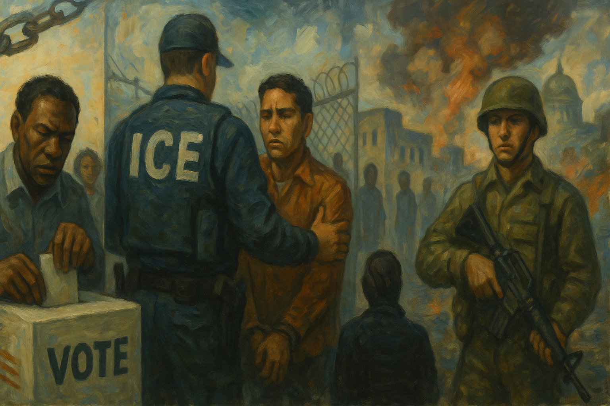

<!-- Generated by build_publish_week_v1 (appendix post) -->
<!-- Header image: image_wide_week79_appendix.png -->

# Week 79 Appendix: War Powers Ignored, Casualties Rewritten

*As the president escalated an undeclared war and the Pentagon revised its own death toll, courts and states supplied the week's sharpest resistance.*

This week was dominated by an escalating, undeclared war with Iran that exposed the administration's willingness to manipulate casualty data, bypass congressional war powers, and threaten war crimes against civilian infrastructure, while simultaneously advancing a sweeping voter-suppression package (the SAVE America Act) tied to national-security rhetoric equating dissent with terrorism. The Pentagon's altered casualty counts, withheld strike disclosures, and contradictory testimony to Congress reveal a pattern of manufactured opacity around war costs even as oil and gas prices spiked and the defense budget request reached unprecedented scale. Executive action extended into cultural terrain, with Trump ordering corrective signage at the Smithsonian, and into economic terrain, with emoluments-adjacent nuclear and tariff deals benefiting Kushner-linked interests. Congress passed dueling war-powers resolutions that the administration ignored, while courts pushed back on tariffs, FDA drug restrictions, and FEMA's coercive election-related grant conditions—signaling judicial resistance amid otherwise weakening institutional checks.

Power and Authority

1. Stephen Bannon suggested Trump could declare a national security emergency executive order tied to the SAVE America act (2026-07-18): An informal Trump ally floated using emergency executive power to bypass normal legislative process for a voting restriction law.

2. President Trump ordered DHS to notify states of noncitizens on voter rolls and called on Congress to pass the SAVE America Act (2026-07-18): The president directed a federal agency to pressure states on voter rolls while pushing legislation critics say would restrict ballot access.

3. Secretary of Homeland Security Markwayne Mullin demanded states run voter rolls through a blocked federal tool and threatened prosecution for noncompliance (2026-07-18) *[single source]*: A cabinet official threatened state officials with criminal charges over a voter-verification tool previously halted by courts.

4. President Trump posted online that Iran would "pay many times over" for each American soldier killed (2026-07-20): The president issued a public threat of disproportionate military retaliation, raising escalation risk absent congressional authorization.

5. President Trump told reporters the war objective against Iran had expanded beyond the originally stated scope (2026-07-20): The president publicly redefined the aims of an active war, raising questions about the original authorization's limits.

6. President Trump declared Israeli Prime Minister Netanyahu immune from arrest while in the United States (2026-07-21) *[single source]*: The president unilaterally overrode an international arrest warrant, asserting personal control over domestic law enforcement decisions.

7. President Trump threatened to bomb an Iranian bridge or power plant for every attack on ships in the Strait of Hormuz (2026-07-23): The president publicly threatened deliberate strikes on civilian infrastructure, an act that would violate international humanitarian law.

8. President Trump said he was close to deciding on a "massive attack" on Iran larger than prior operations (2026-07-23): The president signaled imminent major military escalation without indicating new congressional authorization.

9. President Trump reversed an ICE vehicle-stop safety suspension imposed after a fatal shooting (2026-07-24): A presidential order overturned an agency safety protocol adopted after a deadly incident, prioritizing enforcement volume over stated safety concerns.

Institutions and Governance

1. 21st Century ROAD to Housing Act became law with bipartisan congressional support despite the president's refusal to sign it (2026-07-18) *[single source]*: Congress enacted major housing legislation over presidential objection, showing continued legislative capacity on a bipartisan issue.

2. Third U.S. Circuit Court of Appeals struck down New Jersey's ban on assault weapons and large-capacity magazines (2026-07-18): A federal appeals court invalidated a state gun-safety law for the first time nationally, signaling likely broader Supreme Court review.

3. Rep. James Comer acknowledged the House was largely done working before the midterm elections (2026-07-19) *[single source]*: A senior House leader's admission signals reduced legislative oversight capacity during a period of military escalation.

4. Commodity Futures Trading Commission investigated Rep. Anna Paulina Luna over alleged insider tipping on a vice-presidential pick (2026-07-18): A federal regulator opened an ethics-related inquiry into a sitting member of Congress for potential insider trading.

5. Senator Angus King and 38 Democratic senators demanded independent investigation of fatal ICE shootings and lack of body cameras (2026-07-20): Nearly forty senators formally sought accountability after federal agents killed civilians without required equipment in place.

6. NIH canceled a Harvard professor's research grant studying discrimination and health (2026-07-20): A federal science agency terminated funded research on discrimination for ideological reasons, undermining merit-based scientific inquiry.

7. Pentagon requested $67 billion in emergency funding for Iran war operations (2026-07-21): Defense officials sought a massive supplemental appropriation as war costs outpaced budgeted funds, raising fiscal accountability concerns.

8. Defense Secretary Pete Hegseth gave evasive Senate testimony redefining Iran's military capability after prior contradictory claims (2026-07-21): A cabinet secretary's shifting statements to Congress about war progress undermine legislative oversight of military operations.

9. Senator Andy Kim introduced legislation to expand Medicaid to all children through age 26 (2026-07-21) *[single source]*: A senator proposed a major expansion of government health coverage for children amid administration cuts to safety-net programs.

10. Federal appeals court upheld Peter Navarro's contempt of Congress convictions (2026-07-21): A court affirmed that executive officials remain accountable to congressional subpoenas, reinforcing legislative oversight power.

11. Justice Department found UC San Diego's medical school discriminated based on race in admissions (2026-07-20): A civil rights enforcement action applied a Supreme Court ruling to eliminate race-conscious admissions at a major medical school.

12. Justice Department opened a compliance review of Harvard's China-based financial aid programs (2026-07-20): Federal civil rights investigators examined whether a university's foreign funding disadvantages American students.

13. House of Representatives passed a continuing resolution to fund government through December 4 (2026-07-22) *[single source]*: Congress deferred its constitutional spending duty via a stopgap measure to avoid a shutdown before midterms.

14. House Republicans passed a budget resolution allocating $73 billion for Iran war operations and funds for the Save America Act (2026-07-22): The House advanced a spending package combining war funding with voting restrictions, using reconciliation to bypass Senate filibuster rules.

15. Rep. Jim McGovern delivered a House floor speech characterizing the Republican Party as fascist (2026-07-22) *[single source]*: A member of Congress used formal floor proceedings to escalate rhetoric describing the ruling party's alignment with authoritarian conduct.

16. Magistrate Judge Enjoliqué Lett ordered Trump to disclose financial details in a $10 billion defamation suit against the BBC (2026-07-22) *[single source]*: A federal court compelled presidential financial disclosure and authorized subpoenas of Trump associates in a defamation case.

17. Gates Foundation / WilmerHale released a review finding about 30 meetings between Bill Gates and Jeffrey Epstein from 2011 to 2014 (2026-07-22): An external investigation documented sustained undisclosed contact between a major philanthropy and a convicted sex offender.

18. House Republicans passed a $1.15 trillion defense bill merging military policy with voting restrictions from the Save America Act (2026-07-23) *[single source]*: Defense authorization was combined with nationwide voting restrictions in a near-party-line vote, entangling military funding with election policy.

19. House Judiciary Committee Chair Jim Jordan referred former special counsel Jack Smith for criminal prosecution over alleged false testimony (2026-07-23): A committee chair sought prosecution of the prosecutor who investigated the president, raising concerns about political retaliation via the justice system.

20. Jes Staley testified before the House Committee on Oversight and Reform on his ties to Jeffrey Epstein (2026-07-23): Congressional oversight continued into financial-sector connections to Epstein's crimes through closed-door testimony.

21. U.S. House of Representatives passed a war powers resolution directing the president to end hostilities with Iran (2026-07-24): The House again asserted constitutional war powers against an administration that had not complied with a prior identical resolution.

22. U.S. Senate rejected a war powers resolution to end the Iran conflict by a narrow party-line vote (2026-07-24) *[single source]*: The Senate declined to force compliance with war powers requirements despite having passed a similar measure weeks earlier.

23. Greg Meeks announced plans to compel a lawsuit against Trump over war powers noncompliance (2026-07-24) *[single source]*: A senior House Democrat sought to force legal action against the executive branch for defying congressional war authority.

24. Judge Robert S. Ballou ruled FDA restrictions on mifepristone arbitrary and capricious and ordered reconsideration (2026-07-24) *[single source]*: A federal court found abortion medication restrictions lacked scientific basis and ordered the administration to revisit the policy.

25. Twelve U.S. states led by California obtained a temporary restraining order blocking the Paramount-Warner Bros merger for 28 days (2026-07-24) *[single source]*: A coalition of states halted a major media merger pending antitrust review, with implications for press competition and control.

26. Twenty-five Democratic state attorneys general sued the federal government over FEMA disaster aid conditions tied to voting and immigration policy (2026-07-24): A large coalition of states challenged the use of disaster funding as leverage to compel state adoption of federal election and immigration rules.

27. Fourth Circuit Court of Appeals rejected the administration's bid to redetain a Georgetown scholar arrested for pro-Palestinian speech (2026-07-24): A federal appeals court upheld habeas rights for a detained immigrant, denying an attempt to reverse a bail release tied to political speech.

28. Liberty Justice Center filed suit challenging new Trump tariffs on behalf of two small businesses (2026-07-24): A legal advocacy group again challenged presidential tariff authority, arguing the action exceeded statutory limits set by Congress.

29. Judge Georgette Castner dismissed an RNC lawsuit seeking New Jersey voter data (2026-07-24) *[single source]*: A federal court rejected a partisan attempt to obtain sensitive statewide voter records, protecting voter privacy.

30. Three-judge federal panel declined to block a Tennessee congressional map splitting a majority-Black district in Memphis (2026-07-24): A federal court allowed a redistricting plan diluting Black voting power to proceed following a weakened Voting Rights Act standard.

31. Judge Nathaniel Gorton issued a temporary restraining order blocking termination of work authorization for asylum seekers and TPS holders (2026-07-24) *[single source]*: A federal judge halted an executive action that would have stripped employment rights from vulnerable immigrants pending review.

32. House Homeland Security Committee Democrats received a closed-door ICE briefing revealing only one disciplinary referral among 56 excessive-force complaints (2026-07-24) *[single source]*: Congressional oversight exposed minimal accountability within a federal agency amid escalating deportation-related violence.

33. Federal district and appellate court dockets recorded multiple rulings and dismissals in cases challenging Trump administration actions (2026-07-20): Several ongoing lawsuits against federal actions reached judgment or dismissal, reflecting active judicial review of executive conduct.

34. Roger Rogoff filed a complaint challenging his removal as U.S. Attorney less than an hour after appointment (2026-07-21): A dismissed federal prosecutor sued alleging his removal violated the Appointments Clause and separation-of-powers protections.

35. State of Illinois and 26 co-plaintiffs filed a complaint challenging FEMA grant conditions tied to election and immigration mandates (2026-07-23): States sued to block federal disaster-preparedness funding conditions requiring changes to election administration and immigration cooperation.

36. Justice Department filed suit against Colorado over in-state tuition for undocumented immigrants (2026-07-23): The federal government challenged a state's tuition policy for undocumented students, its 14th such lawsuit nationally.

37. Justice Department sued Milwaukee over its ban on masked, unidentified federal law enforcement officers (2026-07-23): The federal government challenged local authority to regulate identification requirements for federal agents operating within a city.

38. Judge Ana Reyes ordered the Pentagon to explain a testosterone policy discrepancy affecting transgender troops (2026-07-23): A federal judge questioned inconsistent medical standards in a policy barring transgender military service.

Economic Structure

1. Trump administration formalized new tariffs on dozens of countries including EU members (2026-07-18): Broad new tariffs on major trading partners threaten to raise consumer costs and trigger retaliatory economic measures.

2. Trump administration imposed additional 50% tariffs on Canadian motor vehicles, dairy, and alcoholic beverages (2026-07-20): The administration unilaterally escalated tariffs on a close ally, risking economic retaliation and higher domestic prices.

3. Energy markets pushed gasoline prices to $4 per gallon amid the Iran conflict (2026-07-20): Military escalation drove consumer energy costs higher, directly affecting household budgets and inflation.

4. Citizens Bank ended its financial relationship with private prison operators running ICE detention facilities (2026-07-20) *[single source]*: A major bank withdrew financing from immigration detention contractors following sustained public pressure.

5. SpaceX, Home Depot, Walmart, Toyota, Google donated to members of Congress who sponsored bills expanding ICE's enforcement powers (2026-07-20) *[single source]*: Corporate political action committees financed lawmakers advancing immigration enforcement expansion tied to documented rights violations.

6. Rep. Robert Garcia and House Democratic Whip Katherine Clark criticized a GOP budget allocating billions to war and voter suppression while providing no cost relief (2026-07-20) *[single source]*: Democratic leaders framed budget priorities as favoring military spending and election restrictions over affordability measures.

7. Global oil markets pushed Brent crude above $94 to $100 per barrel amid escalating Middle East conflict (2026-07-22): Compounding military and trade tensions drove energy prices to their highest levels in years, straining consumers and businesses.

8. Trump administration imposed tariffs ranging from 10% to 12.5% on more than 80 economies citing forced-labor enforcement failures (2026-07-23): New broad tariffs affecting nearly all U.S. trading partners were imposed under a different legal theory than tariffs struck down by the Supreme Court.

9. Jamieson Greer testified to the Senate that tariffs have not increased prices despite inflation data suggesting otherwise (2026-07-23) *[single source]*: The U.S. trade representative denied tariff-driven cost increases even as senators cited estimates of $1,700 in added household costs.

10. Reps. Ro Khanna, Tom Suozzi, and Debbie Dingell introduced legislation to create a federal manufacturing bank funded by China tariff revenue (2026-07-23) *[single source]*: Lawmakers proposed redirecting tariff revenue into domestic manufacturing investment for deindustrialized regions.

11. Pentagon established an Economic Defense Unit recruiting Wall Street bankers to manage up to $200 billion in government investment (2026-07-23): A new defense investment office blurs public authority and private financial interests, creating potential conflicts of interest.

12. Trump administration took ownership stakes in private companies including Intel and U.S. Steel without transparent criteria (2026-07-23): Direct government equity investment in private firms raises concerns about favoritism and lack of oversight in economic intervention.

13. Emil Michael and Stephen Feinberg oversee $58.5 billion and $20 billion in Pentagon AI and strategic capital spending despite documented private financial conflicts (2026-07-23) *[single source]*: Officials with undisclosed personal financial stakes in AI and private equity ventures control massive defense procurement budgets.

14. Steve Rattner reported federal debt surpassing 100 percent of GDP under the Trump administration (2026-07-24) *[single source]*: Rising national debt reflects the fiscal consequences of expanded defense spending and reduced revenue, constraining future public investment.

15. Trump administration / DHS diverted $155 million in congressionally appropriated maritime security funds to World Cup and America250 event security (2026-07-24) *[single source]*: Federal funds appropriated by Congress for a specific national security purpose were redirected without authorization to unrelated events.

16. Trump administration requested $11.1 billion in additional supplemental agricultural assistance (2026-07-24): The administration sought further large-scale farm subsidies, adding to over $55 billion in government agricultural support this year.

17. ICE enforced a crackdown in Minneapolis that caused undocumented workers to lose months of income (2026-07-24): Immigration enforcement operations created severe financial hardship for vulnerable families, including single mothers afraid to leave home.

18. Popular Information analysis documented that corporate donors including SpaceX and Walmart fund lawmakers sponsoring ICE-expansion bills (2026-07-24) *[single source]*: An investigative report tied major consumer brand donations directly to legislative efforts expanding immigration enforcement power.

19. Cameron and Tyler Winklevoss donated over $10 million to a pro-Trump super PAC shortly after the administration vacated a prior enforcement action against their exchange (2026-07-24) *[single source]*: A large political donation followed closely after regulatory relief, raising questions about pay-to-play dynamics in enforcement decisions.

20. Byron Donalds received large donations from data center developers seeking state regulatory approval (2026-07-24) *[single source]*: A gubernatorial candidate accepted substantial contributions from companies with direct interests in his future regulatory decisions.

21. President Trump promoted "Trump accounts," a $17 billion federally seeded child investment program, at a campaign rally (2026-07-23): The president championed a major new federal expenditure program while dismissing affordability concerns amid rising consumer costs.

22. Trump administration announced approximately 200 companies signed a non-binding pledge on datacenter electricity costs (2026-07-24) *[single source]*: A voluntary, unenforceable pledge was presented as consumer protection against rising costs from AI infrastructure expansion.

23. HHS Secretary Robert F. Kennedy Jr. withheld over $1 billion in additional Medicaid funding from California and Minnesota over unsubstantiated fraud claims (2026-07-21): Federal health funding was withheld from Democratic-led states based on unproven allegations, straining state health programs.

24. Republican Congress enacted deep SNAP cuts causing Arizona to terminate benefits for 440,000 residents (2026-07-22): Legislative cuts to the food-assistance program stripped benefits from hundreds of thousands, forcing layoffs of caseworkers statewide.

25. TSA privatized airport security screening at Des Moines and Tampa airports (2026-07-22): The agency reversed a post-9/11 federal security safeguard by allowing private contractors to conduct passenger screening.

Civil Rights and Dissent

1. Civil society coalitions organized mass protests over ICE shootings, voter suppression, and datacenter expansion (2026-07-18) *[single source]*: Thousands of Americans held over 800 coordinated events nationwide addressing immigration violence, voting rights, and corporate resource extraction.

2. David Brouillette / federal immigration enforcement fatally shot a Colombian immigrant in Maine despite officer's documented history of domestic violence (2026-07-19): A federal agent with a prior record of abuse allegations killed a civilian, raising serious questions about hiring and vetting standards.

3. Trump administration / DOJ charged over 550 people with assaulting federal agents, with nearly half of resolved cases unraveling due to prosecutorial misconduct (2026-07-19): Widespread evidence destruction and misrepresentation by agents undermined a mass prosecution campaign against immigration protesters.

4. FBI halted investigations into ICE confrontations following multiple fatal officer shootings (2026-07-19): A federal law enforcement agency stopped probing deadly encounters by immigration officers despite public denials from DHS and DOJ.

5. Trump DOJ filed an application to activate the dormant Alien Terrorist Removal Court permitting secret evidence against deportees (2026-07-18): Justice officials activated a never-used tribunal allowing deportation proceedings based on evidence targets cannot see.

6. DHS implemented a policy to stop reporting deaths of detainees reclassified as released from custody (2026-07-19): A new agency policy obscures the true frequency of deaths occurring in or shortly after federal immigration custody.

7. United Airlines employee threatened to call ICE on a naturalized U.S. citizen during a customer dispute (2026-07-20) *[single source]*: A private-sector employee weaponized immigration enforcement against a citizen based on perceived ethnicity, normalizing discriminatory conduct.

8. Popular Information investigation found ICE failed to equip most officers with body cameras despite policy requiring them and adequate funding (2026-07-21) *[single source]*: A federal law enforcement agency systematically avoided implementing its own transparency policy, resulting in unrecorded deaths.

9. Tom Homan mandated ICE body cameras for vehicle stops following two fatal shootings (2026-07-20): A policy reversal required immigration officers to record vehicle stops after fatal encounters, though implementation had previously been slow-walked.

10. Coalition for Humane Immigrant Rights filed a complaint challenging a nonwaivable fee policy blocking abused immigrant youth from humanitarian relief (2026-07-22): Advocacy groups sued to overturn an agency fee rule that could strip vulnerable minors of legal protection from abuse or neglect.

11. ACLU and allied civil rights organizations sued HHS over failure to disclose the basis for freezing childcare and family assistance funds (2026-07-20): Civil rights groups sought transparency after a funding freeze targeting immigrant childcare providers was based on unverified viral claims.

12. Redmond, Washington city council voted to terminate its automated license plate reader surveillance contract (2026-07-21) *[single source]*: A city government ended a mass surveillance program after documented cases of officers abusing tracking data for personal purposes.

13. Electronic Privacy Information Center filed suit alleging DHS maintains an unpublished surveillance policy targeting Americans who observe ICE operations (2026-07-24): A privacy watchdog challenged secret government tracking of citizens engaged in lawful protest observation, alleging retaliation via travel-privilege revocation.

14. Madison Police Department fatally shot a man during an arrest, sparking local protests and an independent state investigation (2026-07-22) *[single source]*: Police use of lethal force captured on video prompted calls for accountability and independent review of the shooting.

15. Trump administration admitted in court filings that $7.5 billion in clean-energy grant cancellations were based solely on state voting patterns (2026-07-24): Federal officials confirmed grant funding decisions were determined by partisan electoral outcomes rather than program merit.

16. Twenty-five states and the District of Columbia sued the federal government over disaster and homeland security grant conditions tied to voter verification and immigration enforcement (2026-07-24) *[single source]*: A multistate coalition challenged federal coercion of state election and immigration policy through conditional emergency funding.

17. House Homeland Security Committee Democrats received a briefing showing only one disciplinary referral among 56 ICE excessive-force complaints (2026-07-24) *[single source]*: Congressional review found minimal accountability mechanisms functioning within immigration enforcement despite rising deadly incidents.

Information, Memory and Manipulation

1. Secretary of State Marco Rubio characterized political opponents as "Radical Left terrorism" despite lower rates of left-wing violence (2026-07-18): A senior official's rhetoric could justify increased surveillance and repression of political dissent based on a misleading premise.

2. President Trump called for revoking broadcast licenses of media outlets and claimed China compromised U.S. election data (2026-07-18): The president threatened press freedom through licensing threats while spreading debunked claims about foreign election interference.

3. Pentagon failed to disclose three prior Iranian strikes on U.S. forces in Jordan before public casualties were reported (2026-07-18): Military officials withheld information about earlier attacks and casualties, obscuring the true scope of an ongoing war from the public.

4. CENTCOM omitted casualty information about prior Iranian attacks from an official statement (2026-07-19): A military command's selective disclosure of casualty data reflects a pattern of incomplete transparency about war costs.

5. Sens. Elizabeth Warren, Richard Blumenthal, and Rep. Melanie Stansbury requested accounting of unexplained gaps in Trump presidential library settlement fund disclosures (2026-07-19) *[single source]*: Lawmakers sought transparency after millions of dollars in disclosed settlement payments did not match foundation filings.

6. Scalise, Miller, Kustoff, Jackson, Cain, McCormick promoted the SAVE Act using a false comparison to a restaurant's photo-ID pasta-pass requirement (2026-07-21) *[single source]*: Republican officials used a misleading analogy to justify federal voter ID legislation, obscuring its actual impact on voter access.

7. The White House published a release framing a state voter-registration software error as evidence of deliberate Democratic policy (2026-07-21): An official release used an administrative glitch to advance partisan claims justifying nationwide voting restriction legislation.

8. Trump administration subpoenaed phone records of New York Times reporters and their relatives before withdrawing the subpoenas (2026-07-20): Federal investigators sought broad records targeting journalists' families in an apparent effort to intimidate reporters covering the president.

9. Major media outlets omitted Jared Kushner's financial conflicts of interest from coverage of a U.S.-Saudi nuclear deal (2026-07-23) *[single source]*: Nearly all major news coverage failed to disclose a senior aide's direct financial ties to a foreign government negotiating a major agreement.

10. President Trump falsely blamed immigrants for a fire set by a U.S. Army veteran at a federal building (2026-07-21): The president spread misinformation attributing a domestic crime to immigration policy despite the actual perpetrator's background.

11. President Trump mischaracterized a humanitarian and security crisis in Venezuela as a natural disaster (2026-07-21): Contradictory presidential statements obscured the actual conditions in Venezuela, undermining informed public and foreign policy discussion.

12. Trump administration altered official casualty figures to remove four service members killed after a declared ceasefire cutoff (2026-07-23): The Pentagon reduced its published war death toll from 18 to 14, obscuring the true human cost and possibly avoiding war powers triggers.

13. President Trump ordered signage installed outside the Smithsonian's American history museum criticizing its exhibits as ideologically biased (2026-07-24): An executive order directed federal agencies to impose government-mandated messaging challenging a museum's independent historical narrative.

14. President Trump defended subpoenaing journalists' family members as an investigative tactic used by prior administrations (2026-07-24) *[single source]*: The president publicly justified targeting reporters' relatives for information, threatening press freedom and journalist safety.

15. Trump administration proclaimed "Captive Nations Week," framing communism as the nation's gravest threat (2026-07-20): A ceremonial proclamation amplified rhetoric conflating domestic political opposition with foreign authoritarian threats.

16. Popular Information reported the U.S. collected over $13 billion from Venezuelan oil sales with no public accounting (2026-07-22) *[single source]*: A major sum of government revenue lacked documented tracking, raising fiscal transparency and accountability concerns.

17. House Appropriations Committee reported the administration refused to disclose how Iran war funding is being allocated across three separate mechanisms (2026-07-24) *[single source]*: Congress's top appropriations Democrat said the administration would not provide a required accounting of war spending despite repeated requests.

18. Pentagon provided minimal public information on Iran war strategy nearly five months into the conflict (2026-07-20): The Defense Department held no major public briefing on war strategy since May despite ongoing casualties and mounting costs.

