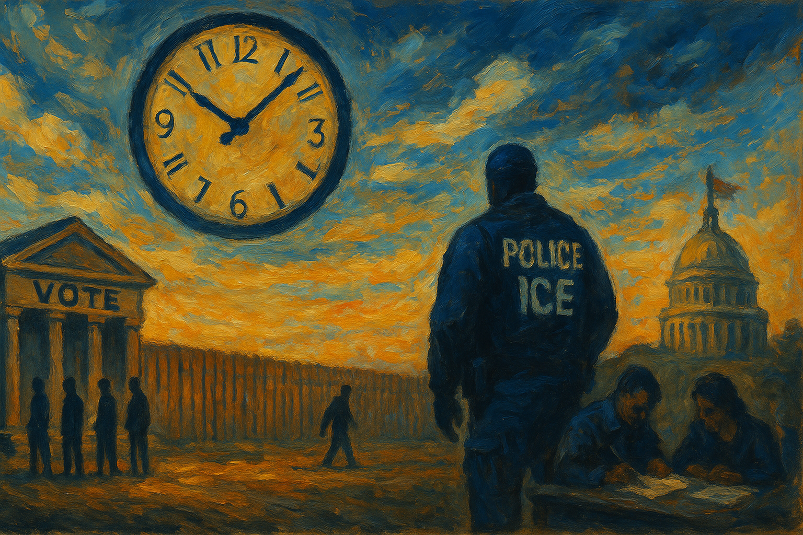

<!-- Generated by build_publish_week_v1 -->
<!-- Header image: image_wide_week79.png -->

# Week 79: War Powers Ignored, Casualties Rewritten

*As the president escalated an undeclared war and the Pentagon revised its own death toll, courts and states supplied the week's sharpest resistance.*

At the close of Week 78, the Democracy Clock stood at 7:41 p.m. This week it slipped back one fifth of a minute, to 7:40 p.m. The movement was small, almost invisible against the scale of what happened. That gap between the size of events and the size of measured harm is itself part of the week's story.

Two forces pulled against each other. The executive branch widened its grip on war, information, and dissent. Mostly these were incremental extensions of old patterns, not new departures. Courts kept doing what they had done in prior weeks: blocking, delaying, occasionally reversing specific actions. The result was a wash, not a rout. The clock's tiny backward tick reflects friction more than rupture. Democratic machinery groaned under pressure but did not give way further than it already had.

The dominant thread was the war with Iran, which entered its most volatile phase without ever receiving a formal declaration. The president escalated in public, through interviews and social media, rather than through deliberation. He told Israeli media he was close to ordering a massive new attack, larger than anything before it. He threatened to bomb a bridge or power plant in Tehran for every Iranian strike in the Strait of Hormuz. He warned Iran would pay "many times over" for American deaths. Each statement functioned as policy. Each was announced before Congress had been briefed on scope or objective.

Congress tried, twice, to reassert its constitutional role. The House passed a war powers resolution directing withdrawal from the conflict. When the White House ignored it, the House passed a second one. The Senate came close to matching that resolve, rejecting a companion measure by only two votes—the margin between an assertion of legislative authority and its absence. The House also could not get real answers from the Pentagon. Officials could not justify, even in closed briefings, why they needed eighty-eight billion dollars in emergency war funding, later trimmed to sixty-seven billion. The war proceeded on executive say-so; Congress could not evaluate the bill, and could not refuse it.

Alongside the war's expansion came a quieter but equally serious failure: the Pentagon's handling of its own casualty figures. Early in the conflict, three Iranian strikes on American forces in Jordan went undisclosed. CENTCOM's later statements omitted mention of the wounded. Then, midweek, the casualty database was altered outright, dropping the toll from eighteen dead to fourteen by excluding deaths that fell after a declared ceasefire. No credible explanation followed. Journalists and even military sources raised alarms. The number of Americans killed in an active war is not a technical detail. When that number can be revised downward for convenience, the public loses its most basic tool for judging the cost of a war it is funding.

The dissonance sharpened around the treatment of the war dead themselves. At a dignified transfer ceremony at Dover Air Force Base, the president attributed political opinions to service members who could not speak for themselves. Around the same time, he posted a chart celebrating the war's death toll as an achievement. The effect, whatever the intent, was to turn mourning into messaging. The memory of the fallen reinforced a story of success even as the Pentagon quietly shrank their number.

Domestically, the immigration enforcement apparatus kept operating with almost no internal check. The FBI halted its investigations into fatal ICE shootings. One of the agents involved in a deadly encounter had a documented history of domestic violence, a fact that should have kept him off field duty long before he killed a Colombian immigrant in Maine. Of fifty-six excessive-force complaints against ICE officers, only one led to a disciplinary referral. Body cameras, promised after the shootings, remained on fewer than a quarter of the twelve thousand officers a year after the policy's adoption. When the agency briefly suspended vehicle stops as a safety measure, the president personally ordered them resumed. Enforcement volume outweighed the caution his own agency had just judged necessary.

The same posture extended to prosecution. More than five hundred fifty people swept up in immigration operations were charged with assaulting federal agents. Nearly half of those cases collapsed once examined; evidence often showed officers, not civilians, had struck first. The Justice Department activated a decades-dormant court built to hear secret evidence against alleged alien terrorists, filing its first case this week. Together, these moves built a legal architecture in which immigrants and bystanders bore the burden of proof, while armed agents bore almost none.

Surveillance reached further than enforcement alone. A lawsuit filed by a privacy watchdog revealed an unpublished Department of Homeland Security policy tracking people who merely observed ICE operations. It used biometric data collection and retaliatory revocation of travel privileges, like Global Entry, for those photographed nearby. Citizens who watched government agents work in public space became subjects of a secret surveillance program for doing so. This is not enforcement against crime. It is enforcement against witnessing.

Voting rights faced a parallel, procedural assault. House Republicans folded a nationwide mail-ballot ban and strict voter identification rules into a ninety-five-billion-dollar reconciliation package built around Iran war funding and farm aid. A separate, trillion-dollar defense authorization bill carried similar voting-restriction language. Neither measure could likely have survived a standalone vote. Bundling let both proceed on largely party-line support, smuggling election policy past ordinary scrutiny inside must-pass legislation. In Arizona, candidates who had challenged the 2020 election results won Republican primaries for governor and the state's top election post. In Tennessee, a federal panel declined to block a new congressional map that splits a majority-Black district in Memphis into three pieces, letting it stand for the state's August primary under a weakened Voting Rights Act.

Federal money became a lever of its own. FEMA and the Department of Homeland Security conditioned more than seven hundred forty million dollars in disaster and security grants on states adopting federal election-verification and immigration-enforcement mandates. Twenty-five state attorneys general sued in response, arguing that emergency funds appropriated for disaster relief cannot be converted into leverage over state policy. It was one of the week's clearest examples of federal power turned against resisting jurisdictions, and one of the clearest examples of resistance organizing to stop it.

Family enrichment ran through the week's foreign policy like a fault line. Jared Kushner's private equity fund kept receiving Saudi sovereign wealth money, including a fresh two-billion-dollar infusion, even as he personally negotiated a thirty-year nuclear agreement with the same government, one reportedly lacking standard international safeguards. The administration separately overrode Commerce Department security objections to grant the United Arab Emirates broad access to advanced semiconductors. That country's sovereign fund had also invested heavily in Kushner's firm. Major outlets, by their own later admission, largely failed to connect these financial ties to the policy decisions they shaped. A new Pentagon investment unit, established this same week and overseeing tens of billions of dollars, was staffed by officials with their own private-equity conflicts. Public power and private profit moved through the same channels, almost unremarked.

Retaliation against scrutiny took several forms. The Justice Department subpoenaed phone records belonging to New York Times reporters and their relatives over reporting about Air Force One security, then withdrew the subpoenas once challenged. The president defended the practice anyway, claiming without evidence that past administrations had done the same. House Judiciary Chair Jim Jordan referred former Special Counsel Jack Smith, who had investigated the president, for criminal prosecution over alleged discrepancies in his congressional testimony. The administration also threatened to revoke the broadcast licenses of outlets whose coverage displeased it, drawing condemnation from more than five hundred journalists. None of these actions fully succeeded, but all of them raised the cost of independent scrutiny.

Historical memory came under more formal pressure than in recent weeks. An executive order directed federal agencies to install signage at the Smithsonian criticizing existing exhibits as ideologically captured, steering visitors toward narratives the administration preferred. Separately, the White House tried to route a repainting project at the Eisenhower Executive Office Building through an office exempt from historic preservation and environmental review, sidestepping laws built to protect the public record of federal buildings. Neither action rewrote history outright. Both asserted a new executive claim to shape how history is presented and preserved.

Against this accumulation, courts supplied the week's most consistent counterweight. A federal judge found FDA restrictions on the abortion medication mifepristone arbitrary and unsupported by evidence, ordering reconsideration. The Fourth Circuit rejected an attempt to redetain a Georgetown scholar held over pro-Palestinian speech, upholding his release on habeas grounds. Another judge blocked the termination of work authorization for tens of thousands of asylum seekers and TPS holders. A federal judge dismissed the Republican National Committee's demand for sensitive New Jersey voter data, finding no legitimate basis for the request. None of these rulings reversed the week's larger trajectory, but each one held a specific line.

Economic strain deepened as a backdrop to all of it. Gasoline prices pushed past four dollars a gallon. Crude oil inventories fell to a forty-five-year low. New tariffs on Canada and dozens of other countries, imposed by executive proclamation rather than legislation, threatened further price increases, even as the administration's own trade representative denied, under Senate questioning, that tariffs were raising costs for American families. Small businesses sued to challenge the tariffs as exceeding presidential trade authority, joining a growing docket of litigation testing the limits of unilateral economic power.

No single moment this week broke the frame that has held since the term began. What continued was the pattern already visible: war conducted by announcement rather than authorization, casualty figures adjusted for convenience, immigrants and observers treated as threats while armed agents faced no accountability, voting rights narrowed through procedural bundling, and family wealth interwoven with national security decisions the press largely failed to examine. Courts kept intervening. State attorneys general kept suing. House majorities kept passing resolutions the executive could safely ignore. The clock's small retreat this week reflects not resolution, but stalemate—erosion and resistance each canceling a fraction of the other's force. Whether that stalemate holds through the coming months of an undeclared war remains, as of this week, unanswered.

<!-- Synopses for cross-posting -->
Long Synopsis: In Week 79 the Democracy Clock moved only slightly, from 7:41 p.m. to 7:40 p.m., a small shift masking a week of intense strain. The president escalated the undeclared war with Iran through public threats rather than deliberation, while the Pentagon altered its own casualty database, dropping the death toll from eighteen to fourteen. Congress twice passed war powers resolutions the executive ignored; the Senate fell two votes short of matching that resolve. Immigration enforcement continued with almost no internal accountability, and House Republicans folded voting restrictions into must-pass war-funding bills. Jared Kushner's Saudi financial ties shaped a nuclear agreement largely unexamined by major outlets. Courts provided the week's most consistent resistance, blocking several executive actions, while state attorneys general sued over coercive federal funding conditions. The stalemate between erosion and resistance held, but its durability through an undeclared war remains uncertain.
Short Synopsis: An undeclared war expanded through presidential threat and altered casualty data, while Congress's resolutions went unheeded. Courts and state lawsuits supplied the week's clearest resistance, holding specific lines even as voting rights, press freedom, and enforcement accountability all came under pressure.

