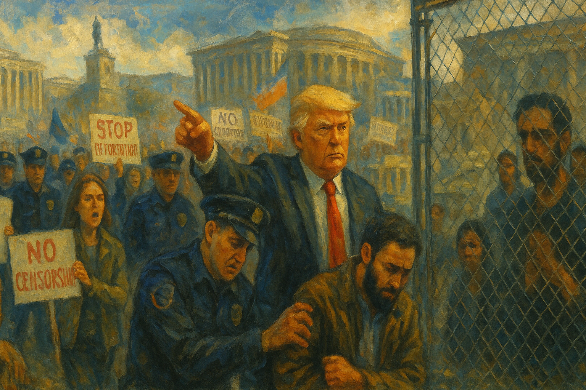

<!-- Generated by build_publish_week_v1 (appendix post) -->
<!-- Header image: image_wide_week8_appendix.png -->

# Week 8 Appendix: Citizenship and Service as Leverage

*A week of quiet decrees and targeted enforcement hollowed institutions, stratified belonging, and turned law and budgets into tools of loyalty and fear.*

This week shows an aggressive consolidation of executive power, heavy politicization of the civil service, and systematic weaponization of law and immigration against dissenters and minorities. Trump and Musk’s DOGE apparatus drive mass firings, lease terminations, and deep cuts across education, science, public health, and social welfare, while courts begin to push back—ordering reinstatement of thousands of workers, blocking teacher-training cuts, and forcing DOGE transparency. Immigration enforcement is overtly repurposed to punish pro‑Palestinian activism, with Khalil’s detention under a foreign‑policy pretext, visa revocations, family detention, and plans to invoke the Alien Enemies Act. Simultaneously, the administration seeks to end birthright citizenship, normalize emergency powers around tariffs and the border, and retaliate against disfavored law firms. Internationally, the US abandons climate and anti‑corruption leadership, escalates trade wars with allies, flirts with NATO withdrawal, and aligns more openly with Russian aims. Civil society mobilizes—mass protests, town halls, watchdog tools like the Musk Watch tracker—but faces surveillance, subpoenas, and delegitimization as “terrorists.” Structurally, this is a high‑pressure week of authoritarian drift, partially checked by an increasingly assertive judiciary.

Power and Authority

1. President Donald Trump ordered transgender women in federal custody transferred to men's prisons despite court rulings (2025-03-08): The order overrode prior court blocks and placed transgender women in men's facilities, signaling willingness to defy judicial limits and exposing a vulnerable group to heightened risk from state power.

2. President Donald Trump and the Department of Government Efficiency expanded centralized presidential control over agencies and empowered Elon Musk to drive deep federal downsizing (2025-03-08): By delegating sweeping restructuring authority to a presidentially aligned unit, the administration concentrated operational power in the executive, weakening traditional bureaucratic and congressional checks.

3. President Donald Trump signed an executive order creating a taxpayer-backed US Crypto Reserve (2025-03-08): The new reserve used public funds to bolster a politically connected industry, blending state financial power with private crypto interests and raising concerns about capture of economic policy.

4. President Donald Trump pardoned individuals convicted for the January 6 Capitol attack (2025-03-08): The pardons signaled leniency toward political violence carried out on his behalf, weakening deterrence for future attacks on democratic institutions and undermining equal application of the law.

5. Department of Homeland Security eliminated union protections for tens of thousands of TSA employees (2025-03-09): Stripping collective bargaining rights from frontline security staff reduced worker voice in a key security agency and demonstrated use of executive power to weaken organized labor in the public sector.

6. Department of Health and Human Services offered large buyouts to tens of thousands of employees during a measles outbreak (2025-03-09): Mass voluntary buyouts in the middle of a public health emergency risked hollowing out response capacity, illustrating how executive-driven staffing cuts can endanger basic protections.

7. Social Security Administration changed overpayment recovery rules to allow 100% benefit withholding (2025-03-09): Authorizing full benefit clawbacks from overpaid recipients, regardless of fault, gave the agency harsh collection power over vulnerable beneficiaries, heightening economic precarity for many.

8. Treasury Secretary Scott Bessent announced an administration goal to shrink and privatize federal services (2025-03-09): Framing privatization as a core response to economic strain signaled a strategic shift away from public provision of key services, with implications for accountability and universal access.

9. President Donald Trump publicly defended Elon Musk and labeled Tesla protesters as domestic terrorists (2025-03-12): Branding peaceful corporate critics as terrorists used presidential rhetoric to delegitimize dissent and protect an allied billionaire, potentially chilling protest activity.

10. President Donald Trump declared a national emergency at the southern US border (2025-03-14): The border emergency expanded unilateral authority over immigration and funding, normalizing emergency tools for long-term policy goals and sidestepping ordinary legislative processes.

11. President Donald Trump ended birthright citizenship by executive action (2025-03-14): Unilaterally revoking automatic citizenship for US-born children of noncitizens challenged long-settled constitutional norms and created a stratified system of membership tied to parentage and status.

12. President Donald Trump terminated federal diversity programs across the government (2025-03-14): Eliminating diversity initiatives reduced institutional support for inclusion and equal opportunity within federal workplaces, weakening tools to address systemic discrimination.

13. President Donald Trump ordered release of water from California dams under disputed justifications (2025-03-14): The directive, apparently misaligned with operational realities, highlighted how presidential intervention in resource management can be driven by narrative rather than evidence, complicating accountable stewardship.

14. President Donald Trump issued an executive order to continue reducing the federal bureaucracy by dismantling non-statutory components of multiple agencies (2025-03-14): Targeting several independent and grant-making entities for elimination concentrated discretion in the executive over which public functions survive, weakening pluralistic institutional infrastructure.

15. President Donald Trump issued an executive order directing punitive restrictions on the law firm Paul Weiss (2025-03-14): Using national security powers to strip clearances and contracts from a disfavored firm blurred lines between public authority and personal vendetta, pressuring independent legal actors.

16. President Donald Trump rescinded multiple Biden-era executive orders across public health, labor, climate, and rights policy (2025-03-14): The sweeping rollback reoriented federal priorities on health, environment, labor, and civil rights through unilateral action, underscoring how much policy rests on reversible executive directives.

Institutions and Governance

1. Representative Terri Sewell and House Democrats reintroduced the John R. Lewis Voting Rights Advancement Act (2025-03-08): The bill sought to restore preclearance and strengthen federal review of discriminatory voting changes, aiming to rebuild institutional safeguards against racial voter suppression.

2. Federal Election Commission scheduled a public Sunshine Act meeting to consider an advisory opinion request (2025-03-10): The open meeting on campaign law guidance reflected ongoing use of formal, transparent procedures in federal election oversight.

3. House Republicans and former President Donald Trump advanced a Trump-backed continuing resolution with deep non-defense cuts to avert a shutdown (2025-03-10): The stopgap bill preserved government operations but shifted spending toward defense and enforcement, illustrating how budget brinkmanship can be used to reshape policy priorities.

4. Wyoming legislature passed multiple bills restricting transgender rights in sports and public facilities (2025-03-10): The package of laws used state legislative power to narrow participation and access for transgender people, embedding contested social policy into institutional rules.

5. Federal Election Commission canceled a scheduled open meeting (2025-03-14): Calling off a public FEC session reduced near-term transparency around campaign-regulation decisions, limiting opportunities for public observation and input.

6. House Republicans passed a measure redefining days to block congressional termination of Trump’s tariff emergency (2025-03-13): By manipulating how statutory days are counted, the House insulated an emergency declaration from timely disapproval, weakening Congress’s practical check on executive trade powers.

7. Congress used the Congressional Review Act to overturn an EPA methane waste emissions charge rule (2025-03-14): The disapproval blocked a climate-related fee on oil and gas emissions, showing how legislative oversight can be used to dismantle regulatory tools for environmental accountability.

8. Congress enacted a resolution disapproving a rule on protection of marine archaeological resources (2025-03-14): Overturning the marine archaeology rule demonstrated Congress’s willingness to narrow agency authority over environmental and cultural resource protections.

9. Senate Democratic leadership agreed to advance and support the House continuing resolution to avoid a shutdown despite internal opposition (2025-03-14): Democratic leaders backed a Republican-authored funding bill to keep government open, trading policy leverage for institutional continuity and exposing intra-party divisions over strategy.

10. House subcommittee chair Keith Self misgendered Representative Sarah McBride and adjourned a foreign affairs hearing amid dispute (2025-03-12): The abrupt adjournment over a discriminatory remark derailed oversight on arms control and assistance to Europe, illustrating how culture-war conflicts can disrupt substantive legislative work.

11. House Republicans held a hearing to consider weakening the Endangered Species Act and Marine Mammal Protection Act (2025-03-11): The oversight session explored easing environmental safeguards to speed industrial projects, signaling legislative interest in rebalancing statutory protections toward development.

12. Federal courts and Democratic state attorneys general pursued and won discovery orders requiring DOGE and Elon Musk to produce internal records (2025-03-13): Judicial orders compelling disclosure about DOGE’s authority and operations strengthened external oversight of a powerful quasi-administrative unit operating from the White House.

13. Census Bureau canceled multiple advisory committee meetings related to the 2030 Census and racial and ethnic populations (2025-03-13): Scrapping planned advisory sessions reduced structured input from experts and communities into census planning, potentially affecting representation and resource allocation decisions.

14. Department of Education abolished more than half of its Civil Rights Division offices (2025-03-11): Eliminating much of the department’s civil-rights enforcement infrastructure weakened federal capacity to investigate discrimination in schools and colleges nationwide.

15. Department of Education under Secretary Linda McMahon laid off roughly half of its workforce in a mass firing (2025-03-12): The large-scale staff reduction, framed as efficiency, severely constrained the department’s ability to administer aid and enforce education laws, and advanced a stated goal of winding the agency down.

16. Coalition of Democratic state attorneys general sued to block the Education Department’s mass layoffs as unconstitutional and illegal (2025-03-13): The lawsuit argued that halving the department’s staff crippled its congressionally mandated functions, turning to the courts to defend agency capacity and separation of powers.

17. Federal judges William Alsup and James Bredar ordered reinstatement of tens of thousands of purged probationary federal employees (2025-03-13): The injunctions found the DOGE-driven mass firings likely unlawful and forced agencies to offer jobs back, reinforcing legal protections for civil servants against politicized purges.

18. Federal judiciary blocked Trump administration cuts to teacher training funds via temporary restraining orders (2025-03-12): By halting large reductions in teacher training grants, courts preserved programs addressing shortages and signaled that executive budget moves must comply with statutory and constitutional limits.

19. Federal courts demanded evidence from EPA to justify cancellation of multibillion-dollar climate grants (2025-03-13): Requiring the agency to substantiate claims of wrongdoing before voiding grants reinforced procedural safeguards around major funding decisions and constrained arbitrary reversals.

20. U.S. District Judge Beryl Howell temporarily blocked most of an executive order punishing law firm Perkins Coie (2025-03-12): The ruling found the order resembled an unconstitutional bill of attainder, curbing the president’s attempt to single out a disfavored firm and protecting independent legal representation.

21. Law firm Perkins Coie filed suit challenging an executive order that stripped its lawyers’ clearances and access (2025-03-12): The lawsuit contested targeted executive retaliation against a private firm, testing judicial willingness to police abuses of national security rationales.

22. Federal courts and Judge Tanya Chutkan ordered DOGE and Elon Musk to disclose staff identities and cost-cutting records (2025-03-13): Compelling detailed discovery into DOGE’s structure and decisions aimed to clarify whether a powerful quasi-agency is operating within constitutional and statutory bounds.

23. Federal courts and Judge William Alsup criticized the administration’s explanations for mass firings as a sham (2025-03-14): Judicial skepticism toward the stated performance-based rationale for purges underscored the role of courts in exposing pretext when executive actions target the civil service.

24. Federal courts ruled that the Department of Government Efficiency is likely subject to FOIA (2025-03-10): Bringing DOGE under public records law extended transparency obligations to a powerful, previously opaque coordinating body inside the executive branch.

25. EPA administrative judiciary denied a petition to set aside a Clean Water Act consent agreement (2025-03-13): Upholding the consent order maintained an existing enforcement settlement and illustrated internal adjudicatory processes for environmental compliance disputes.

Economic Structure

1. Department of Government Efficiency and Elon Musk implemented cuts that reduced basic services for US government staff abroad while funding office luxuries (2025-03-08): Shifting resources from core communications and utilities to high-end amenities for officials reflected priorities that may degrade state capacity while benefiting insiders.

2. Environmental Protection Agency and DOGE required DOGE approval for any EPA spending over $50,000 (2025-03-08): Centralizing mid-level spending decisions in a politically aligned efficiency office curtailed agency autonomy and gave a private-aligned actor leverage over environmental operations.

3. Trump administration cut federal funding for drug detection technology and international container control programs (2025-03-08): Reducing support for border detection tools and cooperative programs weakened the state’s ability to interdict synthetic drugs, with public health and security consequences.

4. Trump administration slashed USAID funding for programs addressing root causes of the drug trade and violence (2025-03-08): Cutting prevention and development programs undermined long-term strategies to reduce crime and migration pressures, shifting costs back onto communities and enforcement systems.

5. Trump administration pursued aggressive tariff policies that contributed to market volatility and recession fears (2025-03-08): Broad tariffs and public rhetoric blaming “globalists” coincided with sharp stock declines and uncertainty, illustrating how trade shocks can destabilize the broader economy.

6. Trump administration cut defense production and science funding and canceled industrial policies supporting factory construction (2025-03-08): Rolling back support for defense manufacturing, research, and industrial strategy risked weakening both national security capacity and long-term economic competitiveness.

7. Trump administration tolerated money laundering and weakened financial enforcement priorities (2025-03-08): A permissive stance toward money laundering undermined the integrity of the financial system and signaled that well-connected actors might evade meaningful scrutiny.

8. Veterans Administration under Secretary Doug Collins planned to cut about 80,000 jobs, many held by veterans (2025-03-10): Eliminating a fifth of the VA workforce threatened both veteran employment and the quality and timeliness of care for millions relying on the agency.

9. Veterans Administration required therapists to conduct mental health sessions in open cubicles due to an end to remote work (2025-03-10): Forcing confidential counseling into non-private spaces risked violating privacy laws and deterring veterans from seeking care, trading service quality for rigid workplace rules.

10. Trump administration cut millions from federal cybersecurity initiatives including election infrastructure support (2025-03-10): Reducing funding for cyber defenses, particularly for state and local election systems, increased vulnerability to digital attacks on critical democratic infrastructure.

11. Trump administration and Department of Education canceled $400 million in federal funding to Columbia University over antisemitism findings (2025-03-11): The unprecedented grant termination used federal purse power to pressure a university’s handling of campus speech and safety, raising concerns about politicized funding decisions.

12. U.S. Department of Agriculture cut over $1 billion from local food purchasing programs for schools and food banks (2025-03-11): Eliminating major local food initiatives reduced support for small producers and threatened nutrition access for children and food-insecure families.

13. National Institutes of Health eliminated or restricted funding for dozens of studies on vaccine confidence (2025-03-13): Cutting research into why vaccination rates are falling limited evidence needed to design effective public health interventions amid rising preventable disease risk.

14. Department of Health and Human Services under Robert F. Kennedy Jr. planned clinical trials of unproven measles treatments while canceling key vaccine advisory meetings (2025-03-13): Redirecting resources toward unvalidated therapies and disrupting normal vaccine review processes risked undermining evidence-based policy and worsening an active measles outbreak.

15. Trump administration canceled $800 million in federal medical research grants to Johns Hopkins University (2025-03-13): Pulling large research grants from a leading institution weakened national biomedical capacity and signaled vulnerability of long-term science funding to political shifts.

16. Environmental Protection Agency under Administrator Lee Zeldin announced 31 actions to roll back environmental regulations including EV and coal plant rules (2025-03-13): The sweeping deregulatory package favored fossil fuel and industrial interests over environmental and health protections, illustrating regulatory capture risks.

17. Department of Government Efficiency moved to terminate 793 federal building leases to cut costs (2025-03-14): Mass lease cancellations aimed at savings forced agencies to relocate or consolidate, potentially disrupting service delivery and access for the public.

18. Trump administration cut off global food and emergency aid and dismantled USAID’s operational capacity (2025-03-08): Curtailing humanitarian and development aid reduced US support for crisis response and democracy abroad, while weakening a key instrument of soft power.

19. Trump administration implemented 25% tariffs on all imported steel and aluminum and threatened higher rates on Canada (2025-03-12): The broad metal tariffs and threats of 50% duties on Canadian imports triggered retaliatory measures and market declines, using trade policy in a confrontational, high-risk manner.

20. President Donald Trump threatened a 200% tariff on EU wines and champagnes in response to EU whiskey tariffs (2025-03-13): The retaliatory tariff threat escalated a transatlantic trade dispute and raised conflict-of-interest concerns given Trump’s own wine business.

21. European Union announced up to €26 billion in counter-tariffs on US goods in response to Trump’s metal tariffs (2025-03-12): The EU’s large countermeasures deepened the trade war, amplifying economic uncertainty for exporters and workers on both sides.

22. Elon Musk and the Department of Government Efficiency overstated claimed federal savings by an estimated 92% according to an external tracker (2025-03-12): Inflating reported budget cuts distorted public understanding of fiscal policy and masked the real scale and impact of reductions in public services.

23. Elon Musk publicly attacked the Musk Watch DOGE Tracker that documented overstated savings (2025-03-13): The personal attack on an independent fiscal watchdog sought to discredit scrutiny of DOGE’s numbers, discouraging critical evaluation of official economic claims.

24. Treasury Secretary Scott Bessent described economic hardship from administration policies as a necessary “de-tox period” (2025-03-08): Framing widespread economic pain as a cleansing phase normalized policy-induced shocks and signaled willingness to offload adjustment costs onto the public.

25. Congressional Budget Office warned that GOP budget targets would require deep cuts to major healthcare programs (2025-03-09): The analysis indicated that meeting proposed reductions would likely mean slashing Medicare, Medicaid, or CHIP, highlighting the distributive stakes of fiscal choices.

26. Trump administration closed applications for all income-driven student loan repayment plans and narrowed PSLF eligibility (2025-03-14): Shutting off access to income-based repayment and limiting forgiveness options increased financial strain on borrowers, especially public servants, and reduced a key social mobility tool.

27. Trump administration cut over $1 billion in local food purchasing for schools and food banks (2025-03-13): The cuts undermined local agriculture and removed a buffer against hunger for low-income families, shifting food insecurity risks back onto communities.

28. Federal agencies (EPA, OSHA, FCC, FDA, DEA, GSA, FAR councils) issued multiple technical rules, comment extensions, and debarment orders affecting safety, procurement, and drug regulation (2025-03-10): Routine regulatory actions on chemicals, workplace safety, communications, and controlled substances continued to shape the economic and compliance environment for firms and workers.

Civil Rights and Dissent

1. North Carolina Judge Jefferson Griffin challenged 2024 election results by seeking to discard over 65,000 ballots (2025-03-08): The attempt to invalidate tens of thousands of votes over registration technicalities in a race he lost raised concerns about partisan use of courts to disenfranchise voters.

2. Supreme Court of the United States previously struck down Voting Rights Act preclearance in Shelby County v. Holder, now cited in current analysis (2013-06-25): The earlier ruling, highlighted this week, removed federal review of voting changes in certain jurisdictions, enabling new state-level restrictions that disproportionately affect minority turnout.

3. Brennan Center for Justice researchers documented a widening racial turnout gap in Alabama after loss of preclearance (2025-03-08): The study showed that nonwhite turnout lagged far behind white turnout in formerly covered areas, evidencing real-world effects of weakened federal voting protections.

4. Trump administration and Secretary of State Marco Rubio used a rarely invoked foreign policy provision to detain and attempt to deport Palestinian activist Mahmoud Khalil (2025-03-10): Invoking foreign policy risk to target a lawful permanent resident for his campus activism blurred lines between immigration enforcement and punishment of political speech.

5. Immigration and Customs Enforcement detained a naturalized US citizen during a mass enforcement operation despite his documentation (2025-03-10): The detention of Jensy Machado, apparently based on appearance rather than status, highlighted risks of racial profiling and erosion of security even for naturalized citizens.

6. Senator Marco Rubio announced plans to revoke visas and green cards of people deemed to support Hamas (2025-03-09): The broad threat to immigration status based on perceived political sympathies risked conflating dissent with terrorism and chilling lawful expression among noncitizens.

7. Department of Homeland Security announced visa revocation for a Columbia student accused of supporting Hamas, leading to self-deportation (2025-03-13): Using immigration penalties tied to alleged political alignment rather than criminal charges raised due process and free speech concerns for student activists.

8. Trump administration resumed family detention for immigrants and reopened two Texas family detention centers (2025-03-12): Reinstating family detention reversed prior moves toward alternatives and exposed children and parents to conditions previously criticized as harmful and legally questionable.

9. Department of Justice under Trump issued a subpoena to a New York City migrant shelter hotel demanding resident identities and funding details (2025-03-12): The sweeping demand for data on undocumented residents and program funding risked deterring participation in city shelter programs and facilitated targeted enforcement.

10. Trump administration dramatically increased immigration arrests and detention, including many people without criminal convictions (2025-03-13): The surge in detentions after rolling back prioritization guidelines expanded the reach of immigration enforcement into everyday life, especially for non-criminal immigrants.

11. Trump administration planned to invoke the Alien Enemies Act to arrest and deport certain noncitizens without due process (2025-03-12): Reviving a wartime authority historically linked to internment threatened to bypass normal legal protections for targeted immigrant groups.

12. Immigration and Customs Enforcement deported the noncitizen parents of a US-citizen child recovering from brain cancer surgery (2025-03-12): Removing caregivers of a critically ill citizen child underscored the human costs of rigid enforcement and raised questions about humanitarian discretion.

13. Immigration officers at Logan Airport allegedly tortured and abused a New Hampshire green card holder during detention (2025-03-14): Reports of violent interrogation, sleep deprivation, and denial of medication against a lawful resident pointed to serious human rights violations within immigration enforcement.

14. Trump administration suspended the US refugee resettlement program (2025-03-14): Halting refugee admissions curtailed a longstanding humanitarian commitment and closed a key pathway to safety for people fleeing persecution.

15. Trump administration and Columbia University pressured and enabled disciplinary actions against students involved in 2024 pro-Palestinian protests (2025-03-11): Expulsions, suspensions, and diploma revocations following federal demands showed how government leverage can shape university responses to political protest.

16. Jewish Voice for Peace and New York City police saw nearly 100 protesters arrested at Trump Tower during a sit-in for Mahmoud Khalil’s release (2025-03-13): The mass arrests for trespass and obstruction at a high-profile protest highlighted tensions between direct action tactics and law enforcement responses in politically sensitive cases.

17. Elon Musk and Tesla critics faced nationwide protests at Tesla facilities over Musk’s policies and political role (2025-03-09): Coordinated demonstrations at corporate sites signaled growing public resistance to perceived oligarchic influence over government and policy.

18. Scientists, women’s rights advocates, and allied groups organized hundreds of protests nationwide against government cuts and policies (2025-03-10): Large coordinated marches for science and women’s rights demonstrated robust civic mobilization against perceived attacks on evidence-based policy and equality.

19. North Carolina Democrats and allied organizers planned rallies, gallery-packing, and protests at the state legislature and Tesla dealership (2025-03-10): These events used peaceful assembly and visibility tactics to pressure state lawmakers and corporate actors, reinforcing participatory channels outside formal elections.

20. Democratic Party organizations announced a series of “People’s Town Halls” in Republican-held swing districts (2025-03-14): Holding unofficial town halls where incumbents avoid constituents aimed to restore direct dialogue and accountability in districts with limited formal engagement.

21. Senator Bernie Sanders and United Auto Workers president Shawn Fain conducted a national tour on oligarchy and democracy (2025-03-10): The tour linked economic inequality to democratic erosion, mobilizing public debate about concentrated wealth and political power.

22. Trump administration and Department of Education Civil Rights Office issued warnings to 60 colleges over alleged antisemitic harassment with threat of enforcement (2025-03-11): The broad warnings signaled aggressive federal scrutiny of campus speech and conduct, raising questions about how civil-rights enforcement intersects with academic freedom.

23. Trump administration ended birthright citizenship and sought Supreme Court approval to enforce the change (2025-03-13): Moving to restrict citizenship for US-born children of noncitizens, and appealing injunctions, threatened to create a hereditary underclass and destabilize equal civic status.

24. Trump administration and DHS saw immigration enforcement deaths and dangers at the US-Mexico border during a storm (2025-03-14): The deaths of migrants in harsh terrain underscored the lethal risks of current border policies and the limits of humanitarian safeguards in enforcement operations.

25. Family of Monica Cameroni De Adams filed a $50 million claim against San Diego over an unhoused woman’s death in a towed van (2025-03-14): The claim alleged city negligence in failing to discover and aid an injured unhoused woman, spotlighting systemic risks faced by people living in vehicles.

26. Paula White, Director of the White House Faith Office called for challenging separation of church and state to reintroduce prayer and Bibles in public schools (2025-03-14): Her remarks signaled an official push to reshape constitutional doctrine on religion in public institutions, potentially narrowing religious freedom for non-adherents.

Information, Memory and Manipulation

1. Department of Homeland Security under Kristi Noem began polygraph testing employees to identify and prosecute alleged leakers about ICE raids (2025-03-08): Using intrusive lie-detector screenings to hunt leakers risked deterring whistleblowing and constraining internal channels for exposing abuses.

2. Immigration and Customs Enforcement and other federal agencies accessed license plate reader data in sanctuary jurisdictions for immigration enforcement (2025-03-11): Tapping local surveillance systems in areas that limit cooperation with ICE circumvented local policy choices and expanded quiet tracking of residents’ movements.

3. Elon Musk’s social media platform X suffered prolonged outages attributed to a DDoS cyberattack, prompting conspiracy speculation (2025-03-09): The disruption of a major political communication platform, followed by unsubstantiated claims about perpetrators, highlighted both infrastructure vulnerability and the ease of narrative manipulation.

4. Darren Beattie, senior State Department official deleted past abusive tweets about Secretary of State Marco Rubio after appointment (2025-03-10): Scrubbing inflammatory posts by a public diplomacy official raised questions about transparency and the curation of officials’ public records once in office.

5. Elon Musk’s DOGE website removed details that previously allowed independent verification of claimed budget cuts (2025-03-12): Making it harder to cross-check savings figures against federal data reduced fiscal transparency and increased reliance on official narratives.

6. Popular Information launched the Musk Watch DOGE Tracker to fact-check DOGE’s claimed savings (2025-03-13): The tracker exposed large discrepancies between claimed and verifiable cuts, providing an independent tool to scrutinize government cost-cutting rhetoric.

7. Robert F. Kennedy Jr. as HHS Secretary spread false claims about vaccine safety and effectiveness during a major measles outbreak (2025-03-13): Anti-vaccine statements from the nation’s top health official undermined trust in immunization programs and risked worsening preventable disease spread.

8. President Donald Trump repeated baseless claims that the 2020 election was rigged and called for jailing unnamed perpetrators (2025-03-14): Renewed falsehoods about past election fraud from a sitting president continued to erode public confidence in electoral legitimacy and framed political opponents as criminals.

9. President Donald Trump praised Judge Aileen Cannon for dismissing his classified documents case and suggested criticism of judges should be illegal (2025-03-14): Celebrating a favorable ruling while proposing to criminalize criticism of judges signaled a desire to shield the judiciary from public scrutiny when it benefits the executive.

10. Trump administration and USAID leadership ordered staff to shred or burn agency records despite federal preservation laws (2025-03-13): Directing destruction of official documents threatened the integrity of the historical record and future accountability for aid and foreign policy decisions.

11. Federal courts ruled that DOGE is likely covered by FOIA and ordered rolling production of its records (2025-03-11): Bringing DOGE under transparency law and compelling document releases countered efforts to keep a powerful coordinating body outside normal public scrutiny.

12. Federal Election Commission canceled an open meeting under the Government in the Sunshine Act (2025-03-14): The cancellation reduced short-term visibility into FEC deliberations, limiting opportunities for media and public to monitor campaign-regulation decisions.

13. Red Wine and Blue organized a public class explaining how the North Carolina General Assembly functions (2025-03-10): Providing civic education on state legislative processes aimed to equip residents with knowledge to engage more effectively in democratic governance.

14. Elon Musk made televised statements calling Social Security a “Ponzi scheme” and advocating workforce cuts at SSA (2025-03-11): Framing core social insurance as fraudulent from a position of influence shaped public narratives around entitlement programs and potential future cuts.

15. US Agency for Global Media and Trump administration faced defunding and shutdown of USAGM and its international broadcasters by executive order (2025-03-14): Defunding Voice of America and related outlets weakened US-backed independent media abroad and endangered journalists, while pleasing authoritarian rivals’ state media.

16. US Census Bureau canceled multiple scientific and advisory committee meetings on census planning and methods (2025-03-12): Halting expert advisory sessions risked reducing methodological rigor and stakeholder input into population data that underpins representation and funding decisions.

17. FDA and federal courts issued multiple debarment orders against individuals who falsified clinical data or imported illegal drugs (2025-03-13): Removing convicted fraudsters from drug-related work protected the integrity of clinical evidence and regulatory decision-making.

