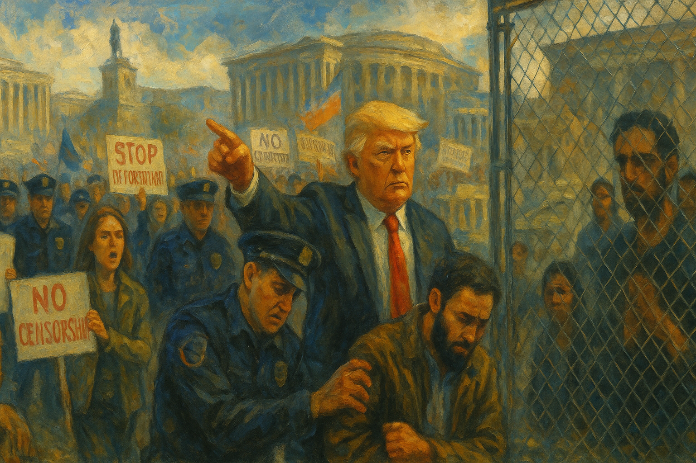

<!-- Generated by build_publish_week_v1 (appendix post) -->
<!-- Header image: image_wide_week8_appendix.png -->

# Week 8 Appendix: The Week the Executive Tested Its Limits

*Immigration law became a weapon against speech, law firms faced retaliation, and courts pushed back—sometimes successfully, sometimes not at all.*

Week 8 marks a sharp acceleration in executive consolidation, retaliatory law enforcement, and institutional dismantlement. The signature event—ICE's arrest and attempted deportation of Columbia activist Mahmoud Khalil, a lawful permanent resident, for pro-Palestinian speech—illustrates the weaponization of immigration law against protected expression, a pattern extended through subsequent visa revocations and dorm searches. Simultaneously, the administration moved to gut the Department of Education (1,300+ firings), disband DOJ anti-corruption and foreign-influence units, purge national security officials, and issue an executive order punishing a law firm (Paul Weiss) for its legal representation choices. Courts pushed back repeatedly—blocking deportations, ordering reinstatement of fired workers, and restraining the Perkins Coie order—demonstrating an active but strained judicial check. Economic policy featured tariff whiplash, market instability, and DOGE's continued disruption of federal operations, while foreign policy showed further alignment away from Ukraine and NATO allies toward Russia. Civil society response (protests, lawsuits, town halls) remained robust.

Power and Authority

1. Trump expanded presidential power through pardons, tariffs, and pro-Russia foreign policy shifts (2025-03-08) *[single source]*: A pattern of pardons, tariffs, and unilateral foreign-policy moves this week reflected continued concentration of executive authority with fewer checks.

2. Trump pardoned January 6 insurrectionists (2025-03-08): Continued reliance on pardons for people convicted of attacking the Capitol weakens accountability for political violence.

3. Trump signed executive order establishing a US Crypto Reserve (2025-03-08): A unilateral order restructuring federal policy toward cryptocurrency raised concerns about regulatory oversight and potential conflicts of interest.

4. DOGE staffers attempted to personally open dam pumps in California without authorization (2025-03-08): An improvised attempt by political appointees to seize operational control of federal infrastructure for a publicity event illustrates erosion of professional agency norms.

5. DOGE cut basic services for overseas government employees while spending on office appliances (2025-03-08) *[single source]*: Uneven cost-cutting that harmed frontline employee welfare while funding discretionary purchases raises questions about the real purpose of efficiency claims.

6. Trump fired the chair of the Joint Chiefs of Staff and other senior military leaders (2025-03-08): Removal of senior military leadership prompted a bipartisan call from former defense secretaries for oversight hearings, raising concerns about politicization of the armed forces.

7. White House published a promotional release listing claimed administration achievements for week seven (2025-03-08): An official communications document framed unverified statistics as accomplishments, illustrating use of government channels for partisan messaging.

8. White House issued proclamation designating March 9 as U.S. Hostage and Wrongful Detainee Day (2025-03-09): A symbolic proclamation asserted executive authority to designate national observances and framed hostage recovery as a presidential achievement.

9. White House published a compilation of Sunday show statements by administration officials (2025-03-09): Curated official messaging amplified unverified administration claims about tariffs, border enforcement, and government efficiency without independent scrutiny.

10. Pam Bondi disbanded Task Force KleptoCapture and paused Foreign Corrupt Practices Act enforcement (2025-03-10) *[single source]*: Dismantling anti-kleptocracy enforcement units weakens accountability for foreign and elite corruption, benefiting sanctioned actors and reducing oversight of illicit foreign money.

11. Pam Bondi disbanded the FBI's foreign influence taskforce (2025-03-10) *[single source]*: Eliminating the unit tasked with countering foreign disinformation weakens national defenses against outside interference in domestic politics.

12. White House published a fact sheet claiming 50 executive achievements in the first 50 days (2025-03-10): A sweeping self-promotional accounting of executive actions used official channels to shape public narrative without independent verification.

13. White House issued a memorandum directing agencies to seek bond requirements from courts issuing injunctions against the government (2025-03-11): The directive aims to raise financial barriers for parties seeking judicial review of executive action, potentially chilling legitimate legal challenges to the administration.

14. White House sent 51 nominations to the Senate for executive and diplomatic posts (2025-03-11): Mass nominations to senior positions shape the composition of federal agencies, subject to the constitutional check of Senate confirmation.

15. White House published fact sheet claiming tariff threats were driving corporate US expansion (2025-03-10): The administration framed tariff coercion as a policy success, asserting executive influence over corporate investment decisions outside legislative channels.

16. White House published fact sheet crediting Trump for a surge in corporate manufacturing investment announcements (2025-03-12): The administration used tariff threats and negotiations to claim credit for corporate investment shifts, illustrating executive influence over private economic decisions outside legislative oversight.

17. Trump addressed a Department of Justice gathering and publicly denounced former prosecutors and lawyers who investigated him (2025-03-14) *[single source]*: A sitting president's public attack on named prosecutors and lawyers at an official DOJ event signaled intent to use executive power for political retaliation against those who held him accountable.

18. Trump praised his lawyer for securing dismissal of a corruption case against New York's mayor (2025-03-14): Presidential involvement in dismissing a criminal case against a political ally raises concerns about politicization of prosecutorial independence.

19. White House published promotional release claiming week-eight administrative achievements (2025-03-14): Another curated self-promotional compilation of claimed executive wins used official channels to shape public perception without independent verification.

20. Paula White suggested the administration might challenge legal precedent on separation of church and state (2025-03-13) *[single source]*: A senior White House faith official's public suggestion of overturning church-state separation law signals potential executive pressure on constitutional norms governing religion in public institutions.

21. Executive Office of the President revised the 2022 Unified Command Plan for military command structures (2025-03-14): A presidential directive altering military command organization exercises core commander-in-chief authority with limited independent review.

Institutions and Governance

1. House Republicans unveiled a spending bill boosting defense funding while cutting non-defense programs (2025-03-08): A partisan approach to appropriations set up a confrontation over federal spending priorities affecting public services and government continuity.

2. Meidas staffers report described DOJ removal of three top National Security Division officials (2025-03-08): Replacing experienced career national-security officials with ideologically aligned appointees threatens the impartiality of federal law enforcement institutions.

3. Supreme Court rejected Trump's attempt to freeze nearly $2 billion in congressionally approved foreign aid (2025-03-08): The Court upheld a lower court's order forcing release of appropriated funds, reinforcing judicial and legislative checks on executive impoundment.

4. Trump administration dropped a landmark environmental justice case in Louisiana's 'Cancer Alley' region (2025-03-08) *[single source]*: Abandoning enforcement in a case protecting a heavily polluted community reduces regulatory accountability for industrial harm to vulnerable residents.

5. American Federation of Teachers plaintiffs moved to convert a temporary restraining order into a preliminary injunction against Treasury data access (2025-03-08): Ongoing litigation sought to block disclosure of personal data to DOGE, testing limits on unaccountable access to sensitive government records.

6. Storch v. Hegseth court scheduled a consolidated merits hearing rather than a preliminary injunction hearing (2025-03-08): A federal court's procedural decision shaped the pace of judicial review over a challenge to Defense Department policy.

7. Trump administration filed an emergency motion to stay district court proceedings in an immigration case (2025-03-08): The government sought appellate intervention to pause district court oversight of an immigration enforcement dispute.

8. HCR/Brennan Center historical retrospective recounted 1965 federal protection of Selma marchers (2025-03-08) *[single source]*: A historical account of federal intervention to protect civil-rights marchers underscores past government commitment to voting rights that contrasts with contemporary enforcement gaps.

9. HCR/Brennan Center historical retrospective recounted passage of the 1965 Voting Rights Act (2025-03-08): A historical account of the landmark Voting Rights Act highlights federal protections against racial discrimination in voting now weakened by subsequent rulings.

10. President Johnson (historical) addressed Congress urging passage of voting rights legislation (2025-03-08) *[single source]*: A historical retrospective on a 1965 presidential address illustrates a past era's federal commitment to combating systemic voter suppression.

11. Trump administration proposed a continuing resolution extending the prior budget for six months (2025-03-08) *[single source]*: Democrats argued the stopgap funding measure gave the executive branch outsized discretion over spending, reducing legislative control of the budget.

12. Jefferson Griffin continued efforts to invalidate over 65,000 ballots after losing a North Carolina judicial election (2025-03-08) *[single source]*: A losing candidate's ongoing challenge to certified results threatens electoral certainty and risks disenfranchising tens of thousands of voters.

13. HCR/Brennan Center historical retrospective recounted the Supreme Court's 2013 Shelby County v. Holder decision (2025-03-08): A retrospective on the ruling that struck down federal preclearance requirements highlights ongoing consequences for minority voter access.

14. Brennan Center study found Alabama's racial voter turnout gap grew fastest in formerly covered jurisdictions (2025-03-08) *[single source]*: New research documents the ongoing suppression effect from the loss of federal preclearance oversight on minority voter turnout.

15. HHS offered buyouts of up to $25,000 to about 80,000 employees (2025-03-09): A mass buyout offer at a major public-health agency signals significant workforce downsizing that could weaken government service capacity.

16. Leland Dudek retracted a Social Security Administration order requiring in-person newborn registration (2025-03-09): A quick reversal followed public backlash over a policy that would have created barriers for new parents seeking benefits.

17. Social Security Administration changed policy to withhold 100% of benefits for overpayments (2025-03-09) *[single source]*: A harsher clawback policy risks severe financial hardship for beneficiaries, many of whom depend on the program for basic subsistence.

18. Congressional Budget Office reported that Republicans would need to cut Medicare, Medicaid, or CHIP to meet budget targets (2025-03-09): An official budget analysis warned that proposed spending cuts would require reductions to major health programs relied on by vulnerable Americans.

19. Nathan Hochman moved to withdraw a resentencing motion for the Menendez brothers (2025-03-09) *[single source]*: A new district attorney's reversal of a predecessor's legal position affects the judicial process and parole prospects in a closely watched case.

20. Trump administration fired Adam Cohen, head of the Organized Crime Drug Enforcement Task Forces (2025-03-09): Removal of a senior law enforcement official raises concerns about political interference with agencies tasked with combating organized crime.

21. Democracy Docket analysis examined Trump firings targeting the Humphrey's Executor precedent protecting independent agencies (2025-03-10): Legal analysis flagged that a series of firings could challenge decades-old precedent limiting presidential removal power over independent regulators.

22. federal judge (D. Mass.) blocked planned cuts to federal teacher-training funding (2025-03-10): A court order halted funding cuts that would have worsened a nationwide teacher shortage, preserving federal support for education programs.

23. Christopher Cooper ordered DOGE to release internal records under transparency law (2025-03-10) *[single source]*: A federal judge required disclosure of documents from a powerful but opaque cost-cutting office, reinforcing statutory transparency obligations.

24. Thomas Varlan ruled that a presidential pardon did not cover a separate FBI murder plot conviction (2025-03-10): A federal judge clarified limits on presidential pardon power, upholding accountability for a plot to kill federal agents unrelated to the pardoned offense.

25. Supreme Court denied a multi-state motion to file a bill of complaint over interstate energy policy (2025-03-10): The denial left plaintiff states without a direct judicial forum for their constitutional dispute over energy regulation.

26. Supreme Court granted certiorari and remanded a property-restitution case in light of new state legislation (2025-03-10): The Court's decision to send a case back to a lower court for reconsideration reflects ordinary judicial process affecting legal remedies.

27. Wilcox v. Trump litigation government sought emergency stay pending appeal in a case over agency removal power (2025-03-10): Ongoing litigation over an independent agency member's firing tests the boundaries of executive removal authority.

28. Judge Abelson clarified an injunction to apply government-wide against diversity-officer restrictions (2025-03-10): A court broadened the scope of an injunction to cover all federal executive agencies, reinforcing judicial checks on a contested policy.

29. Trump administration appealed a preliminary injunction in a New York immigration-related case (2025-03-10): The government's notice of appeal continued a pattern of contesting adverse rulings limiting executive immigration actions.

30. Judge Ali ordered payment of nearly $2 billion in foreign assistance for pre-cutoff work while permitting later contract terminations (2025-03-10): A split ruling partially enforced payment obligations for foreign aid contracts while allowing continued executive discretion over new terminations.

31. Trump administration sought to partially dissolve an injunction covering a Treasury IT hire (2025-03-10): Government filings argued that new hiring safeguards addressed a court's concerns about unauthorized access to Treasury payment systems.

32. PFLAG v. Trump litigation parties disputed whether federal notices threatened funding for gender-affirming care providers (2025-03-10): Ongoing litigation tested whether administration funding notices constituted coercive threats against healthcare providers in violation of a standing injunction.

33. AFGE plaintiffs moved for summary judgment asserting constitutional and statutory violations in federal firings (2025-03-10): A union lawsuit argued that mass federal firings violated the Constitution and Administrative Procedure Act, seeking judicial resolution.

34. William H. Alsup granted a preliminary injunction ordering reinstatement of thousands of fired probationary federal workers (2025-03-12) *[single source]*: A federal judge found the government's stated justifications for mass firings false, ordering reinstatement across multiple agencies and restraining further terminations.

35. James Bredar issued a temporary restraining order blocking further federal firings at 18 agencies (2025-03-14) *[single source]*: A second federal judge found the government likely engaged in an unlawful scheme in mass firings, ordering reinstatement across additional departments.

36. Beryl Howell blocked enforcement of an executive order punishing law firm Perkins Coie (2025-03-12): A federal judge found the punitive order against a law firm violated First Amendment protections, comparing it to an unconstitutional bill of attainder.

37. Tanya Chutkan issued a restraining order demanding evidence from EPA over cancelled climate grants (2025-03-12) *[single source]*: A federal judge required the administration to justify abrupt cancellation of billions in climate research funding, testing procedural limits on agency action.

38. Tanya Chutkan ordered Musk and DOGE to produce records on cost-cutting operations (2025-03-12): A court compelled disclosure from an informal but powerful office wielding government authority without Senate-confirmed leadership.

39. Robert Morris was indicted on five counts of lewd or indecent acts with a child (2025-03-12): A former spiritual adviser to the president faced serious criminal charges from decades-old allegations, testing accountability for figures close to political power.

40. Democratic attorneys general filed lawsuit to block Department of Education cuts (2025-03-13) *[single source]*: A coalition of states sued to halt mass layoffs, arguing the cuts were unconstitutional and would harm students with special needs and low-income households.

41. Trump administration asked the Supreme Court to allow enforcement of an order restricting birthright citizenship (2025-03-13): The administration sought to narrow lower-court injunctions blocking a policy that challenges the constitutional guarantee of birthright citizenship.

42. Congress enacted joint resolutions disapproving marine archaeological and methane emissions rules (2025-03-14): Congress exercised its Congressional Review Act authority to overturn two federal regulations, illustrating legislative oversight of agency rulemaking.

43. Chuck Schumer initially rejected then reversed to support a Republican-authored funding bill (2025-03-12): Shifting Senate Democratic leadership positioning on a stopgap funding bill reflected internal party tension over how to check executive spending discretion.

44. House Republicans passed a Trump-backed continuing resolution funding the government through September (2025-03-11): A near party-line vote advanced a spending bill increasing military funding while cutting non-defense programs, moving the government away from a shutdown.

45. House Republicans passed a measure preventing Congress from challenging Trump's tariff emergency declaration (2025-03-12): A procedural maneuver effectively blocked legislative review of an emergency tariff declaration, reducing congressional checks on trade policy.

46. Senate advanced the House continuing resolution through a cloture vote (2025-03-13): Ten Senate Democrats joined Republicans to move the funding bill forward, sparking internal party controversy over conceding to executive spending priorities.

47. Keith Self adjourned a House hearing after misgendering the first openly transgender member of Congress (2025-03-11) *[single source]*: A legislative hearing broke down over a Republican chair's refusal to correctly address a transgender colleague, illustrating institutional dysfunction around civil rights.

48. Mike Lee introduced a bill to repeal Washington DC's Home Rule Act (2025-03-11) *[single source]*: Legislation to strip DC residents of self-governance authority would centralize control over the city's local decisions in the federal government.

49. Andrew Clyde introduced a bill threatening $185 million in DC transportation funding over a Black Lives Matter mural (2025-03-11) *[single source]*: A funding-conditioned bill used federal leverage to pressure local officials into removing a protest symbol, illustrating punitive federal power over local governance.

50. North Carolina General Assembly proposed bills to remove concealed-carry permit requirements (2025-03-13) *[single source]*: State legislation to eliminate gun permit requirements drew opposition from law enforcement over public safety implications.

51. North Carolina General Assembly fast-tracked a bill favorable to Duke Energy in committee (2025-03-13) *[single source]*: Expedited legislative action on utility-favorable legislation drew activist opposition over regulatory and environmental concerns.

52. US House of Representatives approved a federal budget bill sent to the Senate (2025-03-13) *[single source]*: House passage of a contested budget bill advanced federal spending policy amid partisan disagreement over its contents and impact.

53. Wyoming legislature passed five bills restricting transgender rights (2025-03-10) *[single source]*: State lawmakers enacted multiple measures curbing transgender participation in sports and public facilities, reflecting a broader conservative legislative shift.

54. Trump backed a temporary funding bill to avert a government shutdown (2025-03-10): Presidential support helped secure Republican votes for a stopgap spending measure with significant cuts to non-defense programs.

55. Trump signed executive order to begin dismantling the Department of Education (2025-03-13): A unilateral order directed steps toward closing a cabinet-level federal agency, though full elimination requires congressional approval.

56. US Department of Education laid off 1,300 employees, cutting its workforce roughly in half (2025-03-11): Mass layoffs at a federal agency significantly reduced its capacity to manage federal aid, civil-rights enforcement, and other statutory functions.

57. Trump issued executive order rescinding numerous Biden-era executive actions (2025-03-14): A sweeping revocation of prior administration policies on labor, health, and biotechnology signaled a significant reversal of federal regulatory direction.

58. Trump signed executive order directing elimination of seven federal agencies and their functions (2025-03-14): The order unilaterally directed reduction of multiple congressionally created entities to statutory minimums, raising separation-of-powers concerns.

59. Trump signed executive order targeting law firm Paul Weiss with security-clearance suspensions and contract terminations (2025-03-14): An order punishing a private law firm over its legal representation choices raised concerns about retaliation against legal advocacy and use of executive power against critics.

60. Department of Education abolished more than half of its Civil Rights Division offices (2025-03-11) *[single source]*: Eliminating over half the division's staff sharply reduces the federal government's capacity to investigate and enforce civil-rights protections in schools.

61. Federal Election Commission canceled and later held a scheduled open meeting (2025-03-12): Disruption to a routine election-oversight meeting affected public visibility into the agency's decision-making process.

62. Senate Armed Services Committee demanded a Pentagon inspector general investigation into a Signal chat security breach (2025-03-11): Bipartisan senators sought accountability for a breach that exposed classified military planning to an unauthorized journalist.

63. David Wood case Texas Court of Criminal Appeals blocked a scheduled execution pending review of new evidence (2025-03-11): A state court paused a death sentence two days before execution to consider claims of false testimony and suppressed evidence.

64. Justice Department settled False Claims Act allegations for $20 million over fraudulent pandemic relief loans (2025-03-12): A civil settlement recovered misappropriated federal COVID relief funds tied to a prior criminal conviction, reinforcing accountability for pandemic-era fraud.

65. Justice Department announced task force visits to four cities over campus antisemitism responses (2025-03-13): Federal scrutiny of local school and university responses to antisemitism raises questions about the scope and even-handedness of civil rights enforcement.

66. Justice Department nominated Terry Cole to lead the Drug Enforcement Administration (2025-03-13): Leadership appointments to federal law enforcement agencies shape enforcement priorities and institutional independence.

67. Justice Department dismissed a Biden-era lawsuit challenging Alabama's noncitizen voter-roll removal process (2025-03-14): Reversing federal civil-rights enforcement on a state voter-roll purge changes DOJ's posture on election-administration disputes involving voter eligibility.

68. DOJ sentenced a former police officer to 40 years for sexual assault and evidence tampering under enhanced civil-rights penalties (2025-03-11): A significant sentence under enhanced federal civil-rights law demonstrates accountability for law enforcement abuse of power.

69. Liz Oyer said she was fired from DOJ after refusing to recommend restoring gun rights to Mel Gibson (2025-03-10) *[single source]*: An official's account of retaliatory dismissal for resisting a politically favorable pardon recommendation raises concerns about integrity of the pardon process.

70. Trump administration withdrew the nomination for CDC director on the day of his confirmation hearing (2025-03-11): Sudden withdrawal of a contested public-health nominee left the CDC without confirmed leadership amid ongoing health challenges.

71. Justice Department dismissed a lawsuit against a shelter operator following HHS decision to stop child placements (2025-03-12): Ending a civil lawsuit alleging systemic sexual abuse of children in federal custody raises questions about prioritizing operational continuity over accountability.

72. Justice Department sentenced a former Border Patrol officer to 27 years for abducting and assaulting a minor (2025-03-14): A serious federal sentence for abuse of authority by a law enforcement officer reinforces accountability within federal agencies.

Economic Structure

1. National Fire Academy canceled classes due to federal funding freezes and staffing cuts (2025-03-08) *[single source]*: Suspension of a key fire-training institution reduces public-safety capacity as a direct result of budgetary decisions affecting emergency services.

2. EPA required spending over $50,000 to gain DOGE approval (2025-03-08) *[single source]*: Centralizing financial oversight of an agency under an informal cost-cutting office reduces its independent operational authority.

3. Trump administration canceled $400 million in federal grants and contracts to Columbia University (2025-03-08): A major funding cut used federal economic leverage to pressure a university over allegations of failing to protect students from harassment.

4. Trump administration cut federal funding for drug-detection technology at the border (2025-03-08) *[single source]*: Reduced funding for equipment and personnel could weaken efforts to intercept synthetic drugs entering the country.

5. Trump imposed and escalated tariffs on Mexico, Canada, and China (2025-03-08): Broad tariff actions affecting major trading partners increased economic uncertainty and risked raising consumer prices domestically.

6. FAA faced staffing shortages in critical safety functions due to buyouts and retirements (2025-03-08): Departures of aviation-safety personnel following administration-driven buyouts threaten the agency's ability to maintain safety oversight.

7. Trump administration implemented tariff policy that spiked economic uncertainty and hurt retailers (2025-03-08) *[single source]*: Rising economic policy uncertainty and falling retail stocks signaled growing business and consumer instability tied to tariff volatility.

8. Trump administration canceled industrial policies supporting domestic factory construction (2025-03-08) *[single source]*: Reversing incentive programs for manufacturing investment threatens jobs and economic growth tied to the prior industrial strategy.

9. Trump administration cut defense production funding (2025-03-08) *[single source]*: Reductions in defense manufacturing support could affect national security readiness and the defense industrial base.

10. Trump blamed 'globalists' for the stock market decline (2025-03-08): Deflecting responsibility for market losses onto vague external actors shapes public understanding of economic policy consequences.

11. Trump's Justice Department blamed rising egg prices on hoarders and speculators (2025-03-08): Framing inflation as market manipulation rather than policy consequence shapes public perception of economic accountability.

12. Trump's Treasury Secretary described tariff-driven economic pain as a 'de-tox period' (2025-03-08) *[single source]*: Framing hardship from tariffs as a necessary temporary phase shapes public messaging around administration economic policy.

13. Scott Bessent announced plans to reduce government size and shift toward private spending (2025-03-09) *[single source]*: The Treasury Secretary's framing of reduced public spending as necessary 'adjustment' signals a policy direction with implications for public services.

14. Tesla experienced a significant stock decline amid a consumer boycott (2025-03-09): A steep drop in Tesla shares reflected public backlash against corporate leadership tied to government influence.

15. EPA published notice of availability for environmental impact statements (2025-03-10): Routine disclosure supports public participation in ongoing environmental reviews across multiple states.

16. EPA reopened comment period for a chemical risk evaluation (2025-03-10): Extended public comment on a toxic-substance risk assessment supports regulatory transparency for chemical safety.

17. OSHA extended paperwork approval for chemical exposure and welding safety standards (2025-03-10): Routine regulatory renewals maintain continued worker-safety data collection requirements.

18. Trump imposed tariffs on Canada, Mexico, and China amid criticism from a former economic adviser (2025-03-10) *[single source]*: A former Trump economic adviser publicly criticized the tariffs as harmful to a fragile economy, highlighting internal disagreement over trade policy.

19. Stock market experienced its worst decline of a presidential term since 2009 (2025-03-10): A sharp market downturn linked to tariff and spending policy raised concerns about broader economic instability.

20. Veterans Administration mandated mental-health counseling in open cubicles due to lack of private offices (2025-03-10) *[single source]*: A return-to-office directive without adequate facilities compromises patient confidentiality and quality of care for veterans.

21. Musk's SpaceX faced financial setbacks from a rocket explosion and canceled foreign business deal (2025-03-12): Commercial setbacks for a major government contractor illustrate financial volatility tied to leadership decisions with political dimensions.

22. Trump escalated and then partially reversed tariffs on Canadian steel and aluminum (2025-03-12): Rapid tariff escalation followed by reversal on Canadian metals illustrates volatile trade policy affecting cross-border economic relations.

23. European Union announced retaliatory tariffs worth about $28 billion on US goods (2025-03-12) *[single source]*: The EU's response to US steel and aluminum tariffs escalated a trade dispute with implications for consumer prices and diplomatic relations.

24. Canada announced retaliatory tariffs on about $21 billion of US products (2025-03-12): Canadian countermeasures against US tariffs deepened trade tensions with a major ally and trading partner.

25. Trump imposed 25% tariffs on all imported steel and aluminum (2025-03-12): Blanket tariffs on key industrial metals took effect, prompting immediate retaliation from major allies and raising input costs domestically.

26. Trump threatened a 200% tariff on European wine and champagne (2025-03-12): An escalatory tariff threat targeting European alcohol imports raised trade tensions while raising questions about personal business conflicts of interest.

27. EPA approved pesticide tolerances and rescheduled chemical review meetings (2025-03-11): Routine regulatory actions maintained food-safety standards and chemical risk review timelines.

28. Trump administration canceled $400 million in federal funding to Columbia University over antisemitism allegations (2025-03-11): A major university funding cut used federal financial power to compel compliance with anti-discrimination enforcement demands.

29. USDA cut over $1 billion in funding for local food purchases benefiting schools and food banks (2025-03-11): Eliminating funding for local food programs threatens access to nutrition for food-insecure children and families.

30. Congressional Republicans proposed budget cuts requiring Washington DC to slash $1.1 billion from its 2025 budget (2025-03-11) *[single source]*: Federal budget proposals threatened immediate layoffs of teachers, police, and firefighters in the capital despite most of its budget being locally funded.

31. Office of Personnel Management ordered federal agencies to plan relocation out of Washington DC (2025-03-11) *[single source]*: Directed relocation plans threaten further economic harm to the capital, which relies heavily on federal employment.

32. Federal government reduced federal workforce by over 60,000 jobs in 2025, harming DC's economy (2025-03-11) *[single source]*: Large-scale layoffs concentrated in Washington DC threaten billions in economic losses and a potential local recession.

33. Musk Watch DOGE Tracker revealed that Musk's claimed $105 billion in savings was overstated by 92% (2025-03-12) *[single source]*: Independent analysis found only $8.6 billion of claimed government savings were verifiable, exposing significant inflation of official efficiency claims.

34. Department of Government Efficiency planned to terminate 793 federal building leases (2025-03-14): Large-scale lease terminations risk operational disruption for agencies like the IRS and Social Security Administration despite public disapproval.

35. Trump administration closed applications for income-driven student loan repayment plans (2025-03-14): Ending access to debt-relief programs affects nearly 43 million borrowers, raising monthly payments and limiting public-service loan forgiveness eligibility.

36. EPA revoked a methane emissions reporting rule via the Congressional Review Act (2025-03-14): Elimination of methane emissions oversight for oil and gas facilities reduces federal accountability for greenhouse gas reporting.

37. EPA approved Connecticut's air-quality implementation plan revisions (2025-03-13): Routine approval of state ozone-compliance plans maintains federal air-quality standards under the Clean Air Act.

38. EPA extended compliance deadlines for renewable fuel standards and chemical safety data (2025-03-13): Deadline extensions for fuel-standard reporting and chemical health data affect regulatory timelines for industry compliance.

39. Federal Communications Commission announced computer-matching programs to verify eligibility for low-income phone subsidy programs (2025-03-12): New data-matching programs aim to reduce fraud in subsidy programs but raise questions about privacy safeguards for low-income beneficiaries.

40. RFK Jr.'s HHS announced trials for unproven measles treatments and cancelled vaccine advisory meetings (2025-03-13) *[single source]*: Diverting resources to unproven remedies and cancelling expert vaccine-review meetings during a measles outbreak risks undermining evidence-based public health response.

41. Social Security Administration proposed internet identity-proofing changes that could overwhelm offices and burden elderly and disabled applicants (2025-03-13) *[single source]*: An internal memo revealed planned service changes acknowledging risks of 'service disruption' for vulnerable populations dependent on Social Security.

42. Airbnb donated $25,000 to the Republican Attorneys General Association (2025-03-14) *[single source]*: A corporate donation to a group litigating to restrict abortion access contradicted the company's public commitments to employee reproductive rights.

43. China restricted solar equipment, automaker investment, and manufacturing equipment exports to India (2025-03-14): Coordinated Chinese trade restrictions aimed to limit India's manufacturing growth and competitive position.

44. Indian government blocked some Chinese investments in response to trade restrictions (2025-03-14) *[single source]*: India's defensive economic measures reflect broader geopolitical tension over manufacturing competition with China.

45. FDA classified a coagulation diagnostic device and conducted routine debarment actions (2025-03-12): Ordinary medical-device classification and enforcement actions maintain regulatory oversight of drug and device markets.

46. Trump administration cancelled 83% of USAID programs (2025-03-10) *[single source]*: A dramatic reduction in foreign aid programs significantly diminishes US international humanitarian and development capacity.

47. Federal agencies and DOD/GSA/NASA issued routine paperwork-extension and OMB-review notices for acquisition regulations (2025-03-13): Multiple routine administrative filings extended standard federal contracting information-collection requirements with limited democratic significance.

48. DEA published routine notices of applications for controlled-substance manufacturing and import registrations (2025-03-14): Standard regulatory notices opened public comment on research institution licensing for controlled substances.

49. GSA sought public comment on a routine public-space-use permit form (2025-03-14): A routine administrative notice on federal facility use permits carries minimal democratic significance.

50. TSA requested extension for a customer comment card information collection (2025-03-12): Continuing a passenger feedback mechanism supports routine airport-security oversight and public engagement.

51. FCC invited public comments on routine information-collection practices (2025-03-13): A standard regulatory notice sought public input on agency information-collection burden with limited democratic stakes.

Civil Rights and Dissent

1. Trump administration transferred transgender women to men's prisons despite court rulings blocking the policy (2025-03-08) *[single source]*: Continued enforcement of a blocked policy defying court rulings endangers transgender inmates' safety and undermines judicial authority.

2. ICE arrested and detained Columbia graduate Mahmoud Khalil for pro-Palestinian activism (2025-03-08): Detention of a lawful permanent resident without criminal charge for protected political speech raises serious First Amendment and due-process concerns.

3. Trump administration suspended use of military planes for deportations (2025-03-08): A procedural shift in deportation logistics reduces reliance on costly military transport but continues broad enforcement operations.

4. French scientist was denied US entry after border officers found phone messages critical of Trump (2025-03-09): Denying entry based on private political speech critical of the administration raises concerns about politically motivated immigration screening and academic freedom.

5. ICE revoked green card of Columbia student Yunseo Chung following a protest sit-in (2025-03-09): Revoking legal residency status of a lawful permanent resident for attending a lawful protest demonstrates use of immigration enforcement to suppress political speech.

6. protesters held nationwide protests against Tesla and Musk's role in government (2025-03-09): Sustained public protests at Tesla locations reflect civic mobilization against perceived unaccountable corporate influence over government policy.

7. DHS planned to use Fort Bliss military base as an immigrant detention center (2025-03-09) *[single source]*: Repurposing military infrastructure for civilian immigration detention raises concerns about militarization of enforcement operations.

8. Department of Homeland Security removed union protections for approximately 47,000 TSA employees (2025-03-09): Stripping collective bargaining rights from a large federal workforce reduces job protections and follows a pattern of retaliation against organized labor.

9. Department of Homeland Security detained Columbia graduate Mahmoud Khalil, a former British government employee (2025-03-09): The detention of a respected former government employee without criminal charges intensified concerns about targeting individuals for political speech.

10. Jesse M Furman blocked deportation of Mahmoud Khalil pending further court proceedings (2025-03-10): A federal judge's order temporarily halted deportation of a detained activist, providing judicial check on executive immigration action.

11. federal immigration authorities arrested Mahmoud Khalil; Trump called it 'first of many' targeting pro-Palestinian activists (2025-03-10): Presidential comments confirming intent to target additional activists signaled a broader campaign using immigration law against political dissent.

12. ICE detained 18 Cuban immigrants with legal status at routine check-in appointments (2025-03-10) *[single source]*: Detaining individuals with pending asylum status during compliance appointments undermines trust in immigration processes and reverses prior protections for Cuban migrants.

13. Robert Ehrlich attempted to seize control of a New York village government with a false mayoral claim (2025-03-10) *[single source]*: An attempted local government takeover using fabricated authority challenged democratic governance until police intervened.

14. protesters held nationwide demonstrations including Stand Up for Science and International Women's Day events (2025-03-10): Widespread grassroots protests reflected public opposition to government cuts and concentration of wealth and power.

15. Senator Bernie Sanders toured the country addressing wealth concentration and oligarchy (2025-03-10) *[single source]*: A nationwide political tour drawing large crowds sought to mobilize public opposition to concentrated economic and political power.

16. Indivisible released a toolkit to help citizens organize town halls with representatives (2025-03-10) *[single source]*: A grassroots organizing resource aims to strengthen citizen engagement and accountability, especially in gerrymandered districts.

17. North Carolina Democrats organized a rally at the state legislature (2025-03-12) *[single source]*: A public rally protesting state legislative action reflects continued civic engagement at the state level.

18. DHS revoked student visas and searched Columbia dorm rooms of pro-Palestinian activists (2025-03-11): Visa revocations and dorm searches targeting students involved in protests intensified fear among international students over political speech.

19. ICE accessed license-plate-reader data in sanctuary cities to potentially aid immigration raids (2025-03-11) *[single source]*: Federal access to local surveillance networks appears to circumvent sanctuary-city protections, raising civil-liberties and privacy concerns.

20. Kash Patel relocated up to 1,500 FBI agents amid fears of targeting leftwing protest groups (2025-03-11) *[single source]*: A major reorganization of FBI personnel raised concern that domestic-terrorism resources could shift toward monitoring political dissent rather than far-right extremism.

21. ICE arrested Palestinian activist Mahmoud Khalil, described by advocates as reminiscent of McCarthyism (2025-03-10): Civil rights groups condemned the detention as retaliation for protected First Amendment activity, filing a habeas corpus challenge.

22. unnamed family was deported despite a child's recent brain cancer surgery (2025-03-12): Deportation of a family with US-citizen children during ongoing medical treatment illustrates harsh enforcement outcomes affecting vulnerable individuals.

23. Trump administration resumed family detention for immigrants at Texas facilities (2025-03-12) *[single source]*: Reinstating family detention reverses a prior policy shift and raises health and welfare concerns for detained children.

24. DOJ subpoenaed a New York migrant shelter for residents' personal information (2025-03-12) *[single source]*: A demand for names and identification of undocumented residents raises privacy concerns and could deter people from seeking shelter services.

25. Immigration and Customs Enforcement detained and deported a legally resident immigrant despite a court order (2025-03-12) *[single source]*: A federal judge called the detention and removal 'wholly lawless,' finding no legal basis for the arrest of a man with valid work authorization.

26. US government invoked a rarely used foreign-policy provision to justify deporting Mahmoud Khalil (2025-03-12) *[single source]*: Use of an obscure legal provision to target a permanent resident's political speech tests the boundaries of immigration law and free expression.

27. Democratic Party announced 'People's Town Halls' in Republican-held swing districts (2025-03-13) *[single source]*: A nationwide series of town halls sought to increase political engagement and accountability where incumbents avoided public meetings.

28. protesters were arrested at Trump Tower demanding Mahmoud Khalil's release (2025-03-13): Nearly 100 arrests at a high-profile protest highlight ongoing tension between civil dissent and law enforcement over immigration detention practices.

29. Trump administration signed new 287(g) agreements expanding local law enforcement's immigration authority (2025-03-13) *[single source]*: Widespread new agreements granting local police immigration-enforcement powers raise concerns about racial profiling and community trust.

30. Neiyerver Rengel filed a lawsuit against the administration over illegal deportation to El Salvador (2025-03-13): A Venezuelan man's lawsuit alleges systematic due-process violations and false imprisonment in a broader deportation scheme without evidence.

31. Department of Homeland Security detained and covertly deported hundreds of Venezuelan migrants without notification or due process (2025-03-13) *[single source]*: Secret detention and deportation to a foreign prison without public disclosure of charges or conditions mirror enforced disappearance practices seen under authoritarian regimes.

32. Democracy Out Loud organized protests at a Raleigh Tesla dealership (2025-03-14) *[single source]*: Continued local demonstrations reflect grassroots opposition to corporate influence over government policy.

33. White House removed references to two California national monuments in a fact sheet (2025-03-14) *[single source]*: Deleting monument references raised speculation about plans to strip protections considered sacred by Native American tribes.

34. Trump invoked the Alien Enemies Act to authorize summary detention and removal of alleged gang members (2025-03-14): Using a rarely invoked wartime statute to bypass standard immigration due process for a broad category of noncitizens represents a significant expansion of executive detention authority.

35. US Border Patrol issued statement following three deaths of migrants crossing near San Diego (2025-03-14) *[single source]*: Fatalities during dangerous border crossings underscore ongoing human costs of restrictive immigration enforcement policy.

36. New College of Florida fired a Chinese asylum-seeking professor under a state 'countries of concern' law (2025-03-12) *[single source]*: Terminating an employee based solely on national origin under state law raises constitutional concerns about discrimination against an asylum seeker who fled persecution.

37. ICE/HSI obtained a search warrant using allegedly false pretenses to target activist students (2025-03-13) *[single source]*: Lawyers argue immigration agents misrepresented the purpose of a warrant to justify pursuing students for political activism, raising due-process and judicial-integrity concerns.

38. ICE arrested and detained multiple foreign students and academics for pro-Palestinian activism (2025-03-14) *[single source]*: A pattern of detentions across multiple cases used immigration law to target individuals for constitutionally protected speech critical of US foreign policy.

39. family of Monica Cameroni De Adams filed a $50 million claim against San Diego over a wrongful death (2025-03-14) *[single source]*: A lawsuit alleging negligence toward an unhoused woman highlights systemic gaps in how vulnerable residents are treated by city authorities.

Information, Memory and Manipulation

1. Trump punished journalists as part of a broader pattern of hostility to the press (2025-03-08) *[single source]*: Continued punitive actions against journalists threaten press freedom and the media's role in holding government accountable.

2. DHS conducted polygraph tests on employees to identify sources of ICE raid leaks (2025-03-08): Internal surveillance to root out leakers restricts the flow of information about government enforcement actions to the public.

3. unknown attackers conducted a cyberattack on Musk's X platform, causing extended outages (2025-03-09) *[single source]*: A major disruption to a widely used social platform highlighted vulnerabilities in digital infrastructure central to public discourse.

4. Darren Beattie deleted derogatory tweets about Secretary of State Marco Rubio (2025-03-10) *[single source]*: Removal of a public official's past controversial statements raises questions about transparency and accountability in government communications.

5. USAID ordered staff to shred or burn agency records despite preservation laws (2025-03-12): Directing destruction of federal records in violation of preservation requirements threatens accountability and historical documentation of government action.

6. Elon Musk blamed Ukrainian hackers for platform outages without evidence (2025-03-12): Unfounded public accusations against a foreign country regarding a technical outage risk spreading misinformation and inflaming geopolitical tensions.

7. Elon Musk altered a government efficiency website to hinder independent fact-checking (2025-03-12) *[single source]*: Removing identifying details from a public claims database makes it harder for the public and press to verify official savings figures.

8. Elon Musk publicly criticized an independent tracker exposing overstated savings claims without addressing its methodology (2025-03-13) *[single source]*: Attacking a transparency tool rather than engaging with its findings undermines public accountability efforts around government spending claims.

9. Robert F. Kennedy Jr. made false claims that the MMR vaccine causes deaths and serious illness (2025-03-11) *[single source]*: The nation's top health official spreading vaccine misinformation during an active measles outbreak directly undermines public trust in evidence-based health guidance.

10. Mike Waltz accidentally added a journalist to a classified Signal chat discussing military strike plans (2025-03-13): A serious operational-security failure exposed sensitive military planning discussions to an unauthorized journalist, raising questions about handling of classified information.

11. Trump dismissed a Signal security breach involving classified military plans as a minor 'glitch' (2025-03-11) *[single source]*: Downplaying a serious classified-information leak involving senior officials raises accountability concerns about how national security failures are addressed.

12. US Department of Education reduced workforce by half, affecting services for students with disabilities (2025-03-13) *[single source]*: Mass staff reductions threaten the delivery of educational services and support for vulnerable student populations nationwide.

13. Trump escalated attacks on media outlets, calling CNN and MSNBC 'illegal' and 'corrupt' at a DOJ event (2025-03-14) *[single source]*: Delegitimizing major news organizations from an official government platform undermines press freedom and threatens media's watchdog function.

14. Emil Bove directed DOJ lawyers to disregard potential court orders blocking migrant deportations (2025-03-14): A senior DOJ official's explicit instruction to defy judicial authority represents a direct threat to the rule of law and independence of the courts.

15. Trump signed executive order defunding the US Agency for Global Media (2025-03-14): Eliminating funding for Voice of America and Radio Free Asia endangers journalists abroad and diminishes US soft power promoting press freedom globally.

16. Marco Rubio promised to return MS-13 informants to El Salvador despite prior US protection agreements (2025-03-13): Agreeing to hand over US law-enforcement informants to a foreign government undermines the integrity of American law enforcement and international credibility.

