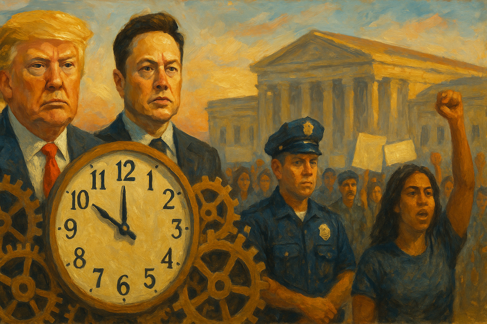

<!-- Generated by build_publish_week_v1 -->
<!-- Header image: image_wide_week8.png -->

# Week 8: The Week the Executive Tested Its Limits

*Immigration law became a weapon against speech, law firms faced retaliation, and courts pushed back—sometimes successfully, sometimes not at all.*

Week 8 opened with a city under sudden legal peril and closed with a government daring the courts to stop it. In seven days the executive branch moved on several fronts at once: against a graduate student's green card, against a law firm's client list, against the surviving architecture of federal anti-corruption enforcement. None of these actions occurred in isolation. Together they described a government testing how far it could reach. In more than one courtroom, something pushed back.

At the close of Week 7, the Democracy Clock stood at 7:32 p.m. By the end of Week 8, it had moved to 7:33 p.m., a shift of six-tenths of one minute. The distance traveled was small. The number of fronts on which it moved was not. Executive power reached into law firms, universities, immigration courts, and federal payrolls. A still-functioning judiciary blocked, delayed, or narrowed several of those advances. The week was defined less by any single rupture than by the buildup of small, deliberate assertions of unchecked authority. Institutions still willing to say no held the line, but only just.

The week's signature event began on a Saturday. Immigration agents detained Mahmoud Khalil, a Columbia graduate and lawful permanent resident, without criminal charge. Khalil had negotiated on behalf of protesters during campus demonstrations the previous year. He held a green card. He had committed no crime the government could name. Within days the administration moved to deport him, framing his advocacy for Palestinian rights as a threat to American foreign policy. Trump called the arrest "the first of many."

He was not exaggerating. Within days, a second Columbia student, Yunseo Chung, had her green card revoked after a protest sit-in. A French scientist was turned away at the border over messages on his phone critical of the president. Dorm rooms were searched. Visas were revoked. Federal officials later relied on a rarely invoked provision of immigration law—not criminal statute, but foreign-policy discretion—to justify Khalil's removal. Civil rights lawyers called it reminiscent of an earlier era's loyalty tests. The comparison was not overstated. Nearly a hundred people were arrested at Trump Tower in New York, demanding Khalil's release. Columbia, meanwhile, lost $400 million in federal funding, a penalty the administration tied directly to its handling of campus protest. The message reached beyond one campus: political speech by a non-citizen now carried the risk of expulsion from the country.

This campaign against activists did not stand alone. It sat inside a broader collapse of due process across immigration enforcement. The administration invoked the Alien Enemies Act, an eighteenth-century wartime statute, to justify summary detention and removal of alleged gang members without ordinary hearings. Venezuelan migrants were deported to a foreign prison without notice to their families or lawyers. One federal judge, weighing a related case, called the practice "wholly lawless." In a private DOJ meeting reported this week, a senior Justice Department official reportedly told career attorneys that the government might simply defy a federal court's order on deportation flights. That single sentence marked the week's most serious institutional threat. Courts can check power only when the executive agrees to be checked.

Against this backdrop, retaliation against lawyers themselves became explicit policy. Trump signed an executive order targeting the law firm Paul Weiss, suspending its lawyers' security clearances and terminating its federal contracts. The order made its purpose plain: punishment for the clients the firm had chosen to represent. A similar order against Perkins Coie was struck down within days by Judge Beryl Howell, who compared it to an unconstitutional bill of attainder. The administration had lost that round, but it did not change course. At a Justice Department event, Trump personally denounced former prosecutors and lawyers who had investigated him, naming them before a room of federal employees. Elsewhere, a DOJ pardon attorney said she had been fired for refusing to recommend restoring gun rights to Mel Gibson. The lesson was consistent: resistance from within the legal system, whether from firms, prosecutors, or career officials, now carried a cost.

That same logic extended to the institutions built to catch corruption before it reached the president's allies. Attorney General Pam Bondi disbanded Task Force KleptoCapture, the unit created to seize assets tied to sanctioned oligarchs. She paused enforcement of the Foreign Corrupt Practices Act for six months. She eliminated the FBI's foreign influence taskforce, the office responsible for detecting foreign interference in American politics. None of these units were symbolic; they were the working infrastructure of anti-corruption enforcement, built over years and dismantled in days. Elsewhere in the same department, the head of the Organized Crime Drug Enforcement Task Forces was fired, and national security officials were purged from their posts. Kash Patel, the new FBI director, began relocating as many as 1,500 agents. Current and former officials worried the shift would weaken efforts against domestic extremism while freeing resources for use against protest movements instead.

The week's fourth front was the federal civil service itself. Trump signed an executive order beginning the formal dismantling of the Department of Education, following mass layoffs that cut the agency's workforce roughly in half—more than 1,300 people gone in a single stroke, including more than half the staff of its Civil Rights Division. Democratic attorneys general in twenty-one states sued to block the cuts, arguing they were unconstitutional and would harm students with disabilities and low-income families who depend on federal enforcement. USAID, already gutted in prior weeks, saw eighty-three percent of its remaining programs cancelled. Staff were reportedly ordered to destroy records despite legal preservation requirements—a direct violation of federal records law. It suggested the administration wanted not just to end these programs but to erase the evidence of how they had operated.

Here the courts intervened with unusual force. Judge William Alsup found the government's stated justifications for mass firings to be false and ordered thousands of fired probationary workers reinstated across multiple agencies. Days later, a second judge, James Bredar, reached a similar conclusion, blocking further firings at eighteen agencies and calling the underlying scheme likely unlawful. These were not narrow technical rulings. Two federal judges, independently, concluded that the executive branch had lied about why it fired people, and ordered those firings undone. It was among the sharpest judicial rebukes of the term. Even amid sweeping executive action, courts retained both the will and the capacity to act when the government's own account did not survive scrutiny.

DOGE, the informal cost-cutting office led by Elon Musk, continued to occupy a strange constitutional space. It wielded real authority over federal payment systems and building leases. It answered to no Senate confirmation process, and resisted the ordinary transparency obligations that bind formal agencies. A federal judge, Christopher Cooper, ordered DOGE to release internal records under public disclosure law. Another judge, Tanya Chutkan, compelled Musk's office to produce documentation of its operations. That same week, an independent tracker found that DOGE's claimed $105 billion in taxpayer savings was overstated by ninety-two percent; only $8.6 billion could be verified. Rather than address the substance, Musk attacked the tracker. DOGE's own website was altered to strip identifying details that had let the public check its claims in the first place. The pattern was familiar by now: assert a number, resist verification, discredit the verifier.

Economic policy moved with similar volatility. Tariffs on Canada, Mexico, and China rose and fell within days of one another. A fifty percent tariff on Canadian steel was threatened, then withdrawn within twenty-four hours. Blanket tariffs on all imported steel and aluminum took effect regardless, prompting immediate retaliation: the European Union announced roughly $28 billion in counter-tariffs, Canada nearly $21 billion. The stock market recorded its worst decline of any presidential term since 2009. Treasury Secretary Scott Bessent called the resulting pain a "de-tox period." The president blamed "globalists" for the market's fall. His own Justice Department suggested price-gouging speculators, rather than tariff policy, were behind rising egg prices. Meanwhile, House Republicans quietly inserted language into a spending bill blocking Congress from formally challenging the tariff emergency declaration that made all of this possible—a procedural maneuver that stripped away a legislative check. What had begun as an emergency measure had become, in practice, a permanent tool for ordinary trade disputes.

Washington, DC absorbed a smaller but pointed version of the week's broader pattern: the use of federal power against a disfavored jurisdiction. Congressional Republicans proposed forcing the city to cut $1.1 billion from its own locally funded budget. A bill was introduced to repeal DC's Home Rule Act outright. Another threatened $185 million in transportation funding unless a Black Lives Matter mural was removed. None of these measures required cooperation from DC's elected government. All of them used federal financial leverage to override local decisions in a city with no voting representation in Congress to resist it.

Not every institutional signal moved in the same direction. The Supreme Court rejected the administration's attempt to freeze nearly $2 billion in congressionally appropriated foreign aid, reaffirming that impoundment—withholding funds Congress has already approved—remains outside the president's unilateral authority. A federal judge blocked Khalil's deportation, at least temporarily, giving his legal challenge time to proceed. Another blocked cuts to federal teacher-training funding. These rulings did not reverse the week's broader direction, but they mattered. They showed that where institutional structure still held—an independent judiciary willing to rule against the government that appointed many of its members—resistance remained possible, and occasionally successful.

The tension between these two currents defined the week more than any single episode. On one side, an administration moved with increasing confidence across law enforcement, civil service, higher education, and trade policy, treating legal boundaries as obstacles to route around rather than limits to respect. On the other, courts continued to function, sometimes forcefully, and civil society did not go quiet. Protesters filled the sidewalk outside Trump Tower. Senator Bernie Sanders drew large crowds on a nationwide tour addressing concentrated wealth. Grassroots groups distributed toolkits for organizing town halls with elected representatives who preferred to avoid them.

What distinguished this week from quieter periods was not any single dramatic act, but the coordination visible across so many smaller ones. A law firm punished here. An agency gutted there. A student detained for speech nobody could show was criminal. A DOJ official prepared, if reports were accurate, to tell a federal court no. Each of these, alone, might have registered as an isolated dispute. Placed together, across a single week, they described a governing style: probe the boundary, absorb whatever resistance the courts offer, and continue.

The Alien Enemies Act invocation and the reported instruction to disregard judicial orders stand apart from the week's other developments in one respect. Statutory reinterpretation and agency reorganization can be reversed by future administrations or corrected by future courts. An executive branch that treats court orders as optional threatens the very predicate on which such correction depends. That distinction may prove, in time, the week's most consequential fact.

The eight weeks since the term began have shown a government growing more comfortable with each test of its own limits. Week 8 did not introduce new tools; it sharpened the ones already in hand: immigration law turned into a lever against speech, emergency powers stretched to cover ordinary economic policy, civil service treated as an obstacle rather than a public trust. The courts that pushed back this week did so with real effect, reinstating fired workers, blocking a punitive order, halting a deportation. Whether that capacity endures depends less on any single ruling than on whether the executive branch continues to treat those rulings as binding at all.

<!-- Synopses for cross-posting -->
Long Synopsis: Week 8 saw the executive branch move simultaneously across multiple fronts: immigration agents detained Columbia graduate Mahmoud Khalil for pro-Palestinian advocacy despite no criminal charge, triggering a wider campaign against student activists and visa holders. The administration disbanded anti-corruption units, purged national security officials, and signed executive orders punishing law firms for their choice of clients. It moved to dismantle the Department of Education and gutted USAID, ordering records destroyed in violation of federal law. Tariff policy swung erratically, provoking retaliation from allies and the worst market decline of the term. Courts intervened repeatedly—reinstating fired workers, blocking a punitive order against Perkins Coie, and halting Khalil's deportation—but a senior DOJ official reportedly suggested the government might simply defy a court's order. The Democracy Clock moved only six-tenths of one minute, from 7:32 to 7:33 p.m., but the number of fronts tested was unusually wide.
Short Synopsis: An administration testing limits across immigration, law enforcement, and civil service met real judicial resistance this week. Courts blocked deportations and reinstated fired workers, but a DOJ official's reported willingness to defy court orders marked the week's most serious institutional threat.

