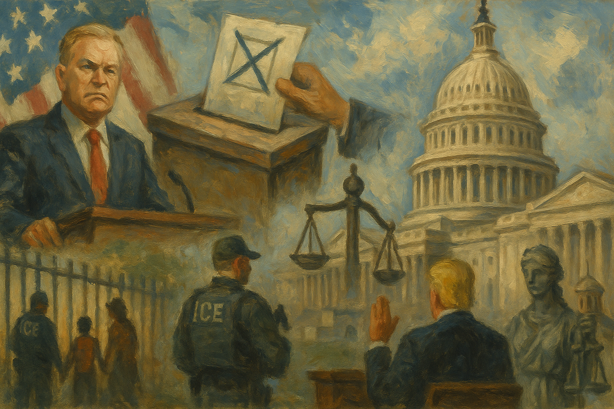

<!-- Generated by build_publish_week_v1 (appendix post) -->
<!-- Header image: image_wide_week80_appendix.png -->

# Week 80 Appendix: Pressure Through Ordinary Forms

*Executive power, election restrictions, immigration coercion, and memory politics advanced together while courts and Congress offered only partial resistance.*

This was a high-pressure week defined by executive overreach, election restriction efforts, politicization of justice, and an unusually explicit campaign to control national memory. The strongest structural signal came from the convergence of multiple fronts: the administration sought to tighten mail-voting rules through legislation and emergency appeals; admitted in court that federal grant cuts were based on partisan voting patterns; continued using war powers and tariff authorities in ways that bypass or strain congressional limits; and pressed a broad ideological intervention into the Smithsonian and historic-preservation processes. At the same time, immigration enforcement and detention produced repeated due-process and abuse concerns, while the Todd Blanche nomination and Trump tax-immunity dispute highlighted the fusion of personal legal protection with control over the Justice Department. Courts provided some countervailing checks, especially on election administration and vaccine policy, but the week’s net effect was still strongly corrosive: it showed a governing style that treats law, administration, and public history as instruments of partisan and personal power rather than neutral democratic infrastructure.

Power and Authority

1. President Trump ordered temporary signs outside the Smithsonian National Museum of American History accusing it of inaccuracy and calling for exhibit renovation (2026-07-25): The order used presidential power to shape public history at a national institution and steer how citizens encounter the historical record.

2. Mayor Zohran Mamdani signed an executive order to ease regulations and fees for small businesses in New York City (2026-07-25): The order changed how city executive power was used over permits and fees, affecting the balance between administrative control and local economic access.

3. The Trump administration admitted in court that it cut clean energy grants based on states' 2024 voting behavior (2026-07-25): The admission showed federal spending power being used to reward allies and punish opposition-led states, weakening neutral administration of public funds.

4. Taylor Farms asked the White House to delay a cyclospora recall announcement (2026-07-26): The request raised concerns that executive influence could distort public health decisions and weaken the independence of safety enforcement.

5. The White House Office of Administration began preparations to paint the Eisenhower Executive Office Building despite ongoing legal objections (2026-07-26): The move suggested executive officials were pressing ahead on a disputed project while sidestepping ordinary oversight and preservation review.

6. President Trump imposed new tariffs on goods from dozens of countries under claimed forced-labor authority (2026-07-27): The tariffs extended unilateral executive control over trade and revenue policy after prior legal setbacks, testing limits on presidential economic power.

7. President Trump notified Congress about military action in Iran while claiming the War Powers deadline did not apply (2026-07-27): The notice asserted broad presidential war authority and narrowed Congress's practical role in authorizing ongoing hostilities.

8. President Trump issued an executive order directing HHS to align U.S. vaccine recommendations with peer nations (2026-07-28): The order used presidential authority to steer scientific and public health guidance, increasing political control over expert policy processes.

9. The FDA announced an agency reorganization to centralize functions across the agency (2026-07-29): The restructuring changed how executive authority was organized inside a major regulator, affecting internal control over public health administration.

10. The Trump administration ordered 250 Cadillac Escalades for government use (2026-07-30): The purchase raised accountability concerns about executive spending priorities and the use of public funds for high-cost official consumption.

11. President Trump refused to end a tax immunity agreement and related settlement fund tied to his tax records case (2026-07-30): The refusal showed presidential power being used to preserve personal legal protections, blurring the line between public office and private interest.

12. Governor Tina Kotek terminated the sale of state-owned land for a Salem data center project (2026-07-31): The decision showed a governor using executive authority over state assets to shape development in line with community and resource concerns.

13. The Trump administration announced plans to end a Medicare drug subsidy program that capped out-of-pocket costs (2026-07-31): The planned rollback used executive power to reverse a major affordability protection, affecting access to medicine for older and vulnerable residents.

Institutions and Governance

1. House Republicans passed a defense bill merged with voting restrictions on mail ballots and voter ID (2026-07-25): The House used legislative procedure to attach election rules to must-pass defense legislation, testing institutional safeguards around voting access.

2. House Minority Leader Hakeem Jeffries pledged reforms on Supreme Court ethics, stock trading, and price gouging at a rally (2026-07-25): The pledge outlined institutional reforms aimed at tightening ethics and accountability rules across Congress and the judiciary.

3. The First Circuit refused to stay an injunction blocking parts of Trump's election administration order (2026-07-25): The ruling preserved a judicial check on federal involvement in state election administration and limited immediate executive reach over voting systems.

4. Judge Emmet Sullivan ordered the Justice Department to produce unredacted Epstein-related records for private review (2026-07-25): The order reinforced judicial oversight of executive secrecy and required the government to justify its redactions in court.

5. Pete Buttigieg and others criticized the administration for withholding the names of U.S. service members killed in Iran (2026-07-25): The criticism highlighted a transparency dispute over military casualties and the public's ability to scrutinize wartime decisions.

6. The Pentagon revised casualty figures and categories for the Iran conflict (2026-07-25): The revisions affected how war costs were reported to the public and Congress, complicating oversight of ongoing military operations.

7. The Advisory Council on Historic Preservation voted to advance revisions to Section 106 review requirements (2026-07-26): The vote would reduce required public input and agency review for effects on historic properties, weakening procedural accountability.

8. Lawmakers opposed the proposed triumphal arch project near Arlington National Cemetery (2026-07-26): The opposition asserted Congress's role in approving federal commemorative works and challenged executive efforts to bypass legal process.

9. Senator Mitch McConnell's office said he remained unable to return to Senate duties after his fall (2026-07-27): His continued absence affected Senate voting capacity and showed how individual incapacity can disrupt legislative functioning.

10. Senate Republicans resisted ending the filibuster to pass the SAVE Act despite pressure from Trump (2026-07-27): The stance preserved an existing Senate rule and showed internal limits on efforts to change legislative procedure for election-related bills.

11. President Trump demanded that Senate Republicans end the filibuster to pass the SAVE America Act (2026-07-27): The demand pressed the Senate to change its own rules for a voting bill, testing separation between executive influence and legislative procedure.

12. Activists urged senators to oppose Todd Blanche's nomination for attorney general (2026-07-27): The campaign focused public pressure on a key confirmation process that shapes control of federal law enforcement and legal accountability.

13. Five conservation groups filed suit against the Army Corps over Nationwide Permit 12 for pipeline crossings (2026-07-27): The complaint sought judicial review of a broad permitting tool that affects how agencies authorize major infrastructure with limited case-by-case scrutiny.

14. The District of Columbia sued HUD over its plan to move headquarters to Virginia (2026-07-27): The suit challenged whether an executive agency could relocate a major federal office without following statutory and review requirements.

15. Judge Cronan dismissed the challenge to the Religious Liberty Commission's membership (2026-07-27): The dismissal ended a case testing whether a federal advisory body met balance and standing requirements under governing law.

16. Judge Kymberly Evanson temporarily blocked the Education Department from terminating certain grants (2026-07-27): The order checked agency power by requiring the government to follow lawful standards before cutting previously awarded funds.

17. Judge Cobb stayed deadlines in a case against ICE while leaving challenged policies enjoined (2026-07-27): The ruling paused litigation while preserving an existing restraint on agency action, showing courts managing both process and interim accountability.

18. The FCC sought comments on emergency information accessibility requirements (2026-07-27): The notice opened a formal rulemaking channel on how emergency information reaches disabled audiences, reinforcing procedural participation in communications policy.

19. The FCC adopted new submarine cable licensing rules with security conditions and faster review paths (2026-07-27): The rules changed how a key regulator balances national security review with infrastructure approvals for critical communications systems.

20. The FCC requested comments on revisions to FCC Form 601 licensing collections (2026-07-27): The notice affected how the agency gathers licensing information and invited public input on administrative burdens and regulatory design.

21. The FCC requested comments on Enhanced 911 information collections (2026-07-27): The notice concerned oversight of emergency calling compliance and kept a public process open around communications safety rules.

22. The FCC submitted an information collection request to OMB for review (2026-07-27): The filing reflected routine administrative oversight of agency paperwork demands and the formal checks built into federal rule administration.

23. Congressional committees and Smithsonian director Anthea Hartig held and participated in hearings over the museum's portrayal of American history (2026-07-28): The hearings brought a cultural institution under direct political scrutiny, showing Congress using oversight to pressure public historical interpretation.

24. An appeals court allowed Safehouse to proceed with a religious liberty claim over a proposed overdose prevention site (2026-07-28): The ruling expanded judicial consideration of how religious liberty arguments can shape public health and criminal law disputes.

25. A federal judge halted changes to the federal vaccine schedule and paused the advisory committee's work (2026-07-28): The order showed courts checking executive and agency changes to expert public health processes when legality was in doubt.

26. The Board of Education of Jefferson County School District sued the Education Department over OCR enforcement tied to Trump's executive orders (2026-07-28): The complaint challenged whether federal civil rights enforcement was being used lawfully in schools, putting agency authority under court review.

27. The Center for Biological Diversity and Sierra Club sued the Bureau of Land Management over a Mojave Trails pipeline approval (2026-07-28): The suit sought judicial review of a federal land-use approval and tested whether agencies followed required environmental procedures.

28. Planned Parenthood Federation of America sued HHS over conditions in a Title X funding notice (2026-07-28): The lawsuit challenged whether an agency used grant conditions to impose political priorities beyond statutory limits.

29. Judge Whitehead kept a preliminary injunction in place in a case against DHS (2026-07-28): The ruling maintained a court-imposed limit on agency action and rejected an effort to dissolve existing judicial protection.

30. The D.C. Circuit affirmed the denial of a preliminary injunction against Trump's mail-voting order on ripeness grounds (2026-07-28): The decision left challengers without immediate relief while preserving the possibility of later review if agencies implemented the order.

31. The Trump administration did not seek Supreme Court rehearing in the birthright citizenship case (2026-07-28): The choice left an existing constitutional ruling in place and shaped the administration's legal posture on citizenship policy.

32. The Supreme Court denied stays of execution and certiorari in three death penalty cases (2026-07-28): The denials ended immediate judicial review in capital cases and underscored the Court's gatekeeping role over final state punishment.

33. The Senate confirmed Jay Clayton as director of national intelligence (2026-07-28): The confirmation placed a presidential ally atop the intelligence apparatus, affecting institutional independence and oversight of national security information.

34. The President approved a nuclear cooperation agreement with Saudi Arabia (2026-07-28): The determination used formal executive-branch process to advance a major foreign policy agreement with security and oversight implications.

35. Dr. Anthony Fauci invoked the Fifth Amendment and declined to answer questions at a Senate Covid hearing (2026-07-29): The hearing highlighted friction between congressional investigative power and individual constitutional protections in a politicized oversight setting.

36. Michigan representatives introduced a bill to fund invasive mussel control in the Great Lakes (2026-07-29): The bill showed Congress using appropriations and legislation to address a regional environmental problem with public resource implications.

37. Ohio officials advanced and discussed school transportation and funding changes affecting districts (2026-07-29): The developments showed state governance choices shaping whether public schools can reliably provide core services and equal access.

38. The Senate passed a resolution opposing any pardon for Ghislaine Maxwell (2026-07-29): The resolution used a formal Senate statement to signal limits on acceptable use of presidential clemency in a high-profile abuse case.

39. Reform advocates continued pushing proposals to reduce the Supreme Court's power (2026-07-29): The push reflected an active institutional debate over how to rebalance judicial authority within the constitutional system.

40. The First Circuit remanded a case over South Sudan TPS after an intervening Supreme Court ruling (2026-07-29): The remand showed higher-court doctrine narrowing lower-court review of executive immigration decisions.

41. President Trump asked the Supreme Court to review the defamation verdict against him (2026-07-29): The petition sought top-court intervention in a case involving a former president, underscoring how elite litigants can extend legal battles through institutional appeals.

42. The House Oversight Committee released Kathryn Ruemmler's testimony transcript about her ties to Jeffrey Epstein (2026-07-30): The release used congressional oversight to expose information about elite networks and test public accountability through disclosure.

43. The Senate Judiciary Committee postponed and then canceled a vote on Todd Blanche's attorney general nomination (2026-07-30): The delay showed the Senate using confirmation leverage to demand changes to a disputed executive settlement tied to Trump's personal interests.

44. The Senate rejected a resolution to limit Trump's authority to continue military operations in Iran (2026-07-30): The vote left broad war-making discretion with the executive and showed Congress declining to reassert its institutional role over hostilities.

45. The Second Circuit lifted the abeyance in Doe v. Mullin and set a briefing schedule (2026-07-30): The update moved an immigration-related appeal back into active judicial review after a Supreme Court ruling changed the legal landscape.

46. Seven environmental groups sued Interior Secretary Doug Burgum over revised Endangered Species Act habitat rules (2026-07-30): The complaint challenged whether executive agencies lawfully rewrote habitat rules in ways that favored industry influence.

47. The CDC announced a public ICD-10 Coordination and Maintenance Committee meeting (2026-07-30): The notice preserved a formal public process for changes to national health coding standards that shape administration and data governance.

48. Republicans were described as having passed the One Big Beautiful Bill Act with major Medicaid cuts (2026-07-31): The lawmaking episode showed one-party control being used to enact large social policy changes with long-term effects on public governance.

49. The Kansas Court of Appeals upheld the counting of timely postmarked mail ballots that arrived after Election Day (2026-07-31): The ruling protected an existing election administration rule and limited an effort to discard valid mailed votes.

50. The Supreme Court issued rulings in major gun rights cases (2026-07-31): The decisions shaped the legal boundary between state and federal authority over firearms and will guide future lawmaking and litigation.

Economic Structure

1. The Democratic National Committee asked vendors to delay billing because of financial strain and debt (2026-07-25): The party's cash shortage affected its capacity to support candidates, showing how organizational finance can shape electoral competition.

2. New Jersey Governor Mikie Sherrill signed a law banning surveillance pricing for identical products (2026-07-26): The law limited the use of personal data in consumer pricing, reducing a market practice that can deepen unequal treatment and opaque economic power.

3. Mayor Zohran Mamdani announced lower prices on essential goods at city-run grocery stores (2026-07-26): The initiative used public retail power to improve affordability of basic goods and expand economic access for residents.

4. The DEA reported that military strikes had not reduced cocaine trafficking into the United States (2026-07-26): The assessment showed costly coercive policy failing to change supply conditions, raising accountability questions about resource use and strategy.

5. Amazon and Walmart were identified as major employers whose low wages left many workers on Medicaid (2026-07-27): The analysis showed private labor practices shifting health costs onto taxpayers, illustrating how corporate wage structures can burden public systems.

6. The FDA classified two new medical devices into class II with special controls (2026-07-27): The classifications shaped market entry rules for health products and showed regulators balancing access, safety, and industry burden.

7. The FDA submitted a paperwork request on radioactive drug research committees for OMB review (2026-07-27): The filing affected how research oversight is administered and how scientific institutions meet federal compliance requirements.

8. Analysts and advocates published discussions on rail costs, national debt, European software policy, and WakeMed privatization (2026-07-27): These debates focused on how public investment, fiscal choices, and privatization shape access to infrastructure, health care, and long-term economic capacity.

9. The Department of Health and Human Services designated Savannah River Site construction workers for the Special Exposure Cohort (2026-07-28): The designation expanded compensation eligibility for workers exposed to hazardous conditions, strengthening economic protection tied to occupational harm.

10. The EPA issued pesticide tolerance corrections and extended compliance dates for PCE and CTC rules (2026-07-28): The actions adjusted regulatory burdens and safety timelines for agriculture and chemical users, affecting how public health protections are implemented in markets.

11. The EPA published April findings on new chemicals and significant new uses under TSCA (2026-07-28): The findings allowed listed chemicals to proceed under federal review, shaping the balance between industrial activity and precautionary oversight.

12. The FCC submitted a VoIP numbering information collection to OMB (2026-07-28): The filing affected compliance costs and administrative oversight in a communications market that underpins public access and competition.

13. The FDA issued final guidance on cancer trial eligibility and sought comment on expanded access to investigational drugs (2026-07-28): The actions shaped who can enter trials and seek experimental treatment, affecting fairness and access in the health care system.

14. The White House Domestic Policy Council released a report criticizing the Smithsonian's historical presentation (2026-07-28): The report used executive policy machinery to pressure a public institution's content, showing how administrative tools can be aimed at cultural governance.

15. The Centers for Disease Control and Prevention awarded a sole-source cooperative agreement to the Public Health Foundation (2026-07-29): The award directed federal funds to public health workforce training and showed how grant design shapes public capacity and institutional dependence.

16. The EPA released a draft risk evaluation for 1,1,2-trichloroethane (2026-07-29): The draft evaluation opened the path to future regulation of a hazardous chemical, affecting industry obligations and public health safeguards.

17. The FDA announced revised draft guidances for generic drug bioequivalence studies (2026-07-29): The guidances shaped how generic drugs reach market, affecting competition, pricing, and access to medicines.

18. The FDA classified a phase-changing fiducial marker for radiation therapy into class II (2026-07-29): The classification set the regulatory path for a medical device and influenced how quickly new treatment tools can enter the market.

19. The EPA approved air plan revisions in California and New Hampshire and proposed a CERCLA settlement in Massachusetts (2026-07-30): These actions used federal regulatory power to set pollution rules and allocate cleanup costs, shaping environmental burdens across communities and industries.

20. The EPA sought comments on groundwater monitoring, academic laboratory waste rules, land disposal restrictions, pesticide establishment reporting, and NPDES collections (2026-07-30): The notices affected how environmental compliance data is gathered, influencing both public oversight and the administrative costs of regulated activity.

21. The FCC sought comment on restricting certain foreign-made drones and components (2026-07-30): The proposal linked market access to national security review, showing how economic regulation can be used to reshape supply chains.

22. The FDA announced multiple fiscal year 2027 user fee rates and reopened comment on BHT safety information (2026-07-30): The notices set major compliance costs across drug, device, food, and importer sectors while extending input on a food additive safety review.

23. The EPA, Department of Energy, Department of War, and Nuclear Regulatory Commission announced Revision 2 of the Multi-Agency Radiation Survey and Site Investigation Manual (2026-07-30): The update revised technical standards for radiation surveys, affecting how agencies and contractors document environmental safety and compliance.

24. Lineage Logistics filed to rebuild its fire-damaged Los Angeles warehouse before cleanup was complete (2026-07-30): The filing tested whether corporate rebuilding could move ahead despite unresolved public health and regulatory concerns at the site.

25. The Federal Open Market Committee voted to hold interest rates steady (2026-07-30): The decision shaped borrowing costs and inflation management, affecting economic conditions that influence public confidence and state capacity.

26. The Commerce Department and market observers reported second-quarter GDP growth of 1.5 percent, below expectations (2026-07-30): The weaker growth figures signaled economic strain that can narrow fiscal room and affect public trust in governing performance.

27. The South Korean government moved to restrict leveraged single-stock ETFs after a market crash (2026-07-30): The restriction showed regulators intervening to curb speculative finance and reduce systemic instability in a major market.

28. The EPA published notice of environmental impact statements and updated Rhode Island SIP materials (2026-07-31): The notices maintained public visibility into environmental review and state-federal air quality governance.

29. The FCC expanded Upper C-band use for wireless services and strengthened cybersecurity rules for the Emergency Alert System (2026-07-31): The rules reallocated valuable spectrum and hardened emergency communications infrastructure, shaping both market structure and public resilience.

30. The FCC requested comments and OMB review on additional information collections (2026-07-31): The filings affected administrative burdens in telecommunications and preserved formal channels for public input on regulatory paperwork.

31. Darden Restaurants, Kroger, and the Social Security Administration were described as having changed or canceled policies after public pressure and reporting (2026-07-31): These cases showed how scrutiny can alter employer benefits and public service access, affecting workers and beneficiaries through institutional accountability.

32. The Trump administration and Koch Industries were described in prior reporting as having taken actions with major economic and geopolitical effects (2026-07-31): The cited cases highlighted how elite financial ties and corporate choices can shape public spending and sanctions policy beyond ordinary public control.

Civil Rights and Dissent

1. A coroner in Cheshire ruled Lucy Harrison's death an unlawful killing (2026-07-25): The ruling challenged prior official handling of a death case and raised accountability questions about justice across jurisdictions.

2. Kidnappers in California held two U.S. Forest Service workers hostage before surrendering (2026-07-25): The attack threatened the safety of public workers and tested the state's duty to protect civil administration from coercive violence.

3. Troy Jackson secured the Democratic nomination for Maine's Senate race at the party convention (2026-07-25): The nomination determined who would represent one major party in a key race, affecting voter choice and political representation.

4. Brazil's Foreign Ministry denied visas to U.S. officials who planned to question Brazil's electoral system (2026-07-25): The denial pushed back against perceived foreign interference in an election system and defended domestic control over democratic procedures.

5. The Supreme Court allowed the Trump administration to terminate TPS for Haitians and Syrians (2026-07-26): The ruling stripped legal protection from large immigrant groups and exposed them to detention, deportation, and loss of work authorization.

6. Venezuelan men sued aviation companies over flights that took them to a prison in El Salvador (2026-07-26): The suit challenged alleged collaboration between private contractors and the government in deportations that bypassed due process and bodily security.

7. Tom Homan announced an investigation into ICE officer vetting after a fatal shooting in Maine (2026-07-26): The inquiry addressed whether a federal enforcement agency failed to screen for abuse risks, affecting trust in coercive state power.

8. ICE prepared to expand arrests and deportations of Haitians after TPS protections ended (2026-07-26): The planned enforcement surge threatened family stability and legal security for a large immigrant community newly exposed to removal.

9. The 250 to 250 Project and its narrators released and presented videos on disability rights, women's representation, public health advocacy, Hispanic veterans, desegregation, rebellion, LGBTQ representation, Jewish history, feminism, and American culture (2026-07-26): The project used civic storytelling to widen public memory of rights struggles and inclusion, supporting democratic participation through shared history.

10. The Justice Department moved to dismiss charges against union leader David Huerta over his protest arrest (2026-07-27): The dismissal eased a case seen as chilling protest activity and underscored the legal stakes around policing dissent during immigration actions.

11. Former DOJ lawyer Liz Oyer testified against Todd Blanche's nomination and then reported receiving death threats (2026-07-27): The threats showed how participation in a public accountability process can trigger intimidation that chills dissent and testimony.

12. Francisco Longoria and his family sued ICE and CBP over a shooting, detention, and dropped charges (2026-07-27): The lawsuit alleged racial profiling and excessive force by immigration agents, raising due process and bodily security concerns.

13. Governor Andy Beshear demanded that Senator McConnell show he could still serve or resign (2026-07-27): The demand framed representation as a public right, arguing that constituents deserve proof that an absent senator can still perform the office.

14. Election organizers in North Carolina scheduled training for poll workers, election advocates, and de-escalation teams (2026-07-27): The training aimed to strengthen citizen capacity to protect voting access and calm conflict around election administration.

15. Engaged Defenders 4 Democracy organized daily street protests and bridge brigades (2026-07-27): The actions used peaceful public assembly to mobilize civic participation and keep democratic concerns visible before the elections.

16. A court-appointed monitor reported that the California City ICE facility failed to meet court-ordered health care standards (2026-07-28): The findings showed detained immigrants facing unsafe conditions despite a judicial order, exposing weak protection of rights in custody.

17. An Indiana judge blocked the state's near-total abortion ban for plaintiffs with conflicting religious beliefs (2026-07-28): The ruling protected bodily autonomy and religious exercise against a sweeping abortion restriction.

18. A judge blocked warrantless ICE enforcement near some churches involved in litigation (2026-07-28): The order protected worship access and limited immigration enforcement practices that burdened religious participation.

19. Apache Stronghold and allied Native groups continued lawsuits to stop mining at Oak Flat (2026-07-28): The litigation sought to protect Indigenous religious practice and land rights against a federal land transfer to mining interests.

20. Seattle police recovered illegal firearms after a mass shooting at a food festival (2026-07-28): The case highlighted the public safety burden of illegal weapons and the state's role in protecting people in shared civic spaces.

21. A Secret Service agent and two others were arrested over violent hazing in Miami (2026-07-28): The arrest raised accountability concerns when a federal protective service employee was implicated in serious off-duty violence.

22. ICE subjected at least one detained hunger striker to forced medical treatment (2026-07-28): The practice raised grave concerns about bodily autonomy, coercion, and the rights of people held in immigration detention.

23. ICE began arresting immigrants at airports whose visas had expired, including some with pending applications (2026-07-28): The tactic increased the risk of family separation and punished people caught in administrative delays within the immigration system.

24. The Office of Refugee Resettlement and ICE shared leads that contributed to thousands of immigration arrests, including children and sponsors (2026-07-28): The information sharing turned a child welfare system into an enforcement pipeline, weakening trust and due process for vulnerable families.

25. The Democracy Docket article described voting-rights disputes involving New Jersey and California (2026-07-28): The analysis pointed to ongoing conflicts over election rules and public response that bear on access to the ballot.

26. The Senate Judiciary Committee and Republican senators faced a standoff over Todd Blanche's nomination for attorney general (2026-07-27): The fight over the nation's top law enforcement post carried direct consequences for civil rights enforcement and public accountability.

27. A court filing alleged that ICE agents used racial slurs during Los Angeles operations (2026-07-29): The allegations pointed to discriminatory enforcement culture inside immigration operations and strengthened claims of unequal treatment under law.

28. A federal judge sentenced a man for ramming a car into a Brooklyn synagogue without treating it as a hate crime (2026-07-30): The sentence showed how courts classify violence against religious sites, affecting recognition of bias harms and minority protection.

29. A 15-year-old suspect was charged in the Seattle festival shooting case (2026-07-30): The prosecution raised questions about juvenile justice, gun violence, and how the legal system handles severe harm in public spaces.

30. Republicans continued public attacks on Dr. Fauci amid the release of his private diary (2026-07-30): The campaign showed how sustained political targeting can chill expert participation and distort public debate around health policy.

31. Emily Moreno filed for a restraining order against Representative Max Miller (2026-07-30): The filing brought allegations of domestic abuse into public view and raised representation and accountability concerns for an elected official.

32. Hundreds of Jordanians signed an open letter demanding that U.S. troops leave Jordan (2026-07-30): The letter was a form of public dissent aimed at foreign military presence and showed civic pressure on security policy.

33. UEFA's member federations voted to boycott the World Cup over FIFA's proposed private stake sale (2026-07-30): The boycott used collective withdrawal to contest governance changes in a major international institution.

34. Mandela Barnes withdrew from Wisconsin's Democratic primary for governor (2026-07-30): The withdrawal narrowed voter choice in a major state race and changed the field of democratic representation.

35. Elon Musk's super PAC planned to spend up to $120 million on midterm races (2026-07-30): The planned spending showed how concentrated private wealth can shape electoral competition and amplify unequal political influence.

36. Two men in Arizona announced plans to file a wrongful arrest lawsuit over the Nancy Guthrie investigation (2026-07-31): The planned suit challenged alleged police overreach and sought accountability for arrests and searches that ended without charges.

37. The FBI obtained a South Carolina voter's IP address in a voter fraud investigation (2026-07-31): The request raised privacy concerns and showed election-related law enforcement reaching into personal digital data.

38. The Trump administration asked the Supreme Court to let restrictive mail-voting rules take effect (2026-07-31): The request sought to narrow ballot access through federal intervention in state election procedures before the midterms.

39. Corporations, super PAC operators, election officials, and journalists were described in reporting on donation suspensions, deceptive campaign operations, and restored North Carolina ballots (2026-07-31): These episodes showed how money, deception, and corrective oversight can each alter whether voters receive fair representation and accurate vote counts.

40. Organizers and South Bay officials rallied against a planned ICE detention facility near Gilroy (2026-07-31): The protest used public assembly to resist expansion of immigration detention and connect present policy to past civil liberties abuses.

41. St. Paul officials opened an inquiry into sexual harassment allegations against Mayor Kaohly Her (2026-07-31): The inquiry tested whether local government would investigate misconduct claims against a sitting mayor and protect workplace rights.

Information, Memory and Manipulation

1. The White House released a report attacking the Smithsonian's portrayal of American history (2026-07-28): The report sought to recast a national museum's historical narrative through executive messaging, pressuring public memory from above.

2. President Trump barred the press from Oval Office meetings with Zelenskyy and Netanyahu (2026-07-28): The exclusion reduced public visibility into high-level diplomacy and limited independent reporting on executive decision-making.

3. Former FCC officials filed objections to the FCC's review of ABC broadcast licenses (2026-07-28): The filing warned that license scrutiny over alleged bias could chill broadcasters and turn regulation into pressure on editorial independence.

4. A Change.org petition organizer and media outlets circulated and amplified unverified claims about 9/11 family signatures against Mayor Mamdani (2026-07-28): The episode showed how unsupported claims can spread through media channels and distort public judgment about a political figure.

5. President Trump claimed he personally controlled the Strait of Hormuz (2026-07-28): The false claim injected misinformation into a tense foreign policy moment and risked confusing the public about real state authority.

6. The Trump administration was reported to be delaying Smithsonian Board of Regents nominations to shape the board's composition (2026-07-29): The maneuver aimed to influence who governs a major cultural institution, extending political control over public memory through appointments.

7. President Trump and Secret Service agents were accused of directing surveillance and a prosecution against James Comey over a social media post (2026-07-29): The allegations suggested information-gathering and criminal process were being used in a politically charged way against a prominent critic.

8. President Trump dismissed allegations of Iranian cyberattacks on Minnesota water systems and blamed state officials (2026-07-30): The comments undercut a coordinated warning about critical infrastructure threats and muddied public understanding of a security risk.

9. Meta partnered with Newsmax to use its content for AI training (2026-07-30): The deal gave a low-credibility outlet a larger role in shaping AI-generated information across major platforms.

10. The State Department displayed a map at a Brazil conference that mislabeled every African country (2026-07-30): The error damaged official credibility and showed how poor information practices can weaken diplomatic communication.

11. Justice Neil Gorsuch said Americans should study history with both its flaws and achievements (2026-07-29): The remarks entered a live struggle over public memory and defended fuller historical inquiry against selective narrative control.

12. The Out Loud report highlighted plans for an ICE detention center in Winton and the organizing response around it (2026-07-27): The coverage made a contested detention project visible to the public and helped frame debate over state power and immigrant treatment.

