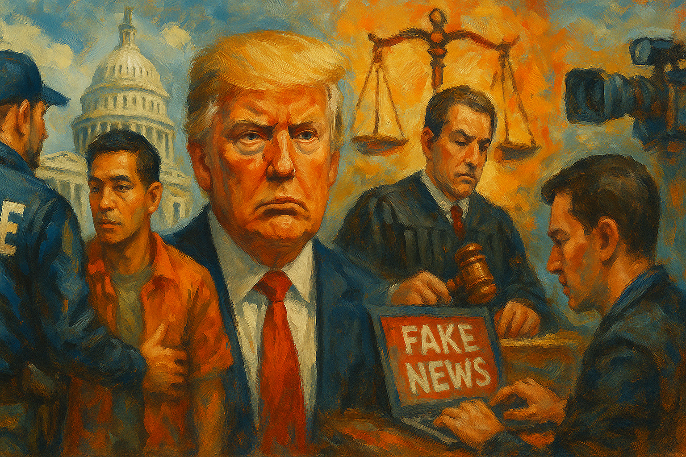

<!-- Generated by build_publish_week_v1 (appendix post) -->
<!-- Header image: image_wide_week81_appendix.png -->

# Week 81 Appendix: Citizenship Pressure, Checks Hold

*Executive power pressed into citizenship, law enforcement, secrecy, and surveillance, but courts and voters blocked enough to prevent further clock movement.*

Week 81 was dominated by the confirmation of Todd Blanche as attorney general after a negotiated rescission of Trump's $1.8bn 'anti-weaponization fund'—a resolution that traded formal DOJ accountability for a paper commitment of uncertain enforceability, while a parallel amended complaint alleged the underlying immunity order still shields Trump and his family from tax audits. Simultaneously, Trump signed two executive orders attacking birthright citizenship just weeks after the Supreme Court affirmed it, testing the finality of judicial review. Immigration enforcement intensified sharply: record ICE detention numbers, force-feeding of hunger strikers, TPS terminations for Haiti and South Sudan, wrongful deportations in defiance of court orders, and a body-camera policy giving ICE's director discretion to suppress footage of killings. Courts provided a genuine counterweight—blocking the White House ballroom, several tariff suits, and 75 First Amendment rulings against the administration—while state-level ballot results (Missouri, Kansas) rejected anti-democratic amendments. Press intimidation (subpoenas, defamation suits, false prosecutorial claims against a journalist) and dark-money disinformation networks further degraded the information environment.

Power and Authority

1. Trump administration issued executive order targeting the Smithsonian Institution over alleged political activism (2026-08-01): The order sought to control messaging at a major public history museum, raising concerns about executive interference with independent cultural and historical institutions.

2. Trump administration requested $10 million from Congress to cover Freedom 250 event expenses (2026-08-01): The request to use taxpayer funds for administration-sponsored events blurs the line between official government business and political promotion.

3. Trump threatened to bypass Senate confirmation by keeping Blanche as acting attorney general (2026-08-01): The threat to install an unconfirmed attorney general and fight for a fund benefiting allies signaled disregard for Senate oversight of the Justice Department.

4. President continued a national emergency on foreign advancement in sensitive technologies (2026-08-03): Renewal of the emergency extends extraordinary executive authority to restrict foreign investment without standard congressional appropriation review.

5. Trump signed an executive order establishing the President's Military Spouse Commission (2026-08-03): The order created a new advisory body inside the executive branch to shape federal policy affecting military families.

6. Department of Homeland Security exempted border wall contractors from Endangered Species Act compliance in Arizona (2026-08-04) *[single source]*: Broad executive waiver authority let contractors bypass environmental law and remove protected species habitat without legislative or judicial check.

7. Trump ordered modifications to the White House helipad for a new presidential helicopter (2026-08-05): A costly renovation project driven by presidential preference illustrates use of public property and resources for personal and symbolic purposes.

8. Trump pressured attorney general nominee over abandonment of the anti-weaponization fund (2026-08-05): Informal presidential pressure on his own nominee signaled continued influence over Justice Department decisions despite claims of noninvolvement.

9. Trump signed executive orders restricting birthright citizenship and birth tourism (2026-08-06): New orders sought to narrow constitutional citizenship protections weeks after the Supreme Court affirmed birthright citizenship, testing the finality of judicial review.

10. Trump signed an executive order imposing a 15% tariff on polysilicon products (2026-08-07): Unilateral tariff action affecting microchip and solar supply chains illustrates continued executive control over trade policy with broad economic consequences.

Institutions and Governance

1. Senate Judiciary Committee scheduled and later advanced a hearing on Todd Blanche's attorney general nomination (2026-08-01) *[single source]*: Senate action reflected resistance to a fund structure viewed as enabling political retaliation before ultimately clearing Blanche's path to confirmation.

2. Rhode Island legislature enacted a law restricting self-checkout stations in grocery stores (2026-08-02) *[single source]*: The first statewide self-checkout restriction sets a labor-protection precedent likely to spread to other states.

3. US Court of Appeals for the District of Columbia Circuit upheld a preliminary injunction halting White House ballroom construction (2026-08-02): The court found the president lacks unilateral authority to demolish and rebuild the White House without Congress, reinforcing separation-of-powers limits on executive property control.

4. Todd Blanche released documents purporting to rescind Trump's $1.8 billion anti-weaponization fund (2026-08-02): The rescission, of contested legal durability, appeared designed to shield Trump and his family from tax audits while easing the path to his own confirmation.

5. North Carolina House and Senate scheduled and passed bills altering court and election administration and removed protesters from the gallery (2026-08-03) *[single source]*: Legislation making courts and elections more partisan advanced with limited debate, while protesters were ejected for objecting during the vote.

6. Washington governor signed the Driver Privacy Act restricting automated license plate readers (2026-08-03) *[single source]*: The law limits mass vehicle surveillance following documented law enforcement abuse of license plate data.

7. House ethics committee recommended censure of Rep. Chuck Edwards for sexual harassment (2026-08-02): A bipartisan finding that a sitting member harassed staffers tests whether Congress will enforce its own conduct standards.

8. Bernie Moreno called for Rep. Max Miller to resign over domestic abuse allegations (2026-08-02): A Republican senator's public call for a colleague's resignation over serious abuse allegations raised questions about fitness for office within the party.

9. House ethics committee launched an investigation into Rep. Max Miller over domestic abuse allegations (2026-08-05) *[single source]*: A formal ethics probe into a sitting member for alleged domestic violence tests institutional accountability ahead of a reelection deadline.

10. Monroe County commissioners voted to terminate a license plate surveillance contract early (2026-08-03) *[single source]*: A local government chose to absorb removal costs to end a mass surveillance program, reflecting grassroots pushback against expanding camera networks.

11. Flock Safety (vendor) reactivated a disabled surveillance camera without municipal authorization (2026-08-03) *[single source]*: Unauthorized reactivation of a decommissioned camera exposed loss of local government control over deployed surveillance infrastructure.

12. Institute for Justice documented 28 cases of law enforcement abuse of license plate reader data (2026-08-03) *[single source]*: Widespread undetected misuse of surveillance data to track personal contacts revealed systemic failure of internal oversight mechanisms.

13. Election Assistance Commission requested an OMB extension for a standardized election grant progress report (2026-08-03): Routine renewal of federal election grant reporting requirements maintains transparency in state use of federal election funds.

14. Transportation Security Administration requested an OMB revision adding a veteran-status question to its customer comment card (2026-08-03): The addition expands demographic data collection on a protected group through a routine public-comment process.

15. Mount Vernon city government terminated a deputy police commissioner following an attempted murder arrest (2026-08-04) *[single source]*: The firing of a senior law enforcement official after violent-crime charges raises questions about vetting and leadership accountability in policing.

16. FCC requested public comment on broadcast license renewal information collection (2026-08-04): Public notice requirements for broadcast license renewals support transparency and citizen participation in media licensing decisions.

17. City of Madison officials obstructed evidence collection in an independent police monitor's investigation of a killing (2026-08-04) *[single source]*: City leaders were accused of blocking or enabling obstruction of an independent oversight investigation into a fatal police encounter, undermining accountability mechanisms.

18. Senate homeland security permanent subcommittee on investigations obtained a copy of Anthony Fauci's phone and weighed contempt charges (2026-08-06) *[single source]*: Seizure of a former official's device and contempt proceedings over invoked Fifth Amendment rights raise questions about oversight authority versus constitutional protections.

19. Senate Homeland Security and Government Affairs Committee voted to hold Anthony Fauci in contempt of Congress (2026-08-06): The committee referred a witness for contempt after he invoked Fifth Amendment protections, raising concerns about subordinating constitutional rights to partisan investigation.

20. Mitch McConnell announced discharge from rehabilitation following a health-related absence (2026-08-06): An extended senatorial absence narrowed the Republican margin on a key cabinet confirmation vote, illustrating fragility in legislative capacity.

21. US Senate passed a Russia sanctions bill granting the president new tariff authority (2026-08-07) *[single source]*: The bill delegates broad tariff power to the executive branch, raising separation-of-powers concerns about congressional transfer of trade authority.

22. Trump administration gutted the DOJ Office of Professional Responsibility amid a surge in misconduct complaints (2026-08-07): Staffing cuts and leadership vacancies at the internal DOJ watchdog office coincided with a record number of misconduct complaints, weakening internal accountability.

23. Bill Cassidy announced support for confirming Todd Blanche as attorney general (2026-08-07) *[single source]*: The final Republican holdout's support cleared the path for confirming the president's former personal lawyer as the nation's top law enforcement officer.

24. Jennifer Mascott operated a private public affairs firm while serving as a federal appeals judge (2026-08-07) *[single source]*: A sitting judge's continued private business operation for months after confirmation raises questions about judicial ethics and conflicts of interest.

25. Census Bureau solicited public comment on a redesigned household income survey (2026-08-07): Public review of survey methodology changes affects the quality of federal economic statistics used to inform policy decisions.

26. ICE adopted a body-camera policy granting the director discretion to withhold footage of officer-involved deaths (2026-08-07): New nationwide camera deployment came paired with rules letting the agency indefinitely delay release of footage showing killings, undermining public accountability for use of force.

27. Freedom 250 sponsors failed to disclose corporate donations to a state fair event (2026-08-07) *[single source]*: Major corporations' undisclosed donations to a political celebration may violate federal lobbying transparency law, obscuring the influence of special interests.

Economic Structure

1. Amazon and Walmart paid wages low enough that employees required public Medicaid benefits (2026-08-01) *[single source]*: Analysis found taxpayers spend roughly $2 billion annually subsidizing wages at two of the largest, most profitable US corporations.

2. Trump Media launched a premium Truth Social tier selling early access to presidential posts for up to $100,000 monthly (2026-08-01): Monetizing advance access to market-moving presidential announcements converts public office into a private revenue stream and undermines equal access to government information.

3. DOGE delayed a forest-thinning grant that preceded subsequent wildfires (2026-08-01): Withholding funding for environmental risk mitigation may have contributed to greater wildfire damage, illustrating consequences of administrative funding decisions.

4. Daniel Litt conceded a bet on AI capability for frontier mathematics research (2026-08-02) *[single source]*: A leading academic skeptic's concession signals a broader shift in how institutions may value and fund human versus artificial research capability.

5. 25 US states and 23 states with two governors sued the Trump administration over new tariffs on 60 trading partners (2026-08-03): State coalitions challenged unilateral tariff authority affecting nearly all US imports, testing constitutional limits on executive control of trade policy.

6. EPA established a pesticide tolerance for permethrin on imported black pepper (2026-08-03): The rule sets food safety limits for a pesticide residue, affecting agricultural trade and consumer exposure standards.

7. EPA issued decisions on six small refinery exemption petitions under the Renewable Fuel Standard program (2026-08-03): The rulings set precedent affecting renewable fuel markets and compliance obligations for refiners nationwide.

8. EPA proposed a 2027 construction stormwater discharge permit (2026-08-03): The proposed environmental permit affects thousands of construction operators and reflects regulatory adaptation to recent Supreme Court water-quality precedent.

9. FCC opened comment periods on wireline, spectrum, and drone-import regulatory collections (2026-08-03): Routine regulatory notices affect telecommunications competition, spectrum allocation, and national-security-based import restrictions.

10. FDA issued draft and final guidance on biosimilar and generic drug development standards (2026-08-03): Guidance documents shape the regulatory pathway for generic and biosimilar drugs, affecting pharmaceutical competition and patient drug costs.

11. OSHA extended OMB approval of building maintenance safety information collection requirements (2026-08-03): Routine renewal of workplace safety reporting requirements maintains regulatory continuity for building maintenance operators.

12. EPA posted preliminary Virginia nitrogen oxide emissions data under interstate pollution rules (2026-08-04): The notice enforces cross-state air pollution accountability mechanisms holding power generators responsible for emissions reductions.

13. FCC sought comment on caller ID recordkeeping requirements (2026-08-04): The rule affects telecommunications carrier obligations related to threatening call tracking and emergency services access.

14. OpenAI announced its Astra model solved ten major math and computer science problems (2026-08-04) *[single source]*: A significant AI capability milestone signals a shift in how knowledge work and research institutions may be organized and valued going forward.

15. Missouri voters approved a state parks sales tax renewal and rejected income-tax elimination and phaseout measures (2026-08-05): Voters rejected sweeping tax-cut proposals by overwhelming margins while renewing dedicated conservation funding, signaling shifting attitudes toward tax-cut fiscal policy.

16. CDC awarded over $20 million in grants and cooperative agreements to international health institutions for influenza surveillance (2026-08-05): Federal grants to health institutions across Africa, Asia, Latin America, and elsewhere establish global disease surveillance capacity affecting pandemic preparedness.

17. FDA issued a request for information on establishing a Quantitative Medicine Innovation Network (2026-08-05): The proposed cross-sector platform would affect regulatory science capacity and the structure of public-private pharmaceutical collaboration.

18. EPA approved a Connecticut air quality plan revision and granted Alaska hazardous waste program authorization (2026-08-06): Federal-state regulatory approvals shape enforceable pollution controls and devolve hazardous waste enforcement authority to a state government.

19. EPA issued a cancellation order for 13 pesticide product registrations (2026-08-06): Removal of pesticide products from the market affects agricultural practices and public health protections.

20. FCC opened comment period on submarine cable national security disclosure requirements (2026-08-06): New disclosure rules for undersea cable infrastructure address foreign adversary involvement in critical communications networks.

21. FDA published final guidance on antimicrobial animal drug safety evaluation (2026-08-06): The guidance shapes regulatory review of antimicrobial drugs in food-producing animals, addressing foodborne antimicrobial resistance risks to public health.

22. EPA established tolerance exemptions for a genetically modified corn protein and a pesticide inert ingredient (2026-08-07): The exemptions affect agricultural production standards and the regulatory pathway for genetically modified crops.

23. EPA proposed reissuance of an oil and gas exploration discharge permit for Cook Inlet (2026-08-07): The proposed permit balances water pollution regulation against continued oil and gas extraction in federal waters.

24. EPA published weekly notice of environmental impact statements for military and infrastructure projects (2026-08-07): The routine notice establishes public transparency and participation mechanisms for major federal projects affecting the environment.

25. FCC established procedures for an FM broadcast construction permit auction (2026-08-07): Spectrum auction rules determine how the federal government allocates broadcast resources shaping media industry structure.

26. ICE purchased two private immigration detention centers for $1.5 billion (2026-08-07): Large-scale acquisition of private detention infrastructure signals a major expansion of enforcement capacity tied to unaccountable contractor arrangements.

27. Trump administration delayed enforcement of a hemp product ban benefiting a senior official's family member (2026-08-07) *[single source]*: Administration intervention to delay a law's implementation appears to benefit a company tied to the White House chief of staff's son-in-law, raising conflict-of-interest concerns.

Civil Rights and Dissent

1. Arizona Supreme Court ruled clergy confession privilege exempts religious leaders from mandatory child abuse reporting (2026-08-01) *[single source]*: The ruling shields religious institutions from disclosing knowledge of child abuse, directly weakening protections meant to safeguard vulnerable minors.

2. North Carolina Senate passed a voter suppression bill without debating proposed amendments (2026-08-03) *[single source]*: Advancing restrictive voting legislation without floor discussion undermines democratic deliberation and threatens voting access.

3. DHS obtained court orders to force-feed at least 10 hunger strikers in immigration detention (2026-08-03): Involuntary force-feeding of detained immigrants, widely regarded as torture, represents a severe violation of bodily autonomy and due process.

4. Carlitos Ricardo Parias released video of apparently contaminated drinking water at an ICE detention facility (2026-08-03) *[single source]*: Documented unsanitary conditions raise questions about government compliance with a court order protecting detainee access to clean water.

5. ICE targeted enforcement operations against children and young people (2026-08-03) *[single source]*: Enforcement disproportionately targeting minors raises constitutional and humanitarian concerns about due process for vulnerable populations.

6. ICE planned a new detention facility in Winton, North Carolina (2026-08-03): Expansion of detention infrastructure increases capacity for immigration enforcement affecting vulnerable populations.

7. North Carolina General Assembly removed protesters from the legislative gallery during a contested vote (2026-08-03) *[single source]*: Ejecting citizens for voicing opposition during a floor vote restricts the public's ability to witness legislative proceedings.

8. Federal judge blocked New York's ban on ICE officers wearing masks (2026-08-04) *[single source]*: The ruling struck down a state transparency measure requiring federal agents to display identification, limiting local accountability over immigration enforcement.

9. ICE detained and released a Johns Hopkins researcher and a University of Maryland pharmacy instructor at airports (2026-08-04) *[single source]*: Detention of individuals with valid work authorization and pending legal status raises due process concerns and chills international academic collaboration.

10. Bernie Moreno called for a congressman's resignation over domestic abuse allegations (2026-08-04): A senator's public accusation against a sitting House member alleging serious abuse fractured party unity ahead of an election deadline.

11. One Nation broadcast a false political advertisement attacking Senator Ossoff (2026-08-04): An undisclosed dark-money group spread demonstrably false claims about a sitting senator's record, saturating a competitive state with disinformation before an election.

12. New Mexico Attorney General Raúl Torrez filed lawsuits against the DOJ for withholding Epstein investigation documents (2026-08-05): State-level litigation challenges federal obstruction of a criminal investigation, testing whether the DOJ can withhold evidence from state prosecutors.

13. ICE force-fed detained hunger strikers, including for periods of nearly six to eight months (2026-08-05): Detailed accounts of coercive medical procedures against detainees, often without legal representation, constitute what human rights experts characterize as torture.

14. ICE deported a Maine man in violation of a federal court order (2026-08-05) *[single source]*: A deportation carried out despite a judge's order not to remove the individual demonstrates disregard for judicial authority in immigration enforcement.

15. Anam Rahman Petit filed a civil rights complaint alleging discriminatory termination as an immigration judge (2026-08-05): The lawsuit tests whether the executive branch may remove federal workers on discriminatory or political grounds under claimed removal authority.

16. Doe plaintiff class filed a class action challenging elimination of gender-affirming care from federal employee health plans (2026-08-03): Federal employees allege the policy change constitutes sex discrimination, affecting tens of thousands of transgender workers' health coverage.

17. Democratic senators demanded a DOJ investigation into deaths of US citizens in the West Bank (2026-08-06) *[single source]*: Nineteen lawmakers alleged the DOJ failed to investigate killings of American citizens abroad, pointing to a breakdown in federal accountability obligations.

18. DOJ directed prosecutors to aggressively pursue charges against immigration protesters (2026-08-06) *[single source]*: Instructions to 'go big' against protesters resulted in lengthy sentences for demonstrators, reflecting use of prosecutorial power against political dissent.

19. ICE expanded airport immigration enforcement targeting visa applicants and asylum seekers (2026-08-06) *[single source]*: A significant expansion of enforcement into civilian air travel spaces raises due process concerns for people with pending legal applications.

20. DOJ charged journalist Georgia Fort with conspiracy for documenting an anti-ICE protest (2026-08-06): Prosecuting a journalist for observing and recording a protest, using false claims in warrant applications, represents a direct attack on press freedom and dissent.

21. Mullin demanded voter roll purges from four Democratic-led states and threatened officials with prosecution (2026-08-06): Coercive letters citing unverified noncitizen voter data seek to force states to remove registrants, restricting voting access ahead of midterms.

22. DOJ sued 30 states and Washington, D.C. for voter registration records and petitioned to lift a mail ballot block (2026-08-06) *[single source]*: Federal litigation to obtain unredacted voter data and restrict mail voting has been rejected by 21 federal judges to date, reflecting a systemic effort to control election administration.

23. Trump stationed hundreds of ICE agents at major US airports (2026-08-06) *[single source]*: Deployment of immigration agents in non-immigration contexts establishes a pattern raising concerns about potential use of federal agents in electoral settings.

24. Democracy Docket published analysis on potential Trump administration interference with 2026 midterm elections (2026-08-06) *[single source]*: The analysis catalogs concrete executive actions and litigation threatening voting access, ballot security, and honoring of election results.

25. Federal judges ruled against the Trump administration in 75 of 93 First Amendment cases (2026-08-07) *[single source]*: A pattern of judicial rejection of speech and press restrictions demonstrates courts' continued role checking systemic efforts to suppress protected dissent.

26. ICE / DHS detained at least 52 military family members since Trump took office (2026-08-07) *[single source]*: Reversal of a longstanding bipartisan exemption shielding military families from deportation undermines the implicit social contract with service members.

27. ICE arrested and detained a record 43,000 people in July (2026-08-07): The highest monthly detention total of the administration reflects a systematic escalation of enforcement affecting hundreds of thousands of people.

28. Trump administration demanded TANF recipient citizenship and immigration data from 24 states (2026-08-07) *[single source]*: Twenty-four states sued to block a demand for personal welfare-program records, which officials say weaponizes a child-welfare program for immigration surveillance.

29. FBI declined to conduct a civil rights investigation into an ICE officer's fatal shooting (2026-08-07): Departure from standard protocol for investigating fatal law enforcement shootings suggests reduced accountability for use of force against immigrants.

30. Trump administration terminated Temporary Protected Status for Haitians and began enforcement and deportations (2026-08-07) *[single source]*: Ending TPS for over 300,000 Haitians, with removal orders surging, strips legal status from a population facing a country still under a US 'do not travel' advisory.

31. Judge Patti Saris approved termination of Temporary Protected Status for South Sudanese nationals (2026-08-07): Judicial deference to executive immigration authority removes legal protections from a vulnerable population despite documented humanitarian crisis in their home country.

32. 50501 Movement briefing reported ICE force-fed at least 10 detained hunger strikers, some for nearly eight months (2026-08-07) *[single source]*: Documented long-term involuntary medical procedures on detainees are classified by human rights organizations as torture and a violation of international protections.

Information, Memory and Manipulation

1. New York Post published an unverified petition story falsely claiming thousands of 9/11 families opposed Mayor Mamdani (2026-08-01): Presenting an unsubstantiated petition as fact without confirming signatories illustrates how misinformation spreads through mainstream outlets and shapes public discourse.

2. Newsmax and Meta agreed to let Meta train AI products on Newsmax's reporting (2026-08-01) *[single source]*: A deal allowing an outlet with a history of election misinformation to shape AI training data risks embedding false narratives into widely used AI systems.

3. Trump posted an AI-generated image of himself to Truth Social without disclosure (2026-08-01): Undisclosed use of artificial imagery in political messaging raises concerns about authenticity and the potential for deepfakes to mislead the public.

4. RFK Jr spread vaccine misinformation while urging measles vaccination amid a record outbreak (2026-08-02) *[single source]*: The health secretary's contradictory messaging and denial of responsibility for a measles surge undermines public trust in health guidance during a public health crisis.

5. Trump posted false claims about vandalism at the Lincoln Memorial reflecting pool (2026-08-03): The president used an official platform to spread misinformation about a public monument incident, then pressured a federal prosecutor over the resulting case.

6. Marco Rubio, Stephen Miller made false claims about rampant left-wing violence at an international terrorism conference (2026-08-03): False statements by senior officials at an international forum distort the factual record and could justify expansive enforcement measures against domestic dissent.

7. CBS News New York published a false report on 9/11 families and Mamdani, then corrected it without transparency (2026-08-05) *[single source]*: Silent correction of a false narrative about public sentiment, without an editor's note, undermines accuracy and public trust in news reporting.

8. Trump Justice Department issued and recalled subpoenas to New York Times journalists over Air Force One security reporting (2026-08-05): Even a rescinded subpoena to journalists represents an attempt to use law enforcement power to intimidate the press and chill national security reporting.

9. Trump pursued $10 billion defamation lawsuits against the BBC and Wall Street Journal (2026-08-05): Aggressive litigation against major outlets over critical coverage exemplifies use of defamation claims to intimidate press and resist judicial discovery of financial records.

10. Trump threatened long-term prison sentences for officials who leaked reports of munitions shortages (2026-08-06): Public threats against leakers over military readiness reporting undermine transparency and press freedom during an active conflict.

11. Trump publicly attacked and pressured US Attorney Jeanine Pirro over a dismissed vandalism case (2026-08-03) *[single source]*: Public criticism of a prosecutor for exercising legal discretion, alongside considered removal, signals pressure to align prosecutorial decisions with presidential preference.

12. One Nation created a network of fake news sites targeting states with competitive Senate races (2026-08-06) *[single source]*: Deceptive outlets posing as independent news while producing partisan propaganda undermine press credibility and voter information ahead of elections.

