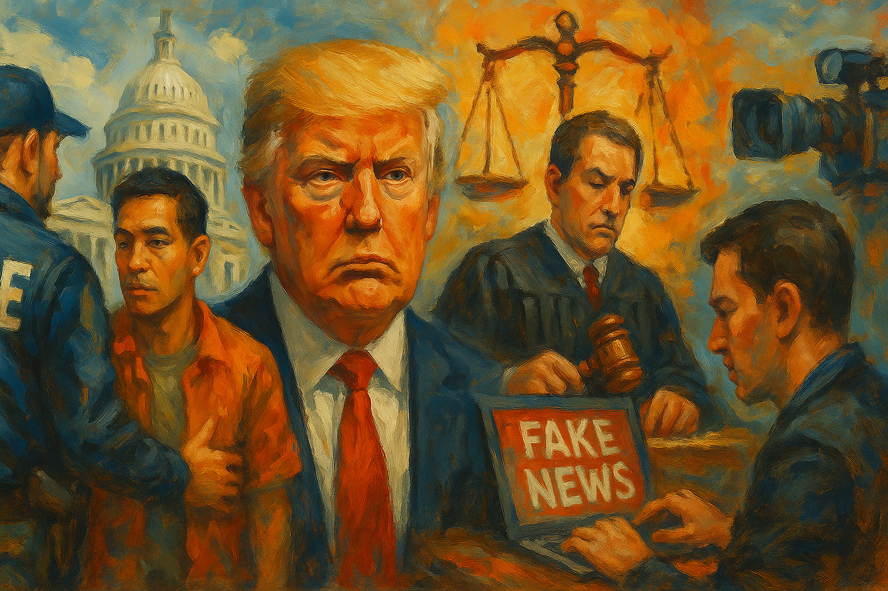

<!-- Generated by build_publish_week_v1 (appendix post) -->
<!-- Header image: image_wide_week81_appendix.png -->

# Week 81 Appendix: A Week That Held Its Line

*Immigration, press freedom, and judicial appointments came under sustained pressure, checked only partly by courts, voters, and Congress.*

Week 81 showed sustained pressure across nearly every axis of democratic erosion, with three dominant storylines: an attorney general confirmation process that traded away a controversial slush fund in exchange for votes while leaving DOJ's independence deeply compromised; a direct executive challenge to a recent Supreme Court ruling via two new birthright-citizenship executive orders; and mounting evidence of systemic prosecutorial misconduct and retaliation, from dismissed reflecting-pool charges to false statements used against a journalist and continued dismissal of January 6-related charges. Immigration enforcement intensified with record ICE detentions, force-feeding of hunger strikers, deportations violating court orders, and removal of TPS protections despite known danger in countries of origin. Countervailing signals appeared in state-level elections (Missouri and Kansas voters rejecting anti-democratic ballot measures), court rulings blocking the White House ballroom project and 75 First Amendment victories against the administration, and continued litigation challenging tariffs, FOIA violations, and agency overreach. The week also featured brazen monetization of the presidency via a paid early-access data feed for Truth Social posts.

Power and Authority

1. Trump administration issued executive order targeting the Smithsonian's American History Museum (2026-08-01): The order pressures a major public institution over its historical exhibits, raising concerns about political control of museum content and public memory.

2. Trump administration requested $10 million from Congress for Freedom 250 event expenses (2026-08-01): Seeking public funds for administration-sponsored events blurs the line between official government functions and political promotion.

3. Trump threatened to bypass Senate confirmation by keeping Blanche as acting attorney general (2026-08-01): The threat to install an attorney general without formal confirmation signals contempt for Senate oversight of the Justice Department.

4. Trump publicly attacked and considered firing US Attorney Jeanine Pirro over a dismissed vandalism case (2026-08-02): Public pressure on a federal prosecutor over an independent charging decision signals that prosecutorial choices may be dictated by presidential preference rather than evidence.

5. Trump used Truth Social to spread false claims about reflecting pool vandalism and attacked a prosecutor (2026-08-03): The president used an official platform to spread inaccurate claims and pressure a prosecutor, blurring commentary and executive influence over law enforcement.

6. Trump pressured attorney general nominee over abandoned anti-weaponization fund (2026-08-05): Informal presidential pressure on his own nominee over policy reversal raises questions about the independence of Justice Department decision-making.

7. Trump ordered helipad modifications on the White House South Lawn (2026-08-05): Use of public resources for presidential preference in facility upgrades raises questions about appropriate stewardship of government property.

8. Senate Homeland Security and Government Affairs Committee voted to hold Dr. Anthony Fauci in contempt of Congress after he invoked Fifth Amendment protections (2026-08-06): A committee vote to punish a witness for exercising a constitutional right against self-incrimination sets a precedent that could deter future testimony and weaponizes oversight power.

9. Trump publicly rebuked US Attorney Pirro again over the same dismissed case (2026-08-06) *[single source]*: Repeated public criticism of a prosecutor for exercising independent judgment reinforces pressure toward politically-directed law enforcement.

10. Trump threatened prosecution of leakers over reports of munitions shortages (2026-08-06): Threatening jail time for officials who disclose embarrassing military information chills transparency and whistleblowing during an active conflict.

11. Trump signed two executive orders restricting birthright citizenship (2026-08-06): The orders reinterpret a recent Supreme Court ruling to deny citizenship to categories of children, testing constitutional limits on executive power weeks after a judicial defeat.

12. Trump administration renewed effort to remove Federal Reserve Governor Lisa Cook (2026-08-05): A renewed removal push against a Fed governor, despite a prior Supreme Court ruling protecting her position, tests the independence of a key economic institution.

Institutions and Governance

1. Senate Judiciary Committee scheduled and advanced reconsideration of Todd Blanche's attorney general nomination (2026-08-01): Senate action on a contested nomination reflects institutional friction over a proposed fund seen as enabling political retaliation within the Justice Department.

2. Arizona Supreme Court ruled clergy confession privilege exempts mandatory child abuse reporting (2026-08-01) *[single source]*: The unanimous ruling shields religious institutions from mandatory reporting obligations even in documented child abuse cases, testing the balance between religious protections and child welfare law.

3. Trump administration accelerated immigration court case processing leading to missed hearings and deportations (2026-08-01): Rapid case processing denies immigrants adequate opportunity to present cases, undermining due process and fairness in immigration courts.

4. House Ethics Committee recommended censure of Rep. Chuck Edwards for sexual harassment (2026-08-02): Formal ethics findings and a censure recommendation test the House's willingness to enforce its own conduct rules against a sitting member.

5. US Court of Appeals for the District of Columbia Circuit upheld preliminary injunction halting White House ballroom construction (2026-08-02): The ruling found the president lacks unilateral authority to demolish and rebuild federal property without congressional authorization, reinforcing separation of powers.

6. Bernie Moreno and Jon Husted called for Rep. Max Miller's resignation over domestic abuse allegations (2026-08-02) *[single source]*: Bipartisan calls for resignation over serious abuse allegations test institutional standards for fitness to serve in Congress.

7. Trump and Speaker Johnson publicly defended Congressman Max Miller against domestic abuse allegations (2026-08-03) *[single source]*: Public defense by senior party leaders of a candidate facing serious abuse allegations signals institutional tolerance and undermines accountability standards.

8. 25 US states and 23 states/governors of Kentucky and Pennsylvania sued the Trump administration over new tariffs on 60 trading partners (2026-08-03): State lawsuits argue the tariffs are unlawful and bypass congressional authority, testing limits on unilateral executive trade power.

9. Judges across the U.S. criticized DOJ lawyers' conduct as unlawful, unethical, and dishonest (2026-08-03) *[single source]*: Widespread judicial criticism of Justice Department legal conduct suggests eroding standards and diminished trust in federal law enforcement practices.

10. James Comey's lawyers filed motions alleging vindictive and selective prosecution (2026-08-03): Allegations of irregularities in the grand jury process and vindictive prosecution raise concerns about the misuse of prosecutorial power for political ends.

11. DOJ dismissed case against David Hearn after grand jury irregularities alleged (2026-08-03): Dismissal following alleged grand jury misconduct raises concerns about the integrity of the DOJ's charging and grand jury processes.

12. Trump filed notice to appeal ruling finding slush fund manipulated judicial process (2026-08-03): The appeal contests a judge's finding that a settlement fund was designed to manipulate the legal process, raising accountability concerns.

13. Justice Department sued Montgomery County, MD over Second Amendment compliance (2026-08-03): Federal enforcement action against a local firearms ordinance tests the scope of Second Amendment protections and federal-local regulatory authority.

14. Doe (plaintiff class) filed class action challenging elimination of gender-affirming care coverage for federal employees (2026-08-03): The suit challenges executive action restricting health benefits based on sex, raising equal protection and administrative authority questions.

15. 23 states and governors of Kentucky and Pennsylvania filed complaint challenging USTR tariffs at Court of International Trade (2026-08-03): The suit alleges tariffs affecting nearly all U.S. imports exceed statutory authority and violate the Administrative Procedure Act.

16. State of New York and 24 co-plaintiff states plus D.C. filed complaint challenging agency rule expanding data-sharing of welfare recipients (2026-08-03): The lawsuit challenges unilateral expansion of data-sharing for TANF recipients without required procedural compliance, raising privacy and federalism concerns.

17. Citizens for Responsibility and Ethics in Washington filed complaint challenging Treasury's withholding of Judgment Fund settlement disclosures (2026-08-03): The suit challenges secrecy around settlements potentially benefiting pardoned January 6 defendants and Trump allies, testing transparency law enforcement.

18. Judge Abelson granted preliminary injunction against USCIS voter assistance ban (2026-08-03): The court reinstated a prior USCIS policy on voter assistance pending final resolution, checking an administration change on First Amendment and equal protection grounds.

19. Senate Judiciary Committee voted along party lines to advance Todd Blanche's nomination (2026-08-03): Party-line advancement of a contested nominee reflects partisan dynamics shaping DOJ leadership selection.

20. North Carolina House and Senate scheduled and passed bills altering court and election partisanship (2026-08-03) *[single source]*: Legislation restructuring courts and elections toward partisan control threatens judicial independence and electoral integrity.

21. Judge Mae D'Agostino blocked New York's ICE mask-and-ID transparency law via preliminary injunction (2026-08-04) *[single source]*: The ruling struck down a state accountability measure requiring visible identification of federal immigration agents, limiting state oversight of federal enforcement.

22. Hearn's legal team filed motion to dismiss with prejudice and sought accountability remedies (2026-08-04) *[single source]*: The motion seeks accountability for alleged prosecutorial misconduct, testing whether courts and Congress will provide remedies for wrongful prosecution.

23. Judge Emmet Sullivan reviewed DOJ redactions in Epstein files case (2026-08-04): Judicial review of DOJ redactions tests compliance with transparency law and potential misconduct in handling sensitive investigative documents.

24. Democracy Forward Foundation filed complaint compelling USCIS to comply with FOIA requests on election-related data (2026-08-04): The suit seeks records on USCIS's role in voter roll data systems ahead of midterms, raising transparency and separation-of-powers concerns.

25. Supreme Court announced October docket including climate change and immigration detention cases (2026-08-04): Upcoming rulings on major disputes could reshape executive power, agency authority, and civil rights protections.

26. Trump Justice Department dismissed seditious conspiracy charges against Oath Keepers members (2026-08-04): Dismissal of serious charges tied to the January 6 insurrection signals retreat from accountability for the attack on the Capitol.

27. House Ethics Committee launched investigation into Max Miller over domestic abuse allegations (2026-08-05): The investigation directly tests the fitness of a sitting member of Congress to serve amid serious personal conduct allegations.

28. Missouri voters rejected Amendment 4 requiring district-by-district approval of citizen amendments (2026-08-05) *[single source]*: Voters preserved direct-democracy mechanisms that have protected abortion rights and social programs from a supermajority-style barrier.

29. Kansas voters rejected constitutional amendment to make Supreme Court justices directly elected (2026-08-05) *[single source]*: Voters preserved judicial independence by rejecting a partisan attempt to politicize state court selection for a second time.

30. New Mexico Attorney General Raúl Torrez sued DOJ for withholding Epstein investigation documents (2026-08-05): The suit challenges federal obstruction of a state criminal investigation, testing whether DOJ can withhold evidence from state prosecutors.

31. Trump filed motion to block court order requiring financial disclosure to BBC (2026-08-05): Efforts to block a court-ordered disclosure combined with a defamation lawsuit against media raise concerns about weaponizing litigation against the press.

32. American Federation of Government Employees filed FOIA enforcement complaint against TSA over privatized screening program (2026-08-05): The lawsuit tests whether the executive branch must comply with statutory transparency deadlines for a program transitioning security functions to contractors.

33. Anam Rahman Petit filed civil rights complaint over termination as immigration judge (2026-08-05): The case tests whether the executive may remove federal workers on discriminatory or political grounds under claimed Article II authority.

34. Judge Randolph Moss dismissed DOJ's 21st consecutive voter roll access lawsuit (2026-08-06) *[single source]*: Repeated judicial rejection of federal attempts to access unredacted voter data reaffirms state authority over election administration.

35. DOJ petitioned Supreme Court to lift block on mail ballot restriction (2026-08-06): If granted, the petition would allow restrictions on mail voting shortly before the midterms, directly affecting voting access.

36. Human rights organizations filed federal lawsuit challenging ICC sanctions executive order (2026-08-06): The suit contests executive sanctions on international justice institutions, raising First Amendment and separation-of-powers concerns.

37. Georgia Fort's attorneys sought dismissal of charges over protest documentation on First Amendment grounds (2026-08-06) *[single source]*: The dismissal motion challenges prosecutorial use of false claims and law enforcement pressure against a journalist covering a protest.

38. Federal judges ruled against Trump administration in 75 of 93 First Amendment cases (2026-08-07) *[single source]*: The high rate of judicial rejection demonstrates a pattern of administration efforts to suppress protected speech being checked by the courts.

39. Judge Patti Saris approved termination of TPS protections for South Sudanese nationals (2026-08-07): The ruling removes legal protections from a vulnerable immigrant population amid ongoing civil war in the country of origin.

40. Judge Roy Altman issued temporary stay of financial records disclosure order in Trump v. BBC (2026-08-07) *[single source]*: Suspension of a discovery order tests judicial handling of a president's litigation strategy to resist scrutiny of business finances.

41. Will Rosenzweig filed complaint challenging removal as retaliation for protected speech (2026-08-07): The suit challenges a stated policy of removing career civil servants perceived as politically disloyal, testing First Amendment and civil service protections.

42. Appeals court ruled White House ballroom construction requires congressional approval (2026-08-07): The appellate court found no historical precedent for unilateral presidential demolition of taxpayer-funded federal property, reinforcing congressional authority.

43. Trump administration gutted DOJ Office of Professional Responsibility amid record misconduct complaints (2026-08-07): Staffing cuts to internal DOJ oversight coincide with the highest number of misconduct complaints in two decades, weakening internal accountability.

44. Bill Cassidy announced support for confirming Todd Blanche as attorney general (2026-08-07): The final holdout senator's support clears the path for confirming a president's former personal lawyer as the nation's chief law enforcement officer.

45. Todd Blanche issued order terminating $1.8 billion anti-weaponization fund (2026-08-07) *[single source]*: The termination, negotiated to secure confirmation votes, leaves open questions about whether a similar mechanism could resurface once he is confirmed.

46. Senate confirmed Erica Schwartz as CDC director (2026-08-05): Confirmation of a new public health leader occurs amid ongoing concern about vaccine policy independence within the administration.

47. Judge Kathleen Williams / DOJ appealed ruling finding slush fund agreement manipulated judicial process (2026-08-05): Continued appeal of a ruling questioning the legitimacy of a settlement fund underscores unresolved accountability concerns.

Economic Structure

1. DOGE delayed forest-thinning grant that preceded wildfires (2026-08-01) *[single source]*: Administrative delay of environmental mitigation funding may have contributed to increased wildfire risk, showing consequences of budget-cutting decisions on public safety.

2. Amazon and Walmart paid wages requiring employees to rely on public Medicaid benefits (2026-08-01) *[single source]*: Billions in annual taxpayer-funded Medicaid subsidize low wages at major profitable retailers, externalizing labor costs onto the public.

3. Trump Media launched premium subscription selling early access to presidential Truth Social posts (2026-08-01): Selling advance access to potentially market-moving presidential statements for up to $100,000 monthly monetizes the presidency for personal profit.

4. Capital One disclosed anti-money laundering reasons for closing Trump-linked accounts (2026-08-01): The bank's court filing counters claims that account closures were politically motivated, touching on financial regulation and presidential grievance narratives.

5. Texas State imposed moratorium on data center construction (2026-08-01) *[single source]*: Following New York's earlier move, the moratorium signals a potential nationwide trend restricting AI infrastructure with implications for economic growth and energy policy.

6. Trump imposed 50% tariff on Canadian imports (2026-08-02): The tariff, enacted under a Depression-era statute, demonstrates use of unilateral presidential power to influence trade negotiations and international economic relations.

7. Foundation for Liberty and American Greatness misallocated nonprofit funds intended for civics education (2026-08-01) *[single source]*: An investigation found little evidence of promised educational output while founders received outsized compensation, raising accountability and public trust concerns.

8. Trump signed proclamation imposing tariffs and minimum import prices on polysilicon (2026-08-06): The action uses national-security trade authority to unilaterally restructure a critical technology supply chain, bypassing Congress on tariff policy.

9. One Nation spent $1.7 million on demonstrably false attack ad against Senator Ossoff (2026-08-04) *[single source]*: A dark-money group's saturation of a state with false claims about a senator's record exemplifies large-scale funded election disinformation.

10. Meidas reporting reported tariff refunds going to corporations rather than consumers (2026-08-04) *[single source]*: The allocation of billions in tariff refunds primarily to corporations rather than consumers raises economic fairness and policy design concerns.

11. White House published fact sheet claiming manufacturing investment surge under Trump policies (2026-08-04): The release credits tariff and tax policy for private-sector investment announcements without independent verification of causal claims.

12. White House published fact sheet crediting policies for private-sector price reductions (2026-08-06): The document frames corporate pricing decisions as direct responses to administration policy without independent verification of causation.

13. U.S. economy reported unexpected job losses in July with slowing wage growth (2026-08-06): Nonfarm payrolls fell against expectations of gains while labor force participation hit a five-year low, signaling economic softening.

14. Trump administration delayed enforcement of hemp product ban benefiting Chief of Staff's family (2026-08-07): Delayed enforcement of a signed law benefiting a senior official's family member's business raises conflict-of-interest concerns.

15. ICE purchased private immigration detention centers for $1.5 billion (2026-08-07): Large-scale government spending to acquire detention infrastructure signals expansion of immigration enforcement capacity.

16. Freedom 250 sponsors failed to disclose corporate donations to state fair event (2026-08-07): Major corporate sponsors' undisclosed contributions may violate federal lobbying disclosure law, obscuring influence over a political event.

17. Trump ordered 15% tariff on polysilicon products for semiconductors and solar panels (2026-08-07) *[single source]*: Tariff policy targeting a critical technology material affects global commerce, consumer costs, and international economic relationships.

18. DOJ and Tennessee Attorney General reached settlement requiring divestitures in asphalt market (2026-08-07): Federal-state antitrust coordination preserves market competition and protects public procurement interests in a regional industry.

19. Justice Department withdrew 1987 business review letter shielding proxy advisory firm from antitrust action (2026-08-05): The withdrawal signals a shift toward scrutinizing concentrated market power in corporate governance influencing shareholder voting.

20. SEIU / HCA Healthcare workers held picket protests demanding higher pay and staffing (2026-08-06) *[single source]*: Labor organizing highlights disparity between record corporate profits and stagnant worker compensation in a critical healthcare sector.

Civil Rights and Dissent

1. Idaho police (Twin Falls) responded to mass shooting killing three and wounding ten at a restaurant (2026-08-01): A mass shooting and subsequent police video release raise public safety and law enforcement transparency questions.

2. DHS/ICE obtained court orders to force-feed at least 10 hunger strikers in detention (2026-08-03): Involuntary force-feeding of detained immigrants, widely considered torture under human rights standards, represents severe violation of bodily autonomy and due process.

3. Carlitos Ricardo Parias released video of contaminated drinking water at ICE detention facility (2026-08-03) *[single source]*: Documentation of contaminated water in a detention facility raises questions about compliance with court orders protecting detainee welfare.

4. Department of Justice announced record 25 denaturalization complaints against naturalized citizens (2026-08-03): A significant expansion of denaturalization enforcement raises questions about equal application of law and the scope of citizenship revocation.

5. ICE targeted enforcement against children and young people (2026-08-03) *[single source]*: Enforcement operations disproportionately affecting minors raise due process and humanitarian concerns for vulnerable populations.

6. North Carolina General Assembly removed protesters from legislative gallery during voter suppression bill vote (2026-08-03) *[single source]*: Removal of chanting protesters restricts citizens' ability to witness and voice opposition to legislation within a public forum.

7. Monroe County commissioners voted to terminate surveillance camera contract early (2026-08-03) *[single source]*: Local termination of automated license plate reader infrastructure demonstrates grassroots resistance to mass surveillance despite added cost.

8. Prosecutors (Suffolk, Virginia) charged individuals with felony destruction of surveillance cameras (2026-08-03): Felony prosecution of direct action against surveillance infrastructure raises the legal cost of grassroots resistance to mass monitoring.

9. Law enforcement officers (multiple jurisdictions) abused license plate reader data to track romantic interests (2026-08-03) *[single source]*: Documented abuse of surveillance data undetected by internal audits demonstrates systemic failure of oversight in mass monitoring systems.

10. ICE detained and released Johns Hopkins researcher over disputed visa status (2026-08-04): Detention of an academic with valid work authorization demonstrates inconsistent enforcement raising due process concerns.

11. ICE detained University of Maryland pharmacy instructor at airport (2026-08-04) *[single source]*: Detention of an award-winning instructor without criminal record contradicts stated enforcement priorities and raises due process concerns.

12. RFK Jr spread vaccine misinformation while urging measles vaccination amid outbreak (2026-08-02): The health secretary's contradictory messaging during a major measles outbreak degrades public trust in health institutions and immunization guidance.

13. Trump administration exempted border wall contractors from Endangered Species Act compliance (2026-08-04) *[single source]*: Broad statutory waivers concentrate authority in DHS to bypass environmental protections without legislative or judicial review.

14. DOJ directed aggressive prosecution ('go big,' 'go loud') of anti-ICE protesters (2026-08-06) *[single source]*: A directive to pursue harsh charges against protesters opposing immigration enforcement represents weaponization of law enforcement against protected activity.

15. ICE and TSA expanded airport immigration enforcement targeting visa applicants and asylum seekers (2026-08-06) *[single source]*: Expanded enforcement into commercial spaces targeting people with pending legal applications raises constitutional due process questions.

16. Democratic senators demanded DOJ investigate deaths of US citizens in West Bank (2026-08-06) *[single source]*: Apparent failure to investigate killings of American citizens abroad signals breakdown in federal accountability obligations.

17. Trump administration terminated TPS protections for Haitians and initiated ankle-monitor deportation enforcement (2026-08-05): Removal of legal status protections for hundreds of thousands of Haitians, followed by enforcement using electronic monitoring, targets a vulnerable population.

18. ICE deported Maine man in violation of federal court order (2026-08-05) *[single source]*: Deportation despite a judge's order not to remove the individual demonstrates disregard for judicial authority and due process protections.

19. ICE arrested and detained 43,000 people in July, a record monthly total (2026-08-07): Record detention pace demonstrates systematic escalation of immigration enforcement affecting hundreds of thousands of people.

20. ICE / DHS detained at least 52 military family members since Trump took office (2026-08-07) *[single source]*: Reversal of a bipartisan policy protecting military families from deportation undermines the implicit social contract with service members.

21. Trump administration demanded TANF recipient data from 24 states for immigration enforcement (2026-08-07) *[single source]*: Weaponizing a social-safety-net program to identify families for immigration enforcement chills program enrollment and undermines its protective purpose.

22. FBI declined civil rights investigation into fatal ICE shooting (2026-08-07): The refusal to conduct a standard civil rights probe into a fatal shooting suggests reduced accountability for law enforcement use of force against immigrants.

Information, Memory and Manipulation

1. New York Post published unverified petition story targeting Mamdani (2026-08-01) *[single source]*: Presenting an unsubstantiated petition as fact shows how misinformation spreads through mainstream outlets around public figures.

2. Newsmax and Meta agreed to AI training partnership using Newsmax reporting (2026-08-01) *[single source]*: A deal enabling a misinformation-prone outlet to shape AI training data risks embedding false narratives into widely used AI systems.

3. Trump posted AI-generated image to Truth Social without disclosure (2026-08-01) *[single source]*: Undisclosed AI imagery in political messaging raises concerns about authenticity and the potential for deepfakes to mislead the public.

4. Freelance reporter Matthew Cole fought DOJ subpoena seeking to reveal sources for national security reporting (2026-08-01) *[single source]*: The subpoena reflects intensified government pressure on reporters to divulge sources, testing press freedom protections.

5. Marco Rubio and Stephen Miller made false claims about left-wing violence at international conference (2026-08-03): False claims by senior officials on an international stage risk distorting the factual record and justifying expansive enforcement.

6. Trump campaign and White House used and then removed copyrighted music from social media posts without permission (2026-08-03): Repeated unauthorized use of artists' work for political mockery, then silent removal, raises questions about intellectual property and messaging tactics.

7. Polymarket posted false political claim about NYC grocery store ID requirement (2026-08-03): A platform claiming accuracy amplified a false claim to drive prediction-market engagement, showing profit incentives overriding factual accuracy.

8. CBS News New York published false report on 9/11 families opposing Mamdani, then quietly corrected it (2026-08-05) *[single source]*: Initial false reporting followed by uncredited correction undermines public trust and accuracy in civic information.

9. One Nation created network of fake news sites targeting Senate races (2026-08-06) *[single source]*: Coordinated deceptive news infrastructure by a partisan dark-money group undermines press credibility and voter information ahead of elections.

10. White House released declassified FBI memos framing past Trump investigation as illegitimate (2026-08-05): Selective declassification and release of law-enforcement records to shape political narrative raises separation-of-powers and information-control concerns.

11. White House published fraud.gov release tracking administration enforcement actions (2026-08-06): The release documents a sustained enforcement campaign affecting federal benefit programs, raising due process and state autonomy questions.

12. ICE adopted body-camera policy allowing agency discretion to withhold footage of deaths (2026-08-07) *[single source]*: The policy formalizes selective disclosure, granting the director discretion to withhold video of officer-involved deaths deemed contrary to agency interest.

13. Judge Jennifer Mascott operated private public affairs firm while serving as federal appellate judge (2026-08-07) *[single source]*: A sitting judge maintaining a private business for months after appointment raises judicial ethics and impartiality concerns.

