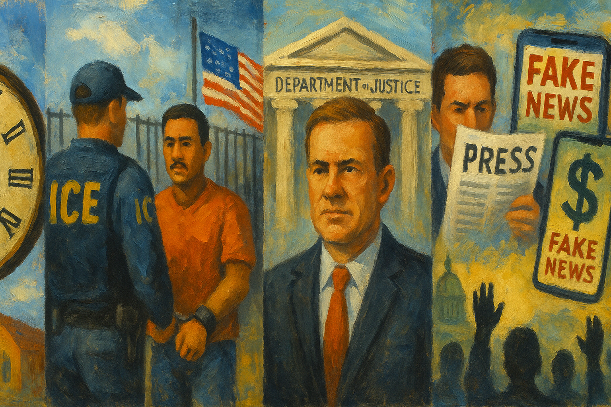

<!-- Generated by build_publish_week_v1 -->
<!-- Header image: image_wide_week81.png -->

# Week 81: A Week That Held Its Line

*Immigration, press freedom, and judicial appointments came under sustained pressure, checked only partly by courts, voters, and Congress.*

The week did not announce itself with a single defining moment. It moved through accumulation, across immigration enforcement, media pressure, judicial defiance, and one confirmation fight that dragged nearly every other thread behind it. Nothing here broke sharply from what came before. That, itself, is a signal. The Democracy Clock recorded a movement so small it barely registers on paper. Yet the record beneath it shows continued pressure on nearly every front, checked only in scattered places by courts, voters, and internal congressional discipline.

At the close of the previous week, the clock stood at 7:40 p.m. It closed this week at the same public time, 7:40 p.m., with an internal shift of two-tenths of a minute. The number is almost too small to notice. But it reflects real tension: serious erosion in citizenship law, prosecutorial independence, and press freedom, weighed against real resistance from appellate courts, state voters, and a Senate that still, in places, insisted on its own prerogatives. The week did not deepen the emergency. It held the line at a level already grave, with pressure pushing from several directions at once.

The most consequential story of the week ran through Todd Blanche's confirmation as attorney general. For months, his nomination had been tangled up with a $1.8 billion fund Trump had proposed to compensate political allies, a fund critics said would also shield the president's family from tax audits. Blanche released documents purporting to rescind the fund, timed precisely to unlock the votes of holdout senators. Trump, even as the deal proceeded, pressured his own nominee over the fund's abandonment. Separately, he threatened to bypass Senate confirmation altogether if the process stalled.

The confirmation succeeded only after Senator Bill Cassidy signaled his support. But legal experts flagged loopholes in Blanche's rescission documents suggesting the fund could be revived. What looked like reform read, on closer inspection, like a maneuver built to clear a vote rather than resolve an ethical conflict. Blanche now leads the Justice Department, a former personal defense lawyer to the president, installed through a process shaped by financial protection rather than independent vetting. The Senate's institutional check held its form. In substance, it bent.

A second development tested a different kind of finality. Weeks after the Supreme Court affirmed birthright citizenship as a constitutional guarantee, Trump signed two executive orders narrowing it, targeting both birth tourism and the broader guarantee itself. No court had yet ruled on the new orders by week's end. But the act itself mattered apart from its eventual fate in litigation. It treated a settled constitutional ruling as a starting point for renewed pressure, not a boundary. If judicial review can be relitigated simply by repetition, its authority weakens, regardless of whether any single order survives.

Immigration enforcement expanded on nearly every axis this week. ICE detained a record 43,000 people in July alone, bringing the seven-month total past 238,000. At least ten detainees on hunger strike, some for six to eight months, were force-fed under court order, a practice international law classifies as torture. Enforcement reached into unlikely corners. A Johns Hopkins researcher and a University of Maryland instructor, both with valid work authorization, were detained despite meeting the government's own stated enforcement priorities. More than fifty relatives of active-duty service members were detained and deported after a policy shift ended long-standing protections for military families.

The administration also terminated Temporary Protected Status for Haitians and, separately, secured court approval to end it for South Sudanese nationals, stripping legal protection from people facing documented violence and civil war at home. ICE adopted a new body-camera policy granting its director broad discretion to withhold footage of officer-involved deaths, following two recent fatal shootings without available video. The FBI declined to open a civil rights investigation into one such shooting, a decision that stood in stark contrast to the aggressive prosecution, that same week, of protesters and a journalist. The pattern was not accidental. Scrutiny moved one direction, protection the other.

Election administration bore its own version of this pressure. The Justice Department petitioned the Supreme Court to lift a block on mail-ballot restrictions and sued thirty states and the District of Columbia demanding voter registration data, continuing a campaign federal courts had already rejected twenty-one times running. A federal judge dismissed the twenty-second such suit this week, reaffirming that states retain authority over their own rolls. The administration separately demanded citizenship data on recipients of a child-welfare assistance program from twenty-four states, turning a safety-net system into a tool for tracking vulnerable families. North Carolina's Senate, meanwhile, passed a restrictive voting bill without debating a single proposed amendment, ejecting protesters from the gallery when they objected.

Journalists absorbed direct legal pressure this week, not as an abstraction but as prosecution. The Justice Department indicted Georgia Fort, a journalist who had documented an anti-ICE protest, using false claims across more than fifteen warrant applications to build the case against her. Homeland Security Investigations twice tried to seize her work product and subscriber data, sidestepping statutory protections meant to shield journalists from exactly this kind of seizure. Trump simultaneously pursued ten-billion-dollar defamation suits against both the BBC and the Wall Street Journal, while the Justice Department issued, then hastily withdrew, subpoenas targeting New York Times reporters. None of these cases needed to succeed to do their work. Litigation itself imposes cost, and cost chills coverage regardless of outcome.

That same week, Trump publicly attacked his own appointed prosecutor, Jeanine Pirro, for dropping vandalism charges tied to a false claim about damage at the Lincoln Memorial reflecting pool, a claim he kept repeating even after the underlying evidence collapsed. The episode revealed something uncomfortable inside the administration's own machinery. Prosecutorial accuracy and political loyalty do not always align. When they conflict, the president chose loyalty to the narrative over the finding of fact.

Beneath these headline confrontations ran a quieter breakdown of internal oversight. The Justice Department's Office of Professional Responsibility, tasked with investigating attorney misconduct, was cut from twenty-nine staff to sixteen, its director fired with no replacement named, even as misconduct complaints reached a twenty-year high. Ninety-nine departures from inspector general offices compounded the loss. These cuts do not make headlines on their own. They are the kind that determine, a year later, whether anyone was watching when something went wrong.

A parallel commercial development deserves its own accounting. Trump Media launched a subscription tier selling early access to the president's Truth Social posts for up to one hundred thousand dollars a month, monetizing advance knowledge of statements capable of moving markets. Paired with a multimillion-dollar renovation of the White House helipad and a ten-million-dollar request to Congress for Freedom 250 event costs, the pattern held steady: public office turned into private financial instrument, often through channels too diffuse to prosecute but too visible to ignore.

Disinformation infrastructure grew in scale and coordination. A dark-money group called One Nation built a network of fake local news sites across six Senate battleground states and spent 1.7 million dollars on a false attack advertisement against Senator Ossoff, reaching seventy-eight million impressions. Trump posted undisclosed AI-generated imagery to his own following. A licensing deal let Meta train artificial intelligence systems on Newsmax's reporting, an outlet with a documented record of misinformation. Each piece, alone, is a data point. Together, they describe an information environment increasingly filled with manufactured consensus ahead of a midterm election.

Not every current in the week moved toward erosion. The DC Circuit upheld an injunction blocking construction of a White House ballroom, reaffirming that the president cannot unilaterally demolish and rebuild federal property without congressional authorization. Twenty-five states sued to block a new round of tariffs imposed on sixty trading partners, testing the limits of executive trade authority. Federal judges ruled against the administration in seventy-five of ninety-three First Amendment cases reviewed this year, a substantial majority suggesting the judiciary has not abandoned its role as a check on speech restriction.

Voters delivered their own answer in three states. Missouri rejected a measure that would have made citizen-led constitutional amendments far harder to pass, and separately rejected a proposal to eliminate the state income tax. Kansas voters, for the second time, defeated an effort to have Supreme Court justices directly elected, preserving a nominating commission designed to insulate judicial selection from partisan capture. In Michigan, progressive candidates overcame record spending from outside groups aligned with established interests. Structural financial disadvantage does not always decide outcomes.

Congress showed intermittent capacity for self-discipline as well. The House ethics committee recommended censure of a sitting Republican for sexual harassment and opened a formal investigation into another over domestic abuse allegations, with a Republican senator publicly calling for his colleague's resignation. These were not large victories. They were evidence that some baseline mechanism for holding members of the governing party to their own conduct standards continued to function, even amid larger strain elsewhere.

Two threads remain unresolved and worth watching. The fund rescission tied to Blanche's confirmation carries an unsettled legal life ahead. Its enforceability is contested, and whether it can be quietly reinstated once confirmation pressure has passed is a live question, not a settled one. The birthright citizenship orders await their first test in court, a test that will show whether repeated executive action can wear down a recent constitutional ruling through sheer persistence rather than argument.

What this week shows, more than any single event within it, is how erosion and resistance now run on parallel tracks without resolving into either direction. The administration presses hardest at the edges of basic democratic membership: who counts as a citizen, who may document power, who may be watched, and who profits from proximity to office. Courts, voters, and even parts of Congress continue to hold certain lines, but their victories arrive after the fact, correcting rather than preventing. The distance between those two tracks, pressure and correction, is where the health of the system now lives. This week, that distance neither widened nor closed. It simply persisted, and persistence, week after week, becomes its own kind of history.

<!-- Synopses for cross-posting -->
Long Synopsis: This week the Democracy Clock barely moved, but the underlying record showed continued strain across multiple fronts. Todd Blanche's confirmation as attorney general advanced only after a contested rescission of a fund tied to protecting Trump's family from tax audits. Executive orders sought to narrow birthright citizenship weeks after the Supreme Court affirmed it. ICE detentions hit record highs, hunger strikers were force-fed, and a journalist was indicted using false warrant claims. Meanwhile, appellate courts blocked a White House construction project, judges rejected a majority of First Amendment challenges to the administration, and voters in Missouri and Kansas rejected anti-democratic ballot measures. The week did not deepen the emergency, but pressure persisted on nearly every front, with resistance arriving after the fact rather than preventing harm.
Short Synopsis: A confirmation fight entangled with a slush fund, new orders challenging birthright citizenship, record immigration detentions, and press prosecutions defined the week. Courts, voters, and parts of Congress pushed back, but correction trailed pressure rather than preventing it.

