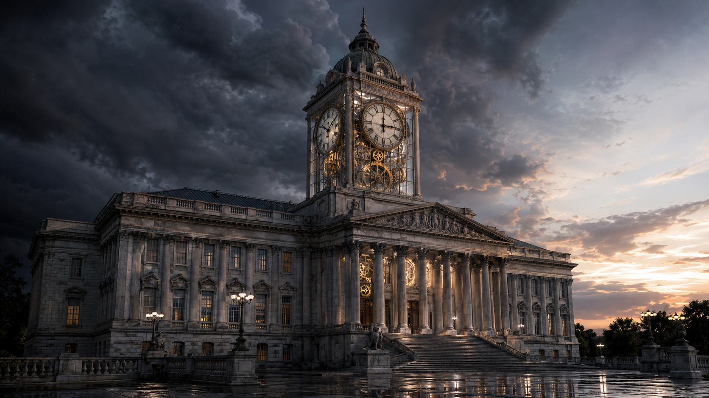

<!-- Generated by build_publish_week_v1 -->
<!-- Header image: image_wide_week82.png -->

# Week 82: The Clock That Refused to Move

*A politicized Justice Department, quantified self-enrichment, and open defiance of a court order offset by scattered, partial resistance across courts and voters.*

The clock stood still this week. Not because the machinery of power slowed down, but because its motion cancelled itself out. Where one office built new instruments of coercion, another briefly reasserted a boundary. Where one arm of government sold access to itself, a court somewhere else refused to bend. The result was a week of intense activity that moved the needle almost nowhere at all. That near-stillness is worth sitting with. It is not the same thing as peace.

Week 82 opened with the clock at 7:40 p.m. It closed there too, moving by only a tenth of a minute, from 460.2 to 460.1. The net change was negative: the week's damage slightly outweighed its repairs. Beneath that flat number sat some of the most consequential developments of the term so far. A president's personal lawyer was confirmed as chief law enforcement officer. A federal board defied a binding court order. Documented multi-billion-dollar personal enrichment flowed through the presidency itself. The stillness did not mean nothing happened. It meant that courts, voters, and a handful of holdout legislators pushed back hard enough to keep the week from tipping further.

The most structurally significant event was the Senate's confirmation of Todd Blanche, the president's former personal defense attorney, as Attorney General. The vote passed by the narrowest possible margin, fifty to forty-nine. Within days, the promise embedded in that vote was fulfilled. The president publicly pressured a sitting U.S. Attorney, Jeanine Pirro, to reverse her own dismissal of a case against a defendant he wanted prosecuted. The White House then formally asked the Justice Department to revive dropped charges against a different man, a former Olympian accused of vandalizing a reflecting pool. Neither intervention required Blanche's signature to succeed. It required only that everyone understand what kind of Attorney General now sat atop the department.

This was not an isolated appointment. Trump also named Will Scharf, the aide who had helped clear his own ballroom construction project, as White House Counsel. The pattern held steady: place people who had already served personal interests into posts meant to check those interests. Judicial independence eroded not through one dramatic act, but through appointments that kept blurring the line between advocate and overseer. The record now treats this blurring as entrenched, not exceptional.

A second current ran through the week's economic disclosures. Reporting placed the president's personal revenue for the term at roughly $2.2 billion, drawn from cryptocurrency holdings, a settlement granting him personal tax-audit immunity, and a foreign gift. Trump Media's new "Truth API" sold early access to presidential posts for $100,000 a month, a service aimed at Wall Street firms who stood to profit from knowing what the president would say before the public did. A crypto investor with a history under money-laundering scrutiny funneled $100 million into a Trump-linked token. Jared Kushner's firm collected fees from Middle Eastern governments even as he negotiated with those same governments in an official capacity.

None of this required secrecy. It happened in plain view, defended or ignored rather than hidden. A lawsuit was filed against the Truth API scheme before the week ended, but the scheme itself kept operating. The presidency had become, in measurable terms, a revenue stream. These are not abstractions. They describe a specific, quantifiable transfer of governmental function into personal gain.

A third development concerned public money and public buildings. The administration bypassed Congress to fund $927 million in White House renovations, drawing much of it from redirected agency budgets, including a nearly 5,000 percent spike in National Park Service funds diverted to presidential grounds projects. This came even as a federal appeals court upheld an injunction against the president's separate ballroom construction, a ruling Trump vowed to appeal and then, before the week closed, asked the Supreme Court to override outright.

The juxtaposition mattered. A court said no. The money moved anyway, just not through the channel the court had blocked. This is the shape erosion often takes: not defiance of a single order, but movement around it. The scale and audacity of the diversion drove one of the week's largest single trait shifts.

The clearest instance of outright defiance came from the Kennedy Center. Its Trump-aligned board voted to inscribe the president's name on the building and proceed with closure plans, despite a standing federal court order blocking both actions. This was not litigation or appeal. It was a board simply declining to comply, betting that no one would make them. Whether anyone does remains unresolved at week's end. But the act itself tested something courts rarely have to test explicitly: whether their orders bind institutions that answer, in practice, to political loyalty rather than law.

Set against this defiance, the week also produced real judicial resistance. The same appellate panel that blocked the ballroom held its line even as the president escalated toward the Supreme Court. A federal judge dismissed the administration's lawsuit against Harvard for lack of factual basis, a case that had been used to pressure the university over its handling of campus antisemitism complaints. These rulings did not reverse the broader current. But they showed that a judge insulated from political pressure could still say no, and make it stick, at least for now.

Enforcement agencies expanded their physical and surveillance capacity in ways that moved several traits at once. ICE announced plans to spend up to $20 million procuring electric-shock gloves for use against detainees, a budgeted acquisition rather than an isolated field abuse. Haitian immigrants in Ohio, present under legal status, were fitted with ankle monitors without explanation. Deportation proceeded against a man despite a Minnesota governor's pardon, a direct override of state clemency by federal authority. The State Department revoked more than 175,000 visas, a pace quadrupling the prior year's rate, including visas pulled for political speech: a student's op-ed, commentary on an activist's death.

Separately, and perhaps more troublingly, DHS ran an undercover operation, publicly labeled Operation Puppet Master, infiltrating peaceful protest groups and labor unions in Minnesota. It produced fifteen indictments. Signal chats, financial records, and organizing meetings were monitored over an extended period. This was not a response to violence. It was surveillance of lawful assembly and union activity, treated by the state as inherently suspect. Ordinary organizers were watched closely while the president's own financial dealings drew scrutiny but no consequence.

A parallel thread ran through economic data and the administration's response to it. The Department of Labor reported a loss of 23,000 jobs in July and revised prior months downward by more than 100,000 positions. Retail sales fell 0.6 percent against forecasts of growth. Gas prices hit record highs for the date. Rather than acknowledge this, senior officials denied the numbers on air. The president himself called the economy strong only from the vantage point of Wall Street, an admission that inadvertently confirmed the gap between markets and household experience. A similar pattern of denial surfaced elsewhere: the president falsely claimed total U.S. Navy control of the Strait of Hormuz, a claim directly contradicted by shipping data.

The week also delivered a chapter in the ongoing tension between military judgment and presidential preference. Reports of a weapons shortage prompted not correction but denial, paired with a presidential order for leak investigations and threats of long prison sentences for whoever had disclosed the shortfall. Separately, Trump signed a national security memorandum directing the Navy to replace a modern aircraft carrier launch system with outdated steam catapults, overriding engineering and military expertise for a personally preferred technology. During a trip through Turkey, the president reportedly departed via a decoy operation, prioritizing the safety of personal aides over the Secretary of State and the traveling press corps left behind. Individually these might read as eccentricities. Together, they describe a chain of command built around personal instinct rather than institutional process.

Information control took its own shape this week. Trump posted AI-generated propaganda images, including an Islamophobic depiction of a Senate candidate and false claims of an Iran war victory. Outgoing Press Secretary Karoline Leavitt spent her final days blocking the Associated Press from the pool while elevating a favorable seat for aligned commentators, before announcing her resignation. The administration issued an executive order restructuring the childhood vaccine schedule based on unproven autism claims, directing the Justice Department to challenge state mandates that conflicted with it. Each act pulled at a different thread of the same fabric. Manufactured narrative stood in for verifiable fact, whether about war, journalism, or children's health.

Not every current ran downward. Wisconsin and Minnesota primary voters delivered a genuine rebuke to a Trump-endorsed candidate, rejecting Mike Lindell's bid for the Minnesota governorship by a wide margin. He refused to concede, alleging unspecified irregularities, but the result stood. Senate Republicans, for their own reasons, declined to advance a $1.5 trillion defense budget favored by the Pentagon. Democratic senators pressed public questions about luxury aircraft purchases and ICE's use-of-force practices. A California agency banned a toxic pesticide linked to Parkinson's disease. None of these actions reversed the week's larger currents. But resistance, however partial and reactive, had not gone silent.

What distinguishes Week 82 from a week of pure consolidation is this coexistence of escalation and friction, resolving into neither. The Attorney General's confirmation, and the prosecutorial pressure that followed within days, mark a genuine structural deepening, not a symbolic gesture. The scale of personal enrichment, now given a number, $2.2 billion, moves the record from suspicion to documentation. The Kennedy Center's open defiance poses a question still unanswered: what happens when an institution simply refuses to comply, and no one compels it.

Whether that defiance draws consequence, whether the paid early-access lawsuit against Trump Media produces an injunction, and whether the Supreme Court grants or denies the ballroom petition are all questions the record leaves open. No date is yet attached to their resolution.

The larger arc of the term has, by this point, made a certain kind of erosion familiar: appointments that blur loyalty and law, enforcement tools that expand faster than oversight can track them, money that moves around injunctions rather than through them. What Week 82 adds is not a new method but a sharper accounting of costs already accruing, and a reminder that resistance, when it appears, tends to arrive late and partial. It suggests not that the ship has turned, but that it has not yet run aground.

<!-- Synopses for cross-posting -->
Long Synopsis: Week 82 saw the Senate confirm Todd Blanche, the president's former personal lawyer, as Attorney General, followed within days by direct presidential pressure to revive dismissed prosecutions. Documented personal enrichment reached roughly $2.2 billion for the term, drawn from crypto ventures, a paid early-access scheme selling presidential posts to Wall Street, and foreign-linked business deals. A Trump-aligned Kennedy Center board openly defied a binding federal court order. Enforcement agencies expanded coercive capacity, including planned shock-glove procurement and undercover infiltration of peaceful protest and labor groups. Courts still pushed back in places, voters rejected an endorsed candidate in Minnesota, and the Senate stalled a favored defense budget. The clock moved only a tenth of a minute backward, reflecting near-total cancellation between escalation and resistance.
Short Synopsis: A politicized Attorney General, quantified presidential self-enrichment, and a board's open defiance of a court order defined the week, offset only partially by judicial rulings, voter rejection of an endorsed candidate, and stalled legislation.

