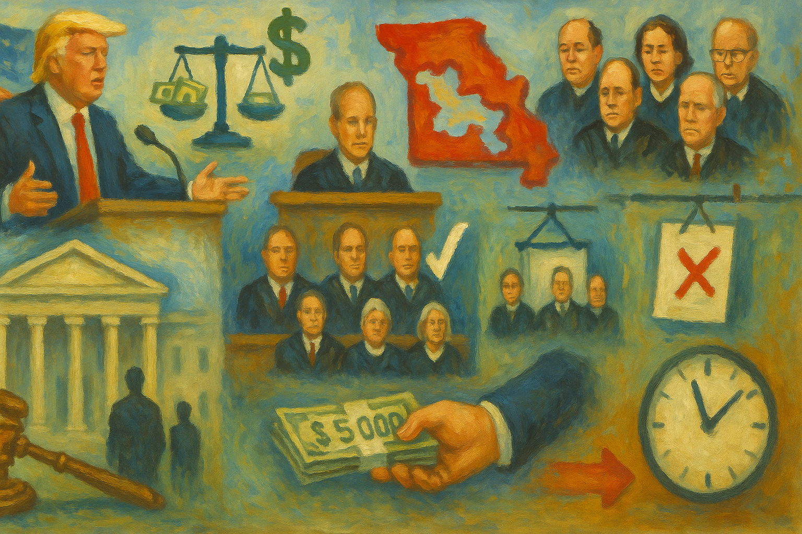

<!-- Generated by build_publish_week_v1 -->
<!-- Header image: image_wide_week86.png -->

# Week 86: The Week Every Line Nearly Held

*Courts blocked a partisan map and mail-voting restrictions this week, but only after damage was done and judicial independence itself came under direct attack.*

Week 86 opened with a president's convention speech that treated the United States Treasury as a campaign account. It closed with a redistricting fight so tangled that four courts issued contradictory rulings within two days. A primary was held under maps of doubtful legal standing. In between came fabricated war-hero stories, secret-evidence deportations, a Justice Department turning its attention to old pandemic scientists, and a proposal to strip citizenship data from the census itself. None of it arrived as a single shock. It arrived as accumulation, the way water finds every low place in a floor.

At the close of the previous period, the Democracy Clock stood at 7:35 p.m. It ends this week at 7:35 p.m. as well, a net movement of six seconds. The stillness in the public reading conceals real motion underneath. Twenty-three separate traits shifted this week, almost all of them toward greater danger. They largely canceled against one countervailing current: courts, this week, mostly held. The redistricting fight rewarded institutional resistance even as it exposed how thin that resistance has become. The clock's flat face is not a verdict of calm. It is a record of forces pulling in opposite directions at nearly equal strength.

The week's central drama began in Missouri. The state's own supreme court ruled that a Trump-backed congressional map, drawn to favor Republicans, could not stand without a voter referendum. A federal judge then issued a temporary order defying that ruling, instructing officials to use the disputed map anyway. Within forty-eight hours, Justice Kavanaugh denied an emergency request to enforce it. The Eighth Circuit declined to intervene, and the dispute bounced back to the full Supreme Court. The Court ultimately blocked the federal judge's order and restored the map Missouri had used before, preserving the redistricting protections voters had approved.

The victory came late and incomplete. A primary was held while the legal status of the districts remained unsettled. Voters cast ballots without knowing, with certainty, which map would govern their representation in November. The Missouri Supreme Court held the Secretary of State in contempt for defying its order and rejected a last-minute attempt to block a referendum. Courts, in the end, protected the process. But the protection came only after the process had already been damaged by confusion no ordinary voter should have had to navigate.

The aftermath revealed something sharper than the ruling itself. When Missouri Republican legislators lost in court, they turned to threatening impeachment against the justices who had ruled against them. The threat did not succeed. In Utah, a similar threat against a judge enforcing anti-gerrymandering protections also failed. So lawmakers packed the state supreme court instead, restructuring the bench until it produced the outcome they wanted. Judicial independence is not eroded only by defiance of rulings. It is eroded by showing, again and again, that judges who rule the wrong way can be replaced.

Against this backdrop, the president promised every American adult a $5,000 check, contingent on Republicans winning the midterms. He suggested he might not need congressional approval to send it. The claim carried no credible funding mechanism. Vice President Vance defended it on television anyway, pointing to tariff revenue that economists said could not plausibly cover a trillion-dollar obligation. The pledge tied a national payout to a partisan election outcome. That arrangement blurs governance and vote-buying past any reasonable line.

What made the moment notable was who objected. Governor DeSantis called the plan inflationary. Congressman Chip Roy and former Freedom Caucus chair Bob Good both questioned its constitutionality. A major Republican donor called it a "bread and circus bribe." This was not opposition-party alarm. It was Republicans, in public, warning that their own president had proposed something outside the boundaries their party claims to defend. The warning did not stop the pledge. It simply documented, for the record, that the boundary had been recognized before it was crossed.

Mail-in voting saw a parallel pattern of executive persistence against judicial resistance. A federal judge extended an injunction blocking Trump's mail-voting order. The administration appealed to the Supreme Court, arguing irreparable harm. The First Circuit unanimously rejected the bid to lift the injunction. A whistleblower separately alleged that the Postal Service was rushing implementation in ways that risked disenfranchising roughly fifty million voters. Courts held this line too, for now. But the repeated appeals suggest an administration testing how many tries it takes before one succeeds.

Elsewhere in the electoral infrastructure, Musk-linked networks expanded quietly. A site called votesafe.org, positioned as an alternative to the government's own voter registration portal, harvested detailed personal data under cover of civic assistance. Front organizations calling themselves Ready to Register and Sentinel Action Fund used the same infrastructure. In one case they sent outdated mailings to people who were no longer alive. AI researcher Geoffrey Hinton warned publicly that this kind of concentrated data access resembled the tools needed to corrupt elections algorithmically. The warning was specific and credentialed. It did not appear to change anything.

The Justice Department's own posture hardened along several fronts at once. Thirty election officials received letters ordering them to retain 2024 records under vague investigative threats, with no charge specified. A New York hospital ended pediatric gender-affirming care after DOJ settlement pressure, and the administration proposed a rule to strip federal funding from any health system offering it. For the first time, the government used the Alien Terrorist Removal Court to deport someone with secret evidence, a tribunal built decades ago but never before activated. Investigators reopened scrutiny of pandemic-era scientists, including Anthony Fauci, seeking records and grand jury testimony years after the fact.

The department's own coherence showed cracks. Joe diGenova, a Trump loyalist appointed to lead an investigation into an alleged anti-Trump conspiracy, resigned after five months without a single charge. He cited what he called ethical problems on his way out. A retribution effort that cannot produce results even from a loyalist points to dysfunction inside the machine, not restraint. The pattern across these actions is not a single conspiracy. It is a department whose discretion increasingly bends toward targets chosen by political convenience rather than evidence.

History took its own beating this week. The president repeated, across several venues including his convention speech and a Pentagon memorial appearance, a fabricated account of his own role in September 11th rescue efforts. Robert F. Kennedy Jr. delivered a convention address containing multiple claims fact-checkers quickly dismantled. AI-generated images of conquest and military strikes circulated from the president's own accounts. None of these falsehoods required legislation to spread. They required only repetition and a platform large enough to make repetition sound like memory.

The same memorial ceremonies became instruments of policy argument. Trump and Defense Secretary Hegseth used Pentagon remarks marking the anniversary to defend the ongoing, unauthorized war in Iran, folding a solemn day of mourning into justification for an unpopular conflict. Trump skipped the main New York memorial, citing a rule barring political speeches there, and was later reported to have fallen asleep during the Pentagon service. A 9/11 widow, Terry Strada, used her own remarks to criticize the administration's business ties to Saudi Arabia. A day meant to unify around shared loss became one more stage for competing claims on its meaning.

The president's personal conduct this week ran in a similar register. He solicited a pledge of personal allegiance from supporters, telling them that failing to vote would send them to hell. He insulted his own Senate nominee's appearance at the convention and attacked a Democratic state legislator's religion and character. He floated renaming New Mexico "New America" and suggested renaming other geographic landmarks after himself, even as litigation targeting immigrants in that same state proceeded. He separately acknowledged pocketing more than two billion dollars in personal stock trading profits while in office, an admission made in passing, without apparent concern for how it read.

None of these were unprecedented in isolation. Together, they describe a presidency increasingly built around personal loyalty rather than constitutional office, where allegiance to the man displaces allegiance to the government he leads. Congresswoman Chellie Pingree publicly called on colleagues to use their constitutional oversight powers to examine the president's fitness for office. The call went nowhere procedurally. It stands nonetheless as a marker that the concern had reached the floor of Congress, even without consequence.

Economic pressures compounded the week's political churn. Retaliatory tariffs with Canada escalated further, with new bans on alcohol, dairy, and motor vehicles. Trump threatened to ban the Canadian aerospace company Bombardier outright, a move critics linked to personal grievance rather than trade policy. U.S. strikes on Iranian oil tankers, absent congressional authorization, pushed diesel prices to record highs. The administration insisted the Iran war would end after the midterms, a claim its own defense advisors reportedly disputed. Inflation crept upward from decisions made without industry consultation or legislative debate, landing hardest on households least equipped to absorb it.

Deregulation moved forward in parallel, quieter but no less consequential. The EPA proposed rules easing permitting for data centers, treating industrial gas turbines as mobile equipment and dropping minimum public-participation requirements. The NLRB's general counsel was replaced with an attorney from a firm that has argued the agency itself is unconstitutional. A State Department hire with documented Nazi-symbol associations was elevated to a senior diplomatic post. Each of these, alone, might read as a personnel decision or a technical rule change. Together they describe agencies steadily repurposed toward the interests that oversight exists to check.

The census proposal deserves its own weight. A plan to add a citizenship question while dropping race and ethnicity data collection would risk excluding millions from the count that determines political representation and federal resources. The Constitution requires an enumeration of all persons, not merely citizens, for apportionment. A change of this kind does not simply adjust a form. It reaches into the foundation of how political power is divided among the states, and it does so through administrative proposal rather than open constitutional debate.

No single event this week broke the republic, and no single ruling saved it. What the record shows instead is a system under sustained, simultaneous pressure across nearly every domain a healthy democracy depends on: courts, elections, the press, the historical record, the line between personal loyalty and public office. Some of that pressure met resistance that held. The Missouri map was restored. Mail-voting restrictions were blocked again. A whistleblower spoke. A donor objected. These were not nothing. But they were defensive actions, holding a line rather than advancing one. Each victory arrived only after damage had already been done to the ordinary confidence a citizen should have in how the system runs.

The week's flat clock reading should not be mistaken for equilibrium. It marks a moment when the forces of erosion and the forces of resistance were, for seven days, nearly balanced. That balance is not guaranteed to hold. It depends on courts continuing to rule against pressure, on officials continuing to object publicly even within their own party, and on citizens continuing to notice when a pledge of allegiance to a president quietly replaces a pledge of allegiance to a country. The record of Week 86 shows both currents running at once, neither yet dominant, both unmistakably present.

<!-- Synopses for cross-posting -->
Long Synopsis: Week 86 opened with a president treating the Treasury like a campaign account and closed with a redistricting fight so tangled that four courts issued contradictory rulings within two days. The Missouri Supreme Court, a defiant federal judge, Justice Kavanaugh, the Eighth Circuit, and finally the full Supreme Court all weighed in before the original map was restored, though a primary was held under maps of doubtful legal standing. Republican legislators in Missouri and Utah then moved to punish or restructure judiciaries that ruled against them. Trump pledged unfunded $5,000 payments contingent on a midterm win, drawing rare Republican objection. Courts blocked mail-voting restrictions again. The clock held flat: twenty-three traits moved, nearly all toward danger, offset almost entirely by judicial resistance that, for now, still holds.
Short Synopsis: A tangled Missouri redistricting fight, an unfunded $5,000 election-year pledge, and coordinated attacks on judicial independence defined a week where courts mostly held the line, even as pressure mounted on nearly every institutional front at once.

