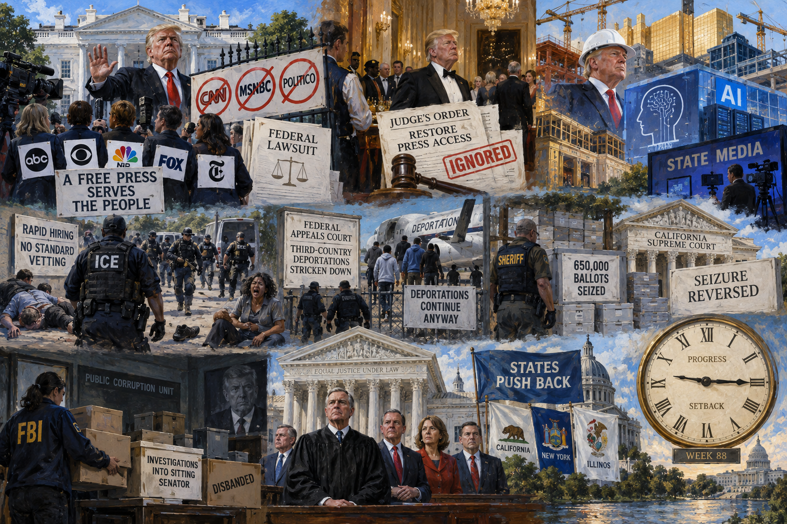

<!-- Generated by build_publish_week_v1 -->
<!-- Header image: image_wide_week88.png -->

# Week 88: The Press Fights Back, Power Pushes Further

*A press ban became a five-network revolt and a defied court order, while ICE violence, corruption cover-ups, and vanity projects tested every institutional check.*

Week 88 did not open with a single alarm bell. It opened with a ban, quiet and administrative in its phrasing, that within days had pulled five competing television networks into common cause, put a federal judge on record against the White House, and ended with the government defying that judge's order in the middle of a state dinner. This was not chaos for its own sake; it was the shape of a week in which power tested how far it could go before institutions pushed back. In several places, the answer was further than expected.

The Democracy Clock stood at 7:35 p.m. at the close of last week. It stands at 7:35 p.m. now. The net movement was negative one-tenth of a minute, a shift so small it rounds to nothing on the public face of the clock. Yet the underlying record shows real motion in both directions. Traits tracking press suppression, executive impunity, and corruption cover-ups pushed the clock backward, while traits tracking judicial pushback, especially rulings that favored ordinary litigants over the administration, pulled it forward almost as far. The week's story is not stillness; it is a standoff, recorded in the balance.

The clearest thread began when the president ordered CNN, MSNBC, and Politico barred from the White House. Secret Service agents confiscated press badges the next day. What might have remained a dispute between one administration and three newsrooms instead grew larger. Five networks, ordinarily rivals, suspended their shared pool coverage in solidarity, an unusual show of unity, the kind not seen in decades. The press corps clearly understood the ban as a test case, not an isolated grievance.

The three excluded outlets sued, arguing the ban violated their rights to due process and free expression, and a federal judge, a Trump appointee named Timothy Kelly, agreed. He ordered credentials restored for seventy-eight journalists, finding the administration had likely broken the law. It was, on paper, a clean win for the First Amendment, suggesting courts could still check the executive, even one that appointed the judge.

Then the White House defied the order. At a state dinner honoring China's president, CNN and MS NOW reporters were again turned away, hours after the ruling meant to guarantee their access. This is the detail that matters most. A ban is a policy dispute; defiance of a court order is something else entirely. It tells future readers that judicial rulings functioned, for this administration, as obstacles to route around rather than commands to obey. A White House letter later cited a Politico story as grounds for the ban, a story sourced to an authorized administration briefing. The government's own justification undercut itself. The pretext was thin from the start.

Even amid this confrontation, cracks in unanimity showed. One Republican senator broke with the president publicly over the ban, while still echoing his complaints about bias — a small dissent, but one that mattered as evidence that the ban's costs were becoming visible even within the president's own coalition.

As the traditional press was pushed to the margins, the administration built its own channel to the public. It launched a government-run video feed on YouTube, disabling comments, and promoted an official app promising news "straight from the Trump Administration." This was not an improvised response to the week's press fight; it was new, permanent infrastructure, built to outlast any single news cycle, letting the government speak without independent scrutiny standing in the way. At the same time, a major media merger, Paramount and Warner, cleared a state antitrust challenge with no meaningful divestiture required. The company's incoming leadership reportedly promised changes at CNN's editorial operation to win the administration's blessing. Consolidation and state media grew side by side. Independent journalism was starved of oxygen from both directions at once.

Immigration enforcement supplied the week's most visceral evidence of power exercised without restraint. An ICE agent shot a Venezuelan asylum seeker delivering food in Austin; the man was later discharged from a hospital into ICE custody with the bullet still in his back. A man died in Michigan after fleeing a traffic stop. In Illinois, agents injured a US citizen mistaken for someone else. A journalist covering a protest was tackled and pepper-sprayed. Agents showed no more restraint toward the press than toward the people they pursued.

None of this happened apart from how the agency was staffing itself. ICE hired ten thousand new agents with signing bonuses, bypassing standard fingerprint checks and interviews. The Government Accountability Office separately found the agency had wasted tens of millions of dollars on detention plans built without any strategic framework. A federal judge in New York ruled that detainees at a Manhattan facility were held in unconstitutional conditions, deprived of sleep, sanitation, food, and care. Read together, these events describe an enforcement apparatus expanding faster than its own capacity to act responsibly. Citizens and migrants alike absorbed the cost.

The judiciary did not stay silent on immigration policy either. A federal appeals court ruled the administration's practice of deporting migrants to third countries, nations with no connection to the people being sent there, was unlawful on due-process grounds. The government kept deporting people anyway while it appealed, and by week's end the Solicitor General had asked the Supreme Court to overturn the ruling outright. This is a live test of a basic question: can an appellate finding of unconstitutionality actually stop a policy already in motion, or can the executive simply outrun the courts on appeal?

Elections themselves came under pressure from several directions. A sheriff in California seized more than 650,000 ballots during what the state's Supreme Court later found was an unauthorized fraud inquiry. The court ordered the ballots returned, rebuking the seizure as a threat to election integrity rather than a defense of it. Democratic party organizations sued separately to block a Department of Homeland Security plan to station armed federal officers at polling places nationwide, warning the policy would intimidate naturalized citizens from voting. A whistleblower alleged that federal agents had impersonated voters, using citizens' Social Security data to test state voter rolls. Nevada's own secretary of state rejected a DHS claim that 185 registered voters were noncitizens, after confirming all were citizens. Mid-decade redistricting shifted nearly thirty-five million Americans into new congressional districts. Against this, Texas's highest criminal court let stand the acquittal of Crystal Mason, a woman whose earlier conviction over an unknowing voting mistake had become a symbol of selective prosecution. California, meanwhile, signed new legislation criminalizing ballot seizure outright. The week left the election system bruised but not broken, contested at every level rather than captured outright.

Corruption investigations suffered their own quiet dismantling. Reporting revealed the administration had shut down specialized FBI and Justice Department public-corruption units, including one building a case involving a sitting senator's alleged pay-to-play defense contracting scheme. A housing official was reported to have dug into the Attorney General's own mortgage records, apparently to pressure him into pursuing the president's opponents more aggressively. The State Department withheld information from Congress about billions of dollars in Venezuelan oil revenue. A Republican senator, breaking sharply with his own party's usual posture, called for a Senate investigation and subpoena of Donald Trump Jr. over an undisclosed cash gift from a Russian oligarch at his wedding. These are not scattered irregularities. They describe the machinery built to catch elite wrongdoing being quietly switched off, even as evidence of that wrongdoing kept surfacing.

Public money continued to flow toward the president's own image. A three-hundred-million-dollar ballroom project at the White House was routed through an office exempt from federal building codes, after the original architect resigned over fire-safety concerns; the president reportedly told him, "I am the code." He announced that a planned triumphal arch in Washington would double as a military complex equipped with drones and snipers. He threatened to demolish or rename the Kennedy Center unless it carried his name, while his appointed director moved to replace foreign gifts honoring its namesake with art chosen by political patrons. Each project on its own might read as excess; together they describe public resources treated as instruments of personal legacy rather than shared inheritance.

Congress showed its own fractures this week, though mostly in words rather than votes. The Senate blocked a war-powers resolution meant to end the prolonged conflict with Iran, even after two hundred days and nineteen American deaths. Speaker Johnson dismissed the idea that Congress should oversee an active military operation at all, and separately adjourned the House early enough to avoid a rare impeachment vote against the Defense Secretary. Yet individual Republican senators broke ranks all week: on corruption, on tariffs, on the press ban, on ICE's lack of local coordination, on the weakness of a Senate nominee in Texas. Whether this reflected genuine conviction or simple electoral fear ahead of a difficult midterm is not resolved by the record. What is clear is that institutional Republican support for oversight remained thin, even as individual discomfort grew louder.

A newer front opened around artificial intelligence. The president announced a federal "AI Force" and an AI czar position while calling safety concerns a hoax, all while personally holding financial stakes in AI-linked companies without the protection of a blind trust. Separately, his administration directed the creation of a political appointee board with power to veto biomedical research grants, overriding a congressional provision meant to block exactly that move. Both are early instances of a familiar pattern applied to new terrain: expertise gets sidelined, oversight gets bypassed, personal interest gets folded quietly into public policy.

Not every current ran the same direction. Courts, several times this week, ruled against the executive rather than for it: restoring press credentials, striking down the deportation policy, ordering the return of seized ballots, dismissing charges against Stanford protesters after a conflicted prosecutor was recused. A Supreme Court justice publicly warned that the Court's own emergency docket was becoming a way to avoid full review of major rights questions. These were not decisive victories, but they show that the judiciary, at multiple levels, retained both the will and the capacity to check power this week, even when the executive chose not to comply.

The Senate is expected to keep weighing the Justice Department's petition asking the Supreme Court to permit resumed third-country deportations, a case that will decide whether an appellate finding of unlawfulness can survive executive appeal.

What this week leaves behind is not a single verdict but a record of contest. The press was banned, then defended itself, then was ordered restored, then was denied anyway. Ballots were seized, then returned by court order. Corruption units were dismantled while a senator called for subpoenas of the president's own son. None of this resolved cleanly. What emerges is a picture of an executive testing limits with growing confidence, and of courts, states, and even a few allies within the president's own party, still willing, this week, to answer.

<!-- Synopses for cross-posting -->
Long Synopsis: Week 88 opened with a White House ban on CNN, MSNBC, and Politico that unified five rival networks in shared protest, produced a federal lawsuit, and ended with the administration defying a judge's order restoring press access at a state dinner. Elsewhere, ICE hiring surged without standard vetting as agents shot, injured, and killed civilians; a federal appeals court struck down third-country deportations while the government kept deporting people anyway; a sheriff's seizure of 650,000 ballots was reversed by California's Supreme Court; and reporting revealed the quiet dismantling of FBI public-corruption units investigating a sitting senator. The president simultaneously pursued vanity construction projects, an AI oversight structure tied to his own investments, and new state-aligned media infrastructure. Courts, a few Republican senators, and state governments pushed back throughout, producing a week of contest rather than resolution, with the clock's net movement nearly flat.
Short Synopsis: A White House press ban triggered unprecedented network solidarity, a lawsuit, and a judicial order the administration then defied. Amid ICE violence, corruption cover-ups, and vanity infrastructure projects, courts and a few dissenting Republicans pushed back, leaving the week's balance nearly unchanged.

