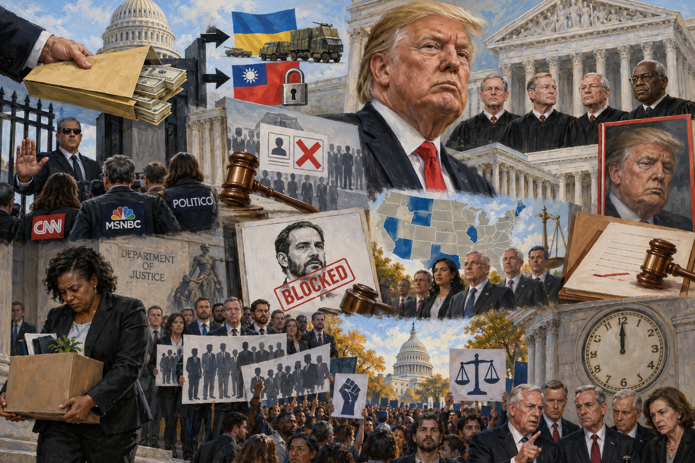

<!-- Generated by build_publish_week_v1 -->
<!-- Header image: image_wide_week89.png -->

# Week 89: A Week the Clock Held Its Breath

*Executive overreach met courts, states, and dissenting senators in equal measure, leaving the Democracy Clock exactly where it stood before.*

Week 89 opens on a scene familiar to anyone who has watched this administration govern by increment. No single act defines the period. Instead the week accumulates through a dozen smaller frictions: a rescission here, a press ban there, a court order defied in a manner too quiet to call rebellion and too deliberate to call accident. The Democracy Clock has spent most of this second term inching backward through exactly this kind of week. Week 89 belongs to that pattern, not to any new one.

At the close of Week 88, the clock stood at 7:35 p.m. It remains there now. The net movement this week is zero minutes. That stillness is not calm. It reflects a week in which serious erosions in executive restraint, law enforcement independence, and election administration were offset, almost minute for minute, by courts that held their ground, states that sued, and senators who broke from their own party to object. The scale did not tip. It strained in both directions at once.

The week's first and most consequential development concerns money, and who controls it. The administration used pocket rescissions to withhold more than $1.8 billion in funds Congress had already appropriated, covering health, immigrant, and refugee programs. The Government Accountability Office reviewed the maneuver and called it unconstitutional. The finding did not stop the practice. Days later the administration diverted $52 million in Ukraine-region military aid to governments in Latin America, against an active congressional hold, and classified the accounting of $300 million in Taiwan aid after its funding deadline passed.

Congress did not stay silent. Senator Patty Murray called the withholding theft from the public. Susan Collins condemned the rescissions as unconstitutional, though she had confirmed the OMB director who pursued them. That contradiction says something about how deep the discomfort runs inside the president's own party. Seven states, including California, Maryland, and Oregon, sued to compel the spending Congress had ordered. New York sued separately over withheld housing funds. The GAO ruling gave these cases a foundation. Whether that foundation holds will be decided in courtrooms still to come.

The second development turns on the press, and here the record is less ambiguous. A federal judge had ordered the White House to restore credentials for CNN, MSNBC, and Politico. The administration did not comply in any meaningful sense. Reporters from those outlets were blocked from a state dinner, from Air Force One, from coverage that other credentialed press received freely. A friendlier outlet filled the vacant seat. The defiance was not hidden. It played out in plain view of the order meant to stop it.

What makes this more than a media dispute is the posture it reveals toward judicial authority itself. A court ruled. The executive branch decided the ruling did not require action. No one claimed the order was wrong. They simply treated it as optional. That is a different kind of violation than noncompliance born of confusion. It is noncompliance as policy.

The third development concerns the machinery of elections, and it moved in two directions at once. The Supreme Court allowed the SAVE citizenship-verification database to resume operating for voter-roll purges, even after a lower court had found it violated privacy law. The Court also agreed to hear a case in December that could expand the scope of permissible purges, with argument scheduled close enough to the election to matter directly. A cabinet official, Markwayne Mullin, pressed states with unverified claims of fraud and threats to cut funding.

Here the countervailing forces were unusually visible. A federal judge in Georgia dismissed the Justice Department's second attempt to obtain unredacted voter-registration data. The DNC sued over changes to overseas voter registration forms. These rulings did not undo the SAVE database's resumption. But they show that not every door the administration tried to open this week actually opened.

The fourth development sits inside the Justice Department itself, and offers the week's most textured account of how law becomes a weapon rather than a limit. A career prosecutor, Sheri Mecklenburg, resigned, alleging she had been directed to pursue politically motivated felony charges against activists and was then scapegoated for objecting. Nearly three hundred former DOJ employees signed a letter accusing the department of abandoning its rule-of-law mission. The department itself, under Attorney General Bondi, closed more than 23,000 cases in six months, including investigations into terrorism and fraud, and shifted resources instead toward immigration enforcement.

Jack Smith testified before the Senate Judiciary Committee that he had personally faced threats of jail from the president. The claim grew stranger still when Senator Eric Schmitt, during that same hearing, leaned on a conspiracy theory later shown to rest on a mix-up between an Atlanta sports team and an Iowa one. Judge Aileen Cannon, a Trump appointee, blocked release of Smith's final report on the classified documents case, a departure from standard disclosure practice. FBI Director Kash Patel repeated promises of imminent arrests tied to an unproven 2020 election conspiracy. The arrests never came. Two career FBI counterterrorism supervisors were removed for declining to misuse their resources investigating a personal matter involving a White House official's family.

Not every thread in this cluster ran one direction. Judge Todd Edelman dismissed, with prejudice, a thin prosecution against former Olympian David Hearn. He warned explicitly of the risk that the president would force new charges if the case were merely paused rather than ended. It was a small ruling. It was also a rare moment this week in which a court named the danger of politically driven prosecution and acted to shut it down rather than merely delay it.

The fifth development is smaller in scale but telling in texture: public money used for personal and political glorification. Multiple taxpayer-funded advertisements aired this week carrying language lifted from the president's own campaign rhetoric, including one praising the recent military action against Iran. Separately, the Trump Organization filed trademark applications for "MAGA" and "45-47" for streaming platforms. Whistleblowers alleged that Kennedy Center funds meant for roof repair were redirected toward repainting tied to a planned renaming. None of these acts alone reaches the scale of the pocket rescissions. Together they describe an administration growing comfortable treating public institutions as extensions of a personal brand.

The sixth development returns to the judiciary, but from a different angle: the president's own account of what he wants from it. In a Time interview, Trump said he regretted appointing Gorsuch, Kavanaugh, and Barrett, citing insufficient loyalty, and affirmed that loyalty was what he expected from judges generally. A sitting president saying this plainly, rather than implying it, marks a shift from pressure applied quietly to pressure stated as principle. The same interview touched on "annihilating" Iran. The week closed with a third aircraft carrier strike group deployed to the Middle East, and Defense Secretary Hegseth handing questions of future warfare to major donors including Elon Musk and Palmer Luckey. These are separate facts. Read together, they describe a presidency speaking more openly about loyalty, force, and donor access than it has in prior weeks.

The seventh development is economic, and it complicates any simple story of consolidation. September's jobs report showed just 29,000 new jobs against expectations of 84,000, with prior months revised downward. Mortgage rates and bond yields reached multi-decade highs. Diesel prices, driven partly by the Iran conflict, were squeezing independent truckers against the wall of their own businesses. Farmers in Iowa, central to the administration's political coalition, reported tariff-driven hardship serious enough that Republican consultants privately warned of electoral losses. The administration's budget director confirmed plans to deepen cuts to SNAP and healthcare to fund defense priorities. This is not an administration whose economic story is improving as the midterms approach. It is one absorbing bad news while continuing the policies that produced it.

The eighth development follows the money more directly into policy outcomes. A nursing-home industry donation of $4.8 million to a pro-Trump super PAC preceded the abandonment of a staffing-safety rule. Big Tech executives donated over $227 million around the same time an AI self-regulation meeting produced only nonbinding standards. The super PAC MAGA Inc. raised more than $400 million in this period, much of it from donors with pending business before the administration. Trump himself claimed direct personal control over the super PAC's funds, a claim that, if accurate, would itself violate the legal separation between candidates and independent-expenditure committees. None of these facts alone proves exchange. Arranged in sequence, across sectors as different as healthcare and artificial intelligence, they describe a consistent shape.

The ninth development concerns immigration enforcement, where authority expanded even as evidence of abuse piled up. The Supreme Court lifted due-process protections for deportations to third countries. Families of Renee Good, a US citizen killed by an ICE agent during protests, filed wrongful-death suits alleging officials falsely branded her a domestic terrorist and pressured an FBI agent to abandon a civil rights inquiry. ICE deleted internal reviews documenting in-custody deaths from its own website, concealing records tied to at least six deaths from medical neglect among 56 total deaths this term. Local resistance persisted alongside this expansion. Colorado sued over a detention-facility contract awarded without environmental review. A federal judge blocked border-wall construction in Big Bend National Park. California's newly signed "No Kings Act" was invoked by plaintiffs within hours of being signed into law.

Running beneath all nine developments is a quieter thread the week's record names directly. A government chatbot, America.gov, briefly fact-checked the president's own claims before being censored into silence. It is a small thing, almost comic, except that it captures the week's logic in miniature. Even a tool built by the administration itself, when allowed to function honestly, produced an inconvenient truth. The response was not correction. It was suppression.

The Supreme Court has scheduled Republican National Committee v. Mi Familia Vota for argument in December, a case that could expand the legal basis for voter-roll purges before the next federal election. That date is fixed. What the Court does with it is not yet known, but the timing alone places the question of mass disenfranchisement squarely inside the window before voters go to the polls.

Week 89 will likely be remembered, if it is remembered at all, as a week of friction rather than rupture. The clock did not move, and that stillness is itself a kind of evidence. Pressure built on every front: the power of the purse, the independence of prosecutors, the integrity of voter rolls, the loyalty expected of judges. On nearly every front, something pushed back: a GAO finding, a state lawsuit, a judge's dismissal with prejudice, a senator's public break with the president who appointed the people she now condemns. Neither side secured the week. The architecture of restraint held, though barely, and the cost of holding it kept rising.

<!-- Synopses for cross-posting -->
Long Synopsis: Week 89 brought no single rupture but a dense accumulation of friction. The administration withheld over $1.8 billion in appropriated funds through pocket rescissions the GAO called unconstitutional, diverted Ukraine-region aid, and classified Taiwan funding. It defied a court order restoring press credentials to CNN, MSNBC, and Politico. The Supreme Court allowed a contested citizenship-verification database to resume purging voter rolls while agreeing to hear a case that could expand such purges before the election. Inside the Justice Department, a prosecutor resigned alleging political pressure, nearly three hundred former employees protested, and a judge blocked release of Jack Smith's final report. Trump told Time he regretted appointing justices who showed insufficient loyalty. Yet seven states sued over withheld funds, a judge dismissed a politically driven prosecution with prejudice, and senators from the president's own party condemned his actions. The clock did not move. Pressure built on every front, and resistance met it on nearly every front too.
Short Synopsis: A week without a single defining event but many small ones: withheld funds, defied court orders, expanding voter purges, and a politicized Justice Department, all counterbalanced by lawsuits, judicial pushback, and bipartisan senatorial dissent. The clock held still.

