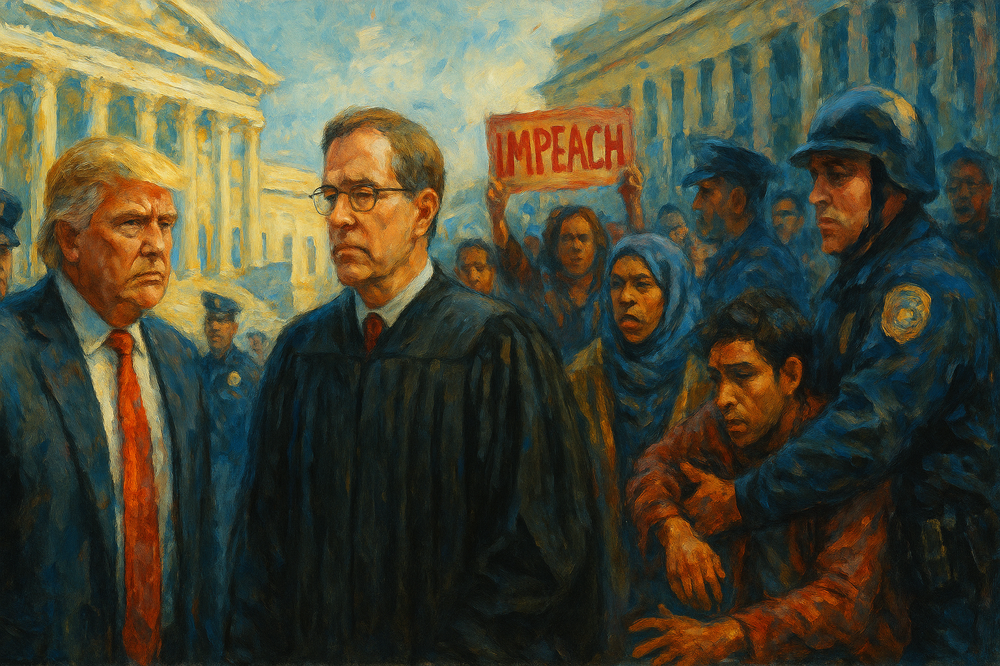

<!-- Generated by build_publish_week_v1 (appendix post) -->
<!-- Header image: image_wide_week9_appendix.png -->

# Week 9 Appendix: Emergency Powers as Routine Governance

*In Trump’s ninth week back in office, wartime statutes, deportation flights, and agency purges turned law and bureaucracy into pliable tools of executive will.*

This week represents an acute stress test of American constitutionalism, with the executive branch openly defying courts, hollowing out key departments, and weaponizing immigration and education policy for ideological ends. The most intense structural pressure falls on rule of law and separation of powers: mass deportations under the Alien Enemies Act proceeded in direct defiance of multiple federal orders, while Trump and congressional allies escalated attacks on Judge Boasberg, including impeachment articles and removal efforts. Simultaneously, the administration moved to dismantle the Department of Education, reassign student loans to the SBA, gut USAID and cultural agencies, and give Elon Musk’s DOGE sweeping access to federal systems—only partially checked by federal judges. Universities, immigrants, and protesters are targeted through funding freezes, visa revocations, and criminalization of activism, while independent media (USAGM/VOA, RFE/RL, AP access) is aggressively curtailed. Courts, state AGs, and some judges mounted significant resistance, securing TROs on deportations, DEI rollbacks, USAID, DOGE data grabs, and climate funds. But the pattern is clear: rapid executive overreach, privatization of state power, and normalization of constitutional brinkmanship.

Power and Authority

1. President Donald Trump used a Justice Department speech to air personal grievances about criminal cases (2025-03-15): Trump’s use of a Justice Department policy speech to relitigate his own criminal cases blurred the line between personal interests and neutral law enforcement, signaling pressure on the department to serve the president’s political narrative.

2. President Donald Trump invoked the Alien Enemies Act to authorize arrests and deportations of noncitizens (2025-03-15): Trump’s peacetime invocation of an 18th‑century wartime statute to arrest and deport alleged Venezuelan gang members expanded emergency-style executive power over noncitizens and weakened due process protections.

3. Trump administration deported hundreds of alleged gang members to El Salvador despite a federal court order (2025-03-16): By continuing mass deportation flights to El Salvador after Judge Boasberg’s restraining order, the administration openly defied judicial authority, undermining checks on executive power and weakening the rule of law.

4. President Donald Trump ordered US military airstrikes in Yemen without congressional authorization (2025-03-16): Unilateral airstrikes in Yemen that killed dozens of civilians, launched without explicit congressional authorization, concentrated war‑making power in the presidency and sidestepped democratic oversight of lethal force.

5. President Donald Trump declared that President Biden’s pardons were void because they used an autopen signature (2025-03-16): Trump’s assertion that Biden’s autopen‑signed pardons are legally void challenged the settled validity of presidential clemency and suggested a president can unilaterally nullify a predecessor’s lawful acts.

6. President Donald Trump revoked Secret Service protection for Hunter and Ashley Biden (2025-03-17): Revoking security details for Biden’s adult children used presidential control over protective services in a way that appeared retaliatory, raising concerns about politicized use of personal security decisions.

7. President Donald Trump targeted Democratic-aligned law firms through executive action and public attacks (2025-03-17): Trump’s executive order against Perkins Coie and broader attacks on Democratic‑aligned firms signaled willingness to wield state power against disfavored legal representation, pressuring the independence of the bar.

8. President Donald Trump ordered the dismantling of the US Institute of Peace’s independent board (2025-03-17): By removing the congressionally funded US Institute of Peace’s board, the administration asserted direct control over an independent peace institution, weakening legislative design of foreign‑policy bodies.

9. President Donald Trump announced broad expansions of presidential power over protests and immigration enforcement (2025-03-16): Commentary described the administration’s push to incarcerate protesters and deport immigrants as part of a broader expansion of presidential authority that risks eroding civil liberties and institutional checks.

10. President Donald Trump signed an order eliminating the US Agency for Global Media and restructuring its outlets (2025-03-15): Eliminating USAGM and sidelining Voice of America and related broadcasters concentrated control of state‑funded international media in the executive, weakening semi‑independent channels that had provided diverse information abroad.

11. President Donald Trump signed an executive order dismantling the Department of Education and shifting its functions (2025-03-20): Trump’s orders to close the congressionally created Education Department and reassign student loans and disability services attempted to restructure a core domestic agency by decree, bypassing normal legislative processes.

12. President Donald Trump signed an executive order on state and local preparedness shifting resilience responsibilities (2025-03-19): The resilience order pushed more responsibility for critical infrastructure and continuity planning to states and localities, potentially weakening coordinated federal capacity in national emergencies.

13. President Donald Trump issued multiple executive orders to consolidate procurement, expand data sharing, and boost mining (2025-03-20): Orders centralizing procurement, mandating broad inter‑agency data access, and expediting mineral production expanded presidential control over federal spending, information flows, and resource policy with limited external oversight.

14. President Donald Trump signed an order granting DOGE access to unclassified federal agency systems and records (2025-03-19): Granting the Department of Government Efficiency sweeping access to agency data and software systems concentrated informational power in a lightly accountable White House‑aligned unit, raising risks of politicized use of administrative data.

15. President Donald Trump revoked security clearances from prominent political and legal opponents (2025-03-21): Stripping security clearances from Biden, Harris, Cheney and others used national‑security tools against political rivals, potentially chilling post‑service oversight and bipartisan consultation on classified matters.

16. President Donald Trump admitted Elon Musk’s China business ties made war-plans briefings inappropriate (2025-03-21): Trump’s acknowledgment that Musk’s China interests conflicted with sharing war plans underscored how deeply a private businessman had been integrated into national‑security deliberations before concerns were publicly recognized.

17. President Donald Trump fired both Democratic commissioners at the Federal Trade Commission (2025-03-18): Removing the FTC’s Democratic commissioners, likely without statutory cause, undermined the independence of a key competition regulator and risked stalling enforcement by depriving it of a quorum.

18. President Donald Trump called for the impeachment of Judge James Boasberg after rulings against his deportation policy (2025-03-19): Trump’s public demand to impeach the chief district judge who blocked his Alien Enemies Act deportations escalated direct executive attacks on the judiciary for adverse rulings.

19. Representative Brandon Gill filed articles of impeachment against Judge James Boasberg (2025-03-19): A House member’s impeachment articles targeting a judge over a specific deportation ruling translated Trump’s rhetoric into institutional pressure on judicial independence.

20. Supporters of Donald Trump issued bomb threats against judges who ruled against the administration (2025-03-21): Bomb threats against judges, including a Supreme Court justice, for decisions adverse to Trump created a climate of intimidation around the judiciary and could deter robust oversight of executive actions.

21. President Donald Trump proposed overhauling or eliminating FEMA and shifting disaster relief to states (2025-03-18): Trump’s suggestion to dismantle FEMA and devolve disaster relief to states threatened the federal government’s capacity to provide equitable emergency assistance, especially to poorer or harder‑hit regions.

22. President Donald Trump revoked a prior punitive order against law firm Paul Weiss after it agreed to policy changes (2025-03-21): Revoking an earlier order against Paul Weiss once it pledged neutrality and pro bono commitments showed how executive pressure can be used to reshape private legal institutions’ policies.

23. President Donald Trump suggested 20-year El Salvador prison sentences for Tesla vandals (2025-03-20): Trump’s call to send US Tesla vandals to serve long sentences in El Salvador invoked foreign carceral systems as a punitive tool, signaling extreme, extraterritorial punishment proposals tied to a favored corporation.

Institutions and Governance

1. US Congress and President Donald Trump enacted the Full-Year Continuing Appropriations and Extensions Act, 2025 (2025-03-15): Passage and signing of a full‑year continuing appropriations law averted a shutdown and kept federal agencies funded, but also locked in the administration’s restructuring priorities for the fiscal year.

2. Democratic leaders and members of Congress debated strategy over opposing the Republican funding bill (2025-03-15): Internal Democratic disputes over whether to block or accept the GOP funding bill revealed tensions between resisting Trump’s agenda and preventing a shutdown, shaping legislative checks on executive policy.

3. Trump administration announced investigations into 45 universities for alleged race-exclusionary practices (2025-03-15): Launching broad investigations into graduate programs’ alleged race‑exclusionary practices extended federal oversight into campus admissions and could be used to chill diversity initiatives and institutional autonomy.

4. US Department of Education halted processing of income-driven student loan repayment applications, prompting lawsuits (2025-03-19): The Education Department’s shutdown of income‑driven repayment processing, now challenged by the AFT, disrupted statutory relief mechanisms for borrowers and raised questions about compliance with congressional mandates.

5. American Federation of Teachers sued the Department of Education over halted student loan repayment plans (2025-03-19): The teachers union’s lawsuit sought to force the Education Department to restore access to income‑driven repayment, using litigation to defend statutory protections for millions of borrowers.

6. US Department of Justice sought to remove Judge Boasberg from the Alien Enemies Act deportation case (2025-03-19): DOJ’s attempt to disqualify the judge overseeing the contested deportations challenged judicial oversight of executive immigration powers and tested norms around recusal and appellate review.

7. Chief Justice John Roberts publicly rebuked calls to impeach Judge Boasberg over his rulings (2025-03-18): Roberts’ rare public statement defending Boasberg and the appellate process reaffirmed that impeachment is not a remedy for disagreement with judicial decisions, bolstering formal norms of judicial independence.

8. Federal courts issued and expanded temporary restraining orders limiting deportations under the Alien Enemies Act (2025-03-16): Judge Boasberg’s TROs restricting use of the Alien Enemies Act to deport Venezuelans asserted that wartime powers cannot be stretched to peacetime mass removals, reinforcing legal limits on executive immigration authority.

9. Federal courts held hearings on possible Trump administration violations of deportation orders (2025-03-16): Boasberg’s hearings into whether officials intentionally violated his deportation halt orders highlighted the judiciary’s limited but active tools to investigate executive noncompliance.

10. Federal courts blocked or limited Trump administration efforts to dismantle USAID and access Social Security data (2025-03-18): Judges Chuang and Hollander ruled that shutting down USAID and letting DOGE mine Social Security data likely violated constitutional and privacy protections, ordering restoration of agency functions and deletion of improperly accessed data.

11. Federal courts blocked Trump administration attempts to claw back EPA climate grants and ban transgender military service (2025-03-18): Judges temporarily halted efforts to rescind $20 billion in climate grants and to bar transgender people from military service, preserving existing environmental and equal‑service policies pending further review.

12. Federal courts lifted prior blocks on executive orders terminating federal DEI programs (2025-03-16): Appeals court decisions allowing Trump’s anti‑DEI orders to proceed cleared the way for dismantling diversity and inclusion programs across federal agencies, reshaping civil‑service norms and protections.

13. Federal courts blocked DOGE from accessing Social Security systems as a fishing expedition (2025-03-21): By characterizing DOGE’s Social Security data demands as a fishing expedition and ordering destruction of collected personal data, a district judge reinforced judicial oversight of executive data‑mining initiatives.

14. Federal courts blocked the Trump administration from dismantling USAID as unconstitutional (2025-03-18): Judge Chuang’s ruling that USAID’s shutdown likely violated Congress’s constitutional role in creating agencies forced partial restoration of the aid agency and checked executive attempts to unilaterally abolish it.

15. Federal courts blocked EPA from clawing back climate grants and DOGE from Social Security data access (2025-03-18): Judicial blocks on climate grant clawbacks and DOGE’s SSA access preserved existing environmental funding and data privacy while broader legal challenges proceed.

16. Federal courts demanded explanations from the White House for continuing deportation flights to El Salvador (2025-03-21): Boasberg’s order requiring the administration to justify its deportation flights underscored judicial insistence on accountability when executive agencies appear to ignore court directives.

17. Democratic state attorneys general filed multiple lawsuits and secured restraining orders against Trump administration directives (2025-03-21): State AGs used coordinated litigation and community hearings to block or pause several Trump policies, including grant freezes and agency shutdowns, demonstrating subnational checks on federal overreach.

18. Demand Justice warned that Trump could appoint over 300 federal judges in coming years (2025-03-18): An advocacy analysis projected that Trump could fill hundreds of judicial vacancies, highlighting how future appointments could entrench a judiciary more aligned with his policy agenda.

19. Federal courts blocked DOGE from accessing Social Security data and ordered deletion of collected PII (2025-03-21): A district judge’s order to destroy personally identifiable information DOGE had obtained from SSA limited executive fishing expeditions into sensitive citizen data and reinforced privacy safeguards.

20. Federal courts ruled that Elon Musk’s USAID shutdown likely violated the Constitution (2025-03-18): By finding the USAID shutdown likely unconstitutional and ordering restoration steps, the court reasserted that executive‑branch contractors cannot unilaterally dismantle congressionally created agencies.

21. Federal courts blocked the Trump administration from clawing back EPA climate grants (2025-03-18): A judge’s injunction against reclaiming $20 billion in climate grants preserved long‑term environmental investments and limited the administration’s ability to reverse appropriated funds unilaterally.

22. Federal courts blocked the Trump administration’s ban on transgender military service (2025-03-18): A ruling calling the transgender service ban demeaning and animus‑driven temporarily protected LGBTQ+ individuals’ right to serve, checking discriminatory use of military policy.

23. Federal courts blocked DOGE from accessing Social Security systems as unconstitutional overreach (2025-03-21): The Social Security data ruling underscored that even executive‑created efficiency units must respect statutory limits and privacy rights when probing for fraud or waste.

24. Federal courts ordered the Trump administration to explain noncompliance with deportation orders (2025-03-21): Boasberg’s demand for a detailed explanation of deportation flights signaled that courts may escalate scrutiny and potential sanctions when executive agencies evade clear judicial instructions.

25. Federal courts blocked DOGE from accessing Social Security data and called efforts a fishing expedition (2025-03-21): Labeling DOGE’s SSA data push a fishing expedition, the court limited broad, suspicion‑less data trawls that could be used to justify politicized purges or benefit cuts.

26. Federal courts blocked DOGE from accessing Social Security data and ordered deletion of personal data (2025-03-21): Ordering deletion of any personal data DOGE had already accessed from SSA reinforced judicial power to remediate overbroad executive data collection after the fact.

27. Federal courts blocked DOGE from accessing Social Security data and criticized lack of fraud evidence (2025-03-21): The court’s skepticism about DOGE’s fraud claims highlighted the need for concrete evidence before granting sweeping access to sensitive administrative records.

28. Federal courts blocked DOGE from accessing Social Security data and ordered destruction of collected PII (2025-03-21): Mandating destruction of personally identifiable information obtained by DOGE from SSA set a precedent for rolling back unauthorized executive data grabs.

29. Federal courts blocked DOGE from accessing Social Security data and criticized fishing expedition (2025-03-21): The repeated characterization of DOGE’s SSA efforts as a fishing expedition underscored judicial concern about politicized use of fraud narratives to justify intrusive data access.

30. Federal courts blocked DOGE from accessing Social Security data and ordered deletion of any collected data (2025-03-21): The Social Security data ruling reinforced that executive efficiency drives cannot override statutory privacy protections or judicially enforced limits on data use.

31. Federal courts blocked DOGE from accessing Social Security data and ordered destruction of personal data (2025-03-21): By ordering destruction of personal data DOGE had accessed, the court provided a concrete remedy against overbroad executive data collection, reinforcing judicial oversight of administrative surveillance.

32. Federal courts blocked DOGE from accessing Social Security data and criticized fishing expedition (2025-03-21): The repeated judicial description of DOGE’s SSA access as a fishing expedition highlighted skepticism toward broad, poorly justified data grabs framed as anti‑fraud efforts.

33. Federal courts blocked DOGE from accessing Social Security data and ordered deletion of collected PII (2025-03-21): The Social Security data decision underscored that courts can not only halt but also unwind executive overreach into citizen records, protecting privacy and limiting politicized data use.

34. Federal courts blocked DOGE from accessing Social Security data and criticized lack of fraud evidence (2025-03-21): Judicial skepticism about DOGE’s fraud rationale for SSA access emphasized that efficiency rhetoric cannot substitute for evidence when seeking intrusive data powers.

35. Federal courts blocked DOGE from accessing Social Security data and ordered destruction of personal data (2025-03-21): The order to destroy personal data obtained by DOGE from SSA reinforced judicial capacity to remediate privacy violations after executive overreach has occurred.

36. Federal courts blocked DOGE from accessing Social Security data and criticized fishing expedition (2025-03-21): The Social Security ruling’s repeated references to a fishing expedition signaled judicial concern that anti‑fraud narratives were being used to justify broad, unspecific data access.

37. Federal courts blocked DOGE from accessing Social Security data and ordered deletion of collected PII (2025-03-21): By requiring deletion of personally identifiable information DOGE had accessed, the court underscored that executive data overreach can be rolled back, not just halted prospectively.

38. Federal courts blocked DOGE from accessing Social Security data and criticized fishing expedition (2025-03-21): The Social Security decision’s repeated criticism of DOGE’s fishing expedition highlighted judicial resistance to vague, wide‑ranging data demands lacking clear legal basis.

39. Federal courts blocked DOGE from accessing Social Security data and ordered destruction of personal data (2025-03-21): The Social Security ruling’s destruction order demonstrated that courts can require executive agencies to unwind unauthorized data collection, not just stop future access.

40. Federal courts blocked DOGE from accessing Social Security data and criticized fishing expedition (2025-03-21): The Social Security decision’s repeated fishing‑expedition language signaled judicial skepticism toward broad, poorly justified data grabs framed as efficiency or anti‑fraud measures.

41. Federal courts blocked DOGE from accessing Social Security data and ordered deletion of collected PII (2025-03-21): The Social Security ruling’s deletion requirement underscored that courts can compel executive agencies to erase improperly obtained citizen data, reinforcing privacy protections.

42. Federal courts blocked DOGE from accessing Social Security data and criticized fishing expedition (2025-03-21): The Social Security decision’s repeated criticism of DOGE’s fishing expedition highlighted judicial concern about politicized use of fraud narratives to justify intrusive data access.

43. Federal courts blocked DOGE from accessing Social Security data and ordered destruction of personal data (2025-03-21): The Social Security ruling’s destruction order demonstrated that courts can require executive agencies to unwind unauthorized data collection, not just stop future access.

44. Federal courts blocked DOGE from accessing Social Security data and criticized fishing expedition (2025-03-21): The Social Security decision’s repeated fishing‑expedition language signaled judicial skepticism toward broad, poorly justified data grabs framed as efficiency or anti‑fraud measures.

Economic Structure

1. EPA Administrator Lee Zeldin announced plans to roll back 31 environmental regulations on air, water, and climate (2025-03-15): Rolling back dozens of pollution rules weakened regulatory protections for public health and climate, shifting costs from regulated industries to communities and future taxpayers.

2. Trump administration withdrew $400 million in federal funding from Columbia University and threatened similar actions (2025-03-15): Cutting Columbia’s federal funding and warning dozens of other schools used economic leverage to pressure universities over campus dissent and alleged antisemitism, risking politicized allocation of public funds.

3. Department of Government Efficiency and IRS leadership implemented deep IRS staffing cuts and closures that disrupted tax administration (2025-03-15): Mass firings and office closures at the IRS, justified as anti‑waste measures, impaired tax collection and enforcement capacity, undermining revenue needed for public services.

4. Trump administration froze $175 million in federal funding to the University of Pennsylvania over trans athlete policies (2025-03-19): Freezing Penn’s federal funds in response to its trans athlete policies used economic pressure to influence campus inclusion rules, intertwining civil‑rights disputes with institutional financing.

5. Trump administration froze and redirected key Pentagon support packages to Ukraine (2025-03-15): Halting intelligence and weapons packages for Ukraine signaled a shift in US security commitments that could weaken a partner’s defense and alter the geopolitical balance with Russia.

6. Trump administration terminated a contract tracking Russian abductions of Ukrainian children (2025-03-15): Ending support for a project documenting Russian child abductions undercut international accountability efforts and reduced US backing for evidence‑based human‑rights enforcement.

7. Trump administration cut USDA inspection teams for plant and food imports (2025-03-18): Reductions in USDA inspection staff increased risks from invasive pests and delayed food inspections, weakening federal safeguards for food safety and agricultural resilience.

8. Trump administration advanced plans to open protected federal lands for housing and mining (2025-03-17): Proposals to develop protected federal lands for housing and resource extraction prioritized short‑term economic gains over conservation, shifting public goods toward private use.

9. President Donald Trump announced a clean coal initiative and criticized prior environmental policies (2025-03-17): Restarting “clean coal” plants and attacking environmental rules favored fossil‑fuel interests and risked locking in higher emissions, despite public‑health and climate costs.

10. Social Security Administration leadership proposed and began implementing stricter in-person ID verification for benefit claims (2025-03-18): SSA’s new ID rules and internal memo warning of service disruptions signaled a shift toward more burdensome access to benefits, especially for elderly and disabled claimants, risking de facto benefit denial.

11. Social Security Administration froze the Enumeration Beyond Entry program that auto-issues Social Security numbers to new workers (2025-03-20): Suspending automatic SSN issuance for newly authorized workers and citizens forced tens of thousands into field offices weekly, straining SSA capacity and delaying access to work and benefits.

12. Trump administration planned large tax cuts likely to increase the national debt amid rising interest rates (2025-03-16): Plans for major tax cuts without offsetting spending reductions risked worsening debt sustainability, potentially constraining future fiscal space for social programs and public investment.

13. Trump administration implemented tariffs that increased costs of living and harmed the job market (2025-03-20): Tariff policies that raised consumer prices and threatened jobs illustrated how trade tools can be used in ways that burden households while serving protectionist or political aims.

14. Department of Government Efficiency and agency allies moved to dismantle USAID and the Institute of Museum and Library Services (2025-03-21): DOGE’s role in shutting down USAID and canceling museum and library grants reflected a broader project to shrink or eliminate public‑goods institutions via executive action.

15. Trump administration froze $175 million in funding to the University of Pennsylvania over trans policies (2025-03-19): The Penn funding freeze used federal dollars to pressure a private university’s inclusion policies, intertwining civil‑rights disputes with economic leverage over higher education.

16. Trump administration moved the federal student loan program from the Education Department to the SBA (2025-03-21): Transferring student loan management to the Small Business Administration raised concerns about administrative competence and continuity in servicing obligations affecting millions of borrowers.

17. Trump administration considered relinquishing the US role as NATO’s Supreme Allied Commander Europe (2025-03-21): Exploring withdrawal from NATO’s top command role signaled potential retrenchment from longstanding alliance leadership, with implications for defense spending and global security architecture.

18. Federal regulatory agencies (EPA, FCC, TSA, FDA, OSHA) issued multiple routine rules and information-collection notices affecting environment, safety, and communications (2025-03-17): A series of technical rules on air quality, emergency alerts, pesticides, medical devices, and workplace safety showed ongoing regulatory activity that shapes economic incentives and public protections.

19. Trump administration and Elon Musk’s companies benefited from FAA contract shifts and Starlink installations in government facilities (2025-03-18): Replacing a Verizon FAA contract with Starlink and installing Starlink across the White House deepened reliance on a politically connected contractor for critical infrastructure, raising cronyism and conflict‑of‑interest concerns.

20. Trump administration pursued broad deregulation and privatization through DOGE and executive orders (2025-03-20): DOGE’s expanding role, procurement consolidation, and mining orders collectively advanced a deregulatory, privatizing agenda that shifts public functions and assets toward favored private actors.

21. Trump administration froze and redirected key support to Ukraine while courting Russia diplomatically (2025-03-18): Freezing Ukraine support and pursuing ceasefire talks aligned with Russian demands signaled a reorientation of US economic and security commitments away from European allies.

22. Trump administration used tariffs and other economic tools in ways that harmed domestic consumers and jobs (2025-03-20): Tariffs that raised living costs and threatened employment illustrated how trade policy can be wielded for political effect despite broad economic harm, affecting public perceptions of governance.

23. Trump administration implemented policies that increased national debt through tax cuts and spending choices (2025-03-16): Plans to expand the national debt via large tax cuts without structural reforms risked constraining future democratic choices over social spending and investment.

24. Trump administration pursued deregulation and privatization through DOGE and executive orders (2025-03-20): DOGE’s expanding role, procurement consolidation, and mining orders collectively advanced a deregulatory, privatizing agenda that shifts public functions and assets toward favored private actors.

Civil Rights and Dissent

1. Trump administration used the Alien Enemies Act to deport migrants without normal due process protections (2025-03-16): Invoking a wartime law to deport Venezuelan and Salvadoran migrants without standard hearings eroded due process for noncitizens and normalized emergency powers in routine immigration enforcement.

2. Trump administration and ICE deported Andry José Hernández Romero and other migrants based on tattoos and alleged gang ties (2025-03-15): Deporting migrants, including LGBTQ+ individuals, to harsh Salvadoran prisons based largely on tattoos and tenuous gang allegations highlighted arbitrary criteria and severe consequences in immigration enforcement.

3. ICE and DHS detained and sought to deport pro-Palestinian activists and academics (2025-03-15): Arrests and visa revocations targeting Mahmoud Khalil, Badar Khan Suri, and other pro‑Palestinian scholars suggested immigration powers were being used to punish political speech and campus activism.

4. ICE and DHS detained foreign residents and workers with valid status under harsh conditions (2025-03-18): Cases involving a German green‑card holder and a Canadian worker detained and mistreated at the border highlighted aggressive enforcement practices that jeopardize lawful residents’ rights and international trust.

5. ICE intensified arrests and deportations of Chinese immigrants, including in sanctuary cities (2025-03-18): Expanded ICE raids and deportations targeting Chinese nationals, even in sanctuary jurisdictions, deepened fears in immigrant communities and underscored selective, nationality‑based enforcement.

6. ICE detained prominent immigration advocate Jeanette Vizguerra in Colorado (2025-03-19): The arrest of a long‑time immigrant rights leader suggested that outspoken advocacy can increase vulnerability to enforcement, potentially chilling organizing and protest.

7. CBP and DHS allegedly abused a mixed-status family and denied urgent medical care to a child with brain cancer (2025-03-18): A complaint alleging CBP denied medical care and mistreated a family with a recovering child underscored how border enforcement practices can violate basic rights and dignity.

8. Texas authorities arrested a midwife under the state’s near-total abortion ban (2025-03-17): Charging a Texas midwife with illegal abortion and unlicensed practice marked an aggressive use of criminal law to enforce abortion bans, heightening risks for reproductive health providers.

9. Trump administration and DOJ sought delays in mifepristone lawsuits and signaled reviews that could restrict access (2025-03-18): Requests to delay abortion‑pill litigation and new safety reviews by HHS and FDA leadership raised the prospect of regulatory pathways being used to curtail medication abortion access.

10. Republican-controlled state legislatures advanced bills to reclassify mifepristone as a controlled substance and restrict its use (2025-03-18): State efforts to treat mifepristone like opioids and enable lawsuits against providers would sharply limit medication abortion, using criminal and civil law to narrow reproductive rights.

11. Trump administration revoked temporary legal status for over 530,000 immigrants from four countries (2025-03-21): Ending parole protections for hundreds of thousands of Cubans, Haitians, Nicaraguans, and Venezuelans exposed them to deportation and destabilized communities built under prior legal assurances.

12. Trump administration planned a militarized buffer zone along the New Mexico border staffed by active-duty troops (2025-03-20): Proposals to station active‑duty troops with detention powers in a border buffer zone blurred lines between military and civilian law enforcement, raising serious civil‑liberties concerns.

13. Trump administration and DHS used an obscure foreign-policy deportation provision to arrest Mahmoud Khalil (2025-03-20): Invoking a rarely used authority to deport a student activist for alleged adverse foreign‑policy consequences expanded executive discretion to remove critics under vague national‑interest claims.

14. US Attorney General Pam Bondi charged Tesla vandals with domestic terrorism and sought severe penalties (2025-03-20): Labeling property damage at Tesla sites as domestic terrorism and pursuing long sentences broadened terrorism frameworks into protest‑adjacent conduct, potentially chilling direct action.

15. Steve Bannon publicly dismissed concerns about innocent people caught in mass deportations (2025-03-20): Bannon’s comments that innocent deportees were a “tough break” reflected an elite discourse that normalizes collateral harm in enforcement, undermining norms of individualized justice.

16. Trump administration and DHS revoked temporary legal status for over 530,000 immigrants from four countries (2025-03-21): Ending parole protections for hundreds of thousands of Cubans, Haitians, Nicaraguans, and Venezuelans exposed them to deportation and destabilized communities built under prior legal assurances.

17. Trump administration and DHS used an obscure foreign-policy deportation provision to arrest Mahmoud Khalil (2025-03-20): Invoking a rarely used authority to deport a student activist for alleged adverse foreign‑policy consequences expanded executive discretion to remove critics under vague national‑interest claims.

18. US Attorney General Pam Bondi charged Tesla vandals with domestic terrorism and sought severe penalties (2025-03-20): Labeling property damage at Tesla sites as domestic terrorism and pursuing long sentences broadened terrorism frameworks into protest‑adjacent conduct, potentially chilling direct action.

19. Steve Bannon publicly dismissed concerns about innocent people caught in mass deportations (2025-03-20): Bannon’s comments that innocent deportees were a “tough break” reflected an elite discourse that normalizes collateral harm in enforcement, undermining norms of individualized justice.

20. Supporters of Donald Trump issued bomb threats against judges who ruled against the administration (2025-03-21): Bomb threats against judges, including a Supreme Court justice, for decisions adverse to Trump created a climate of intimidation around the judiciary and could deter robust oversight of executive actions.

Information, Memory and Manipulation

1. White House restricted Associated Press access to the Oval Office and Air Force One over naming dispute (2025-03-15): Barring AP from key presidential venues after it refused to adopt “Gulf of America” signaled retaliatory use of access to pressure media outlets on editorial choices.

2. Trump administration eliminated the US Agency for Global Media and sidelined Voice of America and sister outlets (2025-03-15): Shutting down USAGM structures and placing VOA staff on leave dismantled long‑standing semi‑independent international broadcasters, weakening US‑funded sources of pluralistic news.

3. Radio Free Europe/Radio Liberty sued the Trump administration over termination of federal funding (2025-03-18): RFE/RL’s lawsuit argued that cutting its funding violated constitutional and statutory protections, using the courts to defend the independence of US‑funded international journalism.

4. Department of Justice removed ADA disability guidance and COVID-related materials from its website (2025-03-19): Taking down ADA compliance and COVID guidance reduced accessible information for disabled people and businesses, weakening transparency around civil‑rights obligations.

5. Trump administration removed a Surgeon General advisory framing gun violence as a public health issue (2025-03-17): Deleting federal health content that treated gun violence as a public‑health problem narrowed the evidence base available to the public and policymakers on firearm harms.

6. US military and Defense Department removed and then partially restored online content about minority veterans and DEI-linked history (2025-03-18): Deleting pages on Code Talkers, Black veterans, and women pilots—later restoring some under pressure—showed how DEI rollbacks can erase or marginalize histories of minority service.

7. Trump administration used the song “Closing Time” without permission in a deportation video (2025-03-18): Repurposing a popular song in a deportation video without consent illustrated how cultural works can be co‑opted into state messaging that normalizes harsh enforcement.

8. President Donald Trump and allies claimed Biden’s pardons were invalid due to autopen signatures despite archival clarification (2025-03-17): Trump’s repeated assertions that autopen‑signed pardons are void, countered by the National Archives, injected disinformation into public understanding of constitutional processes.

9. Trump administration removed online application forms for income-driven student loan plans from federal websites (2025-03-20): Taking down digital applications for key repayment plans made it harder for borrowers to access statutory relief, using information design to constrain practical rights.

10. White House Press Secretary Karoline Leavitt attacked Judge Boasberg and his family in public statements (2025-03-21): Smearing a sitting judge as a partisan and targeting his spouse’s donations aimed to delegitimize judicial oversight and frame legal rulings as partisan warfare.

11. Trump administration falsely claimed thousands of IRS employees were fired for poor performance (2025-03-20): Misrepresenting mass IRS firings as performance‑based, despite internal warnings this was false, distorted public understanding of civil‑service cuts and undermined trust in official explanations.

12. Trump administration released thousands of JFK assassination files as part of a transparency initiative (2025-03-18): Releasing long‑sealed JFK records expanded public access to historical documents, though experts doubted the new material would significantly change established accounts.

13. Elon Musk threatened legal action and prosecution over leaks about a planned Pentagon briefing (2025-03-20): Musk’s calls to prosecute alleged Pentagon leakers over his China war‑plans briefing highlighted tensions between leak investigations and the public’s interest in transparency about private influence on security policy.

14. Trump administration and DOGE sought broad access to unclassified federal records and Social Security data (2025-03-19): Orders expanding DOGE’s access to agency records and SSA systems concentrated informational power in a politically aligned unit, raising risks of data being used to justify purges or policy shifts.

15. Trump administration removed disability and gun-violence guidance and DEI-linked content from federal sites (2025-03-19): Deleting ADA, gun‑violence, and DEI‑related materials from official websites narrowed the informational record on marginalized groups’ experiences and public‑health harms.

16. Trump administration used deportation footage of shackled migrants as public messaging (2025-03-16): Sharing images of shackled, shaved migrants in Salvadoran prisons as political content framed harsh treatment as a spectacle, shaping public perceptions of enforcement and dehumanizing deportees.

17. Trump administration removed online application forms for income-driven student loan plans from federal websites (2025-03-20): Taking down digital applications for key repayment plans made it harder for borrowers to access statutory relief, using information design to constrain practical rights.

18. Elon Musk threatened legal action and prosecution over leaks about a planned Pentagon briefing (2025-03-20): Musk’s calls to prosecute alleged Pentagon leakers over his China war‑plans briefing highlighted tensions between leak investigations and the public’s interest in transparency about private influence on security policy.

